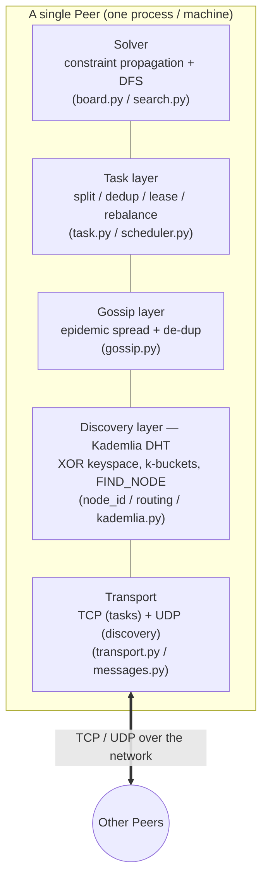
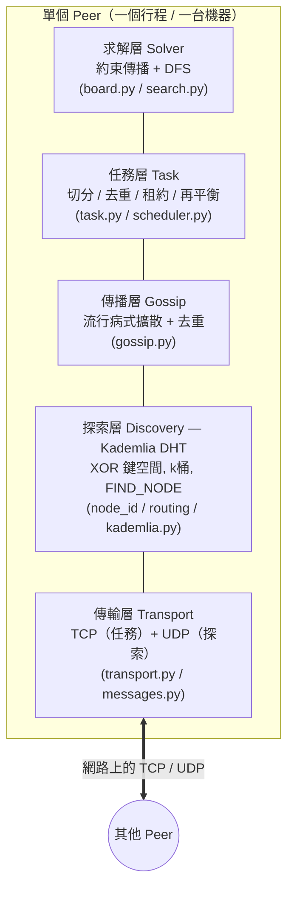

# SwarmSolve

> A decentralized peer-to-peer system for solving very large Sudoku puzzles
> (e.g. 16×16, 25×25). No central server: peers collaboratively explore
> different parts of the search tree in parallel.

**Languages / 语言 / 語言:** English (below) · [简体中文](#中文设计文档) · [繁體中文](#繁體中文設計文件) · code-level docs → [`docs/`](docs/README.md) ([EN](docs/architecture.en.md) · [简](docs/architecture.zh-CN.md) · [繁](docs/architecture.zh-TW.md))

---

## 1. The Idea

A large Sudoku is one giant **search tree** of partial states. A single machine
explores it depth-first; for 25×25 that tree can be huge. **SwarmSolve** cuts
the tree into **subtasks** and spreads them across many equal peers that talk
directly over the network. Three kinds of information flow between peers:

| Message | Meaning |
|---------|---------|
| **Open Task** | an unexplored region (subtree) of the search space |
| **Dead End** | a branch proven invalid → nobody should explore it again |
| **Solution** | the final valid grid → everyone can stop |

Sharing **dead ends** prunes everyone's work; sharing **open tasks** balances
the load; the first **solution** stops the swarm.

## 2. Architecture

Five layers, bottom-up. Each maps to a concept from the course.



| Layer | Responsibility | Course concept (highlight) |
|-------|----------------|----------------------------|
| Transport | message framing, TCP/UDP send/recv | Ch.2 (TCP, messaging) |
| **Discovery** | decentralized peer lookup & routing | **Ch.6 Kademlia** (XOR distance, k-buckets, iterative FIND_NODE) |
| Gossip | spread Open/Dead/Solution, de-dup, TTL | Ch.2 Gossip + Ch.7 probabilistic coverage |
| Task | split tree, dedup, fair placement, leases | Ch.5 load balancing + fault tolerance |
| Solver | constraint propagation + DFS | application core |

### The headline idea (our "wow" factor)

We reuse the **same Kademlia XOR keyspace** for **task IDs**. A subtask's path of
assignments (e.g. `cell12=4; cell37=9`) is hashed into a 160-bit key. The peers
**closest** to that key (XOR distance) are its natural owners. This gives us, for
free:

* **Structured placement** — work spreads deterministically, not randomly.
* **Deduplication** — the same subtask maps to the same owner everywhere.
* **Self-rebalancing** — when peers join/leave, ownership shifts smoothly.

So the DHT is not just "find a peer"; it is the backbone of fair task
distribution. That ties Ch.6 (Kademlia) directly to Ch.5 (balanced load).

## 3. How distributed solving works

```mermaid
sequenceDiagram
    participant S as Submitter peer
    participant A as Peer A
    participant B as Peer B
    Note over S,B: all peers already joined via Kademlia bootstrap
    S->>S: split root puzzle into a task frontier (BFS expand)
    S-->>A: gossip OPEN_TASK(s)
    S-->>B: gossip OPEN_TASK(s)
    A->>A: pick task closest to my ID, CLAIM (lease)
    B->>B: pick a different task, CLAIM (lease)
    A->>A: DFS subtree, hits contradiction
    A-->>B: gossip DEAD_END(path)
    B->>B: prune that subtree (skip it)
    B->>B: DFS subtree → SOLUTION found
    B-->>S: gossip SOLUTION
    B-->>A: gossip SOLUTION
    Note over S,A,B: everyone stops
```

1. **Submit** — one peer expands the root into a frontier of subtasks and
   gossips them as `OPEN_TASK`.
2. **Claim** — each peer picks the open task whose key it is *closest* to, and
   takes a **lease** (a time-boxed claim) announced via `TASK_CLAIM`.
3. **Explore** — it runs DFS on that subtree. Contradictions become `DEAD_END`
   messages; an exhausted subtree becomes `TASK_DONE`.
4. **Prune** — every peer that hears a `DEAD_END` skips that subtree.
5. **Finish** — the first peer to find a complete grid gossips `SOLUTION`; the
   `should_stop` hook stops everyone.

## 4. Fault tolerance

* **Leases**: a claim expires after `LEASE_SECONDS`. If a peer crashes mid-task,
  the lease lapses and [`Scheduler.reclaim_expired`](src/swarmsolve/tasks/scheduler.py)
  returns the task to the open pool → another peer redoes it.
* **Gossip robustness**: losing a few messages doesn't break correctness; dead
  ends and solutions keep re-propagating until everyone converges.
* **Kademlia churn tolerance**: k-buckets prefer long-lived peers, and lookups
  route around dead contacts.

## 5. Possible extension: jigsaw puzzles

The framework is puzzle-agnostic: anything expressible as *"a search tree split
into subtasks + dead-end pruning + first-solution-wins"* fits. For a jigsaw,
each **piece placement** is a branch; an invalid partial assembly is a dead end.
Only the `solver/` package changes; transport/discovery/gossip/tasks stay.

## 6. Tech stack & layout

* **Language**: Python 3.11+, `asyncio` for concurrency.
* **Package/deps**: [`uv`](https://docs.astral.sh/uv/) (recommended) or conda + pip.
* **CLI / output**: `typer` + `rich`.
* **Tests**: `pytest`.

```
SwarmSolve/
├── pyproject.toml            # uv project + deps
├── README.md
├── examples/puzzles/         # sample boards (9x9 easy/hard)
├── src/swarmsolve/
│   ├── transport/            # [A] messages.py, transport.py (TCP+UDP)
│   ├── discovery/            # [B] node_id.py, routing.py, kademlia.py
│   ├── gossip/               # [C] gossip.py
│   ├── tasks/                # [C]+[E] task.py, scheduler.py
│   ├── solver/               # [D] board.py, search.py
│   ├── puzzles.py            # load / generate puzzles
│   ├── peer.py               # [E] orchestration (ties all layers)
│   └── cli.py                # [E] gen/solve/demo/benchmark/dashboard/fault/peer
└── tests/                    # test_solver.py, test_dht.py
```

## 7. Quickstart

### Setup

#### Option A: uv (recommended)

```bash
uv sync --extra dev
```

#### Option B: conda + pip

```bash
conda create -n swarmsolve python=3.12 -y
conda activate swarmsolve
pip install -e .
pip install pytest pytest-asyncio
```

### Run the tests

```bash
# uv
uv run pytest -q

# conda
pytest -q
```

> All commands below use `uv run swarmsolve <cmd>`. If you installed via conda/pip,
> just use `swarmsolve <cmd>` directly.

### Demo commands (for presentations)

All demo commands (`demo`/`benchmark`/`fault`/`dashboard`) spawn **real OS processes**
talking over real localhost sockets, so the CPU-bound search runs in parallel.

| # | Command | What it demonstrates | Key takeaway |
|---|---------|---------------------|--------------|
| 1 | `solve` | Single-machine DFS + constraint propagation | Quick correctness check |
| 2 | `gen` | Generate puzzles of any size | Prepare input for demos |
| 3 | `demo` | Single-machine vs P2P swarm comparison | Distributed architecture works |
| 4 | `benchmark` | Exhaustive search with real speedup | **Near-linear parallel speedup** |
| 5 | `fault` | Kill a peer mid-solve → task auto-reassigned | **Fault tolerance & lease mechanism** |
| 6 | `dashboard` | Live per-peer task counters | Real-time load distribution |
| 7 | `peer` | Manual multi-terminal demo | Interactive live demo |

#### 1. `solve` — single-machine baseline

```bash
# easy puzzle (constraint propagation handles it, ~0.000s)
uv run swarmsolve solve examples/puzzles/easy_9x9.txt

# hard puzzle (deep search tree, ~0.3s, 6050+ nodes explored)
uv run swarmsolve solve examples/puzzles/hard_9x9.txt
```

Shows the solved board with timing stats (`time`, `nodes`, `dead_ends`).

#### 2. `gen` — generate a puzzle

```bash
uv run swarmsolve gen --size 16 --out examples/puzzles/puzzle16.txt
uv run swarmsolve gen --size 25 --out examples/puzzles/puzzle25.txt   # stress-testing
```

Creates a valid solvable puzzle. **Note**: generated puzzles are solved instantly
by constraint propagation — for demos that need a deep search tree, always use
`examples/puzzles/hard_9x9.txt` (hand-crafted, ~6050 nodes explored).

#### 3. `demo` — single-machine vs P2P swarm

```bash
uv run swarmsolve demo --file examples/puzzles/hard_9x9.txt --peers 4
```

Shows:
1. Single-machine baseline timing
2. Per-peer report: who found the solution, nodes explored, time
3. Wall-clock comparison

**Note:** First-solution search has limited parallelism (the answer sits on one
deep path). See `benchmark` below for honest speedup.

#### 4. `benchmark` — exhaustive search with real speedup

```bash
uv run swarmsolve benchmark --file examples/puzzles/hard_9x9.txt \
    --peers 4 --node-delay 0.0012 --split-depth 4
```

Shows **~2× speedup on 4 peers** (wall clock). Explores the *entire* tree (counts
all solutions), so the workload is embarrassingly parallel. Output verifies:
"correctness OK: all solutions covered exactly once".

#### 5. `fault` — fault tolerance

```bash
uv run swarmsolve fault --file examples/puzzles/easy_9x9.txt --peers 4 --kill-peer 2
```

Peer #2 is killed mid-solve. The swarm **still solves** the puzzle because the
lease on its task expires and another peer picks it up. Output confirms:
"swarm STILL solved the puzzle ... despite the failure".

#### 6. `dashboard` — live task counters

```bash
uv run swarmsolve dashboard --file examples/puzzles/hard_9x9.txt --peers 4 --node-delay 0.003
```

A live-updating table of per-peer `open` / `claimed` / `dead_ends` / `done` counts,
showing how tasks flow between peers in real time.

#### 7. `peer` — manual multi-terminal demo

**This is the most interactive demo.** Open 5 terminals side by side and watch
peers discover each other, claim tasks, and collaborate in real time.

> **Important**: Only use `hard_9x9.txt` for this demo. Generated 16×16/25×25
> puzzles are solved instantly by constraint propagation — they don't show any
> peer interaction. `hard_9x9.txt` is a hand-crafted puzzle with ~6050 search
> nodes, which is what makes the demo visible.

> **Why `--node-delay`?** Even `hard_9x9.txt` solves in ~0.3s without it.
> `--node-delay 0.01` adds a 10ms pause per search node (~60s total), giving
> enough time to observe the peer interaction.

```bash
# Terminal 1 (bootstrap + submitter) — start this LAST:
uv run swarmsolve peer --port 9000 --file examples/puzzles/hard_9x9.txt \
    --submit --node-delay 0.01 --split-depth 3 --tasks 32

# Terminals 2, 3, 4, 5 (joiners) — start these FIRST:
# --idle-limit 333 keeps them alive ~10s while you copy-paste
uv run swarmsolve peer --port 9001 --file examples/puzzles/hard_9x9.txt \
    --bootstrap 127.0.0.1:9000 --node-delay 0.01 --split-depth 3 --idle-limit 333
uv run swarmsolve peer --port 9002 --file examples/puzzles/hard_9x9.txt \
    --bootstrap 127.0.0.1:9000 --node-delay 0.01 --split-depth 3 --idle-limit 333
uv run swarmsolve peer --port 9003 --file examples/puzzles/hard_9x9.txt \
    --bootstrap 127.0.0.1:9000 --node-delay 0.01 --split-depth 3 --idle-limit 333
uv run swarmsolve peer --port 9004 --file examples/puzzles/hard_9x9.txt \
    --bootstrap 127.0.0.1:9000 --node-delay 0.01 --split-depth 3 --idle-limit 333
```

> **Demo order**: Open all 4 joiners first (they'll show `waiting for tasks...`
> and `re-bootstrapping...`). Then start the submitter. Each joiner will show
> `peers=1` at first — this is normal, they only know the bootstrap peer.

**What you'll see** (~15-20s of live action):
- **Terminal 1**: seeds 42 tasks and starts exploring
- **Terminals 2-5**: `re-bootstrapping to find submitter...` → `claiming task` →
  nodes explored climbing → `received SOLUTION via gossip` or `FOUND solution`
- **SOLUTION propagates**: the first peer to find the solution gossips it to ALL
  known peers, so everyone stops together

See the **code-level docs** in [`docs/`](docs/README.md) for detailed output
examples and the metrics table.

## 8. Team split (5 members)

| # | Member | Owns | Key files | Deliverable |
|---|--------|------|-----------|-------------|
| A | **Transport** | message format, TCP+UDP I/O, serialization | `transport/` | reliable send/recv, wire schema |
| B | **Discovery (Kademlia)** | NodeID/XOR, k-buckets, FIND_NODE, bootstrap | `discovery/` | a peer can join & locate others |
| C | **Gossip + Task split** | epidemic spread, tree splitting, XOR placement, dedup | `gossip/`, `tasks/task.py` | tasks spread & deduplicated |
| D | **Solver engine** | board, constraint propagation, DFS, dead-end detection | `solver/` | fast subtree solving + pruning hooks |
| E | **Fault tolerance + Orchestration + Demo** | leases/rebalance, `Peer` glue, CLI, dashboard, tests | `tasks/scheduler.py`, `peer.py`, `cli.py` | end-to-end runnable swarm + measurements |

Interfaces are already stubbed so members can work in parallel against agreed
signatures (see the docstrings in each module).

## 9. MVP roadmap

* **M0 — Solver only** *(done)*: `solver/` + tests solve 9×9/16×16 locally; tree
  splitting works. Demonstrable with zero networking.
* **M1 — Two peers, one box**: transport + minimal gossip; peer B receives an
  OPEN_TASK from A and solves it. Proves the message path.
* **M2 — Kademlia discovery**: peers self-discover via bootstrap + FIND_NODE; no
  hard-coded peer lists.
* **M3 — Full swarm** *(done)*: XOR-based placement, dead-end pruning,
  work-stealing, first-solution stop + exhaustive `benchmark` with real speedup.
* **M4 — Fault tolerance** *(done)*: `swarmsolve fault` kills a peer mid-solve;
  lease expiry reassigns its task; the swarm still finishes.
* **M5 — Scale & polish** *(done)*: live dashboard; **deterministic exact mode**
  (single-owner + virtual nodes) → exact solution counts, **~2.55× on 4 peers,
  ~0 % duplicate work**; 25×25 generation + propagation solving. Metrics table &
  details in [`docs/`](docs/README.md) §14.
* **M6 (stretch)** — jigsaw extension reusing the same framework.

## 10. Design decisions & trade-offs

* **Kademlia (UDP) for discovery + TCP for tasks** — matches the brief's "TCP
  messages" for the heavy/reliable payloads while keeping discovery lightweight
  and churn-tolerant, exactly as Kademlia is used in practice (BitTorrent, IPFS).
* **MVP on 16×16 first** — same architecture as 25×25, but fast enough to iterate
  and demo; scaling up is just a parameter.
* **Two load-balancing strategies** — (1) passive `split_depth` re-splitting +
  gossip; (2) **true work-stealing** (`--work-stealing`): idle peers actively
  request work from busy peers over point-to-point TCP (WORK_REQUEST/WORK_DONATE),
  which re-splits an in-flight task and donates a child. Leases are renewed on
  long tasks so a busy peer is never reclaimed. See [`docs/`](docs/README.md) §15.
* **Newline-delimited JSON on the wire** — readable for debugging/demo; can be
  swapped for msgpack without touching call sites.

---

# 中文设计文档

> 一个去中心化的 P2P 系统，用于求解超大数独（如 16×16、25×25）。没有中心服务器：
> 所有对等节点（peer）地位平等，并行探索搜索树的不同部分。

## 1. 核心思路

一个大数独本质上是一棵巨大的**搜索树**（所有部分填充状态构成）。单机用 DFS 探索
它，对 25×25 来说这棵树非常庞大。**SwarmSolve** 把这棵树切成若干**子任务**，分发
给许多地位平等、直接互联的节点。节点间流动三类信息：

| 消息 | 含义 |
|------|------|
| **Open Task（开放任务）** | 搜索空间中尚未探索的区域（子树） |
| **Dead End（死路）** | 已被证明无效的分支 → 任何人都不应再探索 |
| **Solution（解）** | 最终合法的完整数独 → 所有节点可停止 |

共享**死路**可裁剪所有节点的工作量（剪枝）；共享**开放任务**实现负载均衡；
第一个**解**让整个集群停止。

## 2. 系统架构

自底向上五层，每一层都对应一个课程知识点。


| 层 | 职责 | 对应课程亮点 |
|----|------|--------------|
| 传输 Transport | 消息封装、TCP/UDP 收发 | 第2章（TCP、消息） |
| **发现 Discovery** | 去中心化节点发现与路由 | **第6章 Kademlia**（XOR 距离、k桶、迭代 FIND_NODE） |
| 传播 Gossip | 扩散三类消息、去重、TTL 控制泛洪 | 第2章 Gossip + 第7章 概率覆盖思想 |
| 任务 Task | 切分树、去重、公平放置、租约 | 第5章 负载均衡 + 容错 |
| 求解 Solver | 约束传播 + DFS | 应用核心 |

### 最大亮点（我们的"wow"点）

我们把 **Kademlia 的 XOR 键空间**复用为**任务 ID 空间**。一个子任务的赋值路径
（如 `cell12=4; cell37=9`）被哈希成一个 160 位的 key，**XOR 距离最近**的节点就是
它天然的负责人。这样我们免费获得：

* **结构化放置**：任务确定性地分布，而非随机。
* **去重**：同一个子任务在任何节点都映射到同一负责人。
* **自再均衡**：节点上下线时，归属平滑迁移。

所以 DHT 不只是"找节点"，而是公平任务分发的骨架——这把第6章（Kademlia）和
第5章（负载均衡）直接打通了。

## 3. 分布式求解流程

```mermaid
sequenceDiagram
    participant S as 提交节点
    participant A as 节点 A
    participant B as 节点 B
    Note over S,B: 所有节点已通过 Kademlia bootstrap 加入网络
    S->>S: 把根数独切成任务前沿（BFS 展开）
    S-->>A: gossip OPEN_TASK
    S-->>B: gossip OPEN_TASK
    A->>A: 选择离自己 ID 最近的任务，CLAIM（租约）
    B->>B: 选择另一个任务，CLAIM（租约）
    A->>A: DFS 子树，遇到矛盾
    A-->>B: gossip DEAD_END(路径)
    B->>B: 裁剪该子树（跳过）
    B->>B: DFS 子树 → 找到 SOLUTION
    B-->>S: gossip SOLUTION
    B-->>A: gossip SOLUTION
    Note over S,A,B: 所有节点停止
```

1. **提交**：一个节点把根展开成子任务前沿，以 `OPEN_TASK` 广播。
2. **认领**：每个节点选取 key 离自己最近的开放任务，取得**租约**（带时限的认领），
   通过 `TASK_CLAIM` 通告。
3. **探索**：对该子树执行 DFS。矛盾 → `DEAD_END`；子树穷尽 → `TASK_DONE`。
4. **剪枝**：任何收到 `DEAD_END` 的节点跳过该子树。
5. **结束**：第一个找到完整解的节点广播 `SOLUTION`，`should_stop` 钩子让所有节点停止。

## 4. 容错机制

* **租约（Lease）**：认领在 `LEASE_SECONDS` 后过期。若节点中途崩溃，租约失效，
  [`Scheduler.reclaim_expired`](src/swarmsolve/tasks/scheduler.py) 把任务放回开放池
  → 由其他节点重做。
* **Gossip 鲁棒性**：丢几条消息不影响正确性；死路与解会持续重传直到全网收敛。
* **Kademlia 抗抖动**：k桶偏好长寿节点，查找会绕过失效联系人。

## 5. 可能的扩展：拼图（Jigsaw）

框架与具体谜题无关：凡是能表达为"搜索树切分子任务 + 死路剪枝 + 首解即停"的问题
都适配。对拼图而言，每次**拼块放置**是一个分支，非法的局部拼装就是死路。
只需替换 `solver/` 包，传输/发现/传播/任务层完全复用。

## 6. 技术栈与目录

* **语言**：Python 3.11+，并发用 `asyncio`。
* **包管理**：[`uv`](https://docs.astral.sh/uv/)（推荐）或 conda + pip。
* **命令行/展示**：`typer` + `rich`。
* **测试**：`pytest`。

目录结构见上方英文部分第 6 节（方括号标注了负责人 A–E）。

## 7. 快速开始

### 安装

#### 方式 A：uv（推荐）

```bash
uv sync --extra dev
```

#### 方式 B：conda + pip

```bash
conda create -n swarmsolve python=3.12 -y
conda activate swarmsolve
pip install -e .
pip install pytest pytest-asyncio
```

### 跑测试

```bash
# uv
uv run pytest -q

# conda
pytest -q
```

> 以下命令均以 `uv run swarmsolve <cmd>` 为例。若使用 conda/pip 安装，直接使用 `swarmsolve <cmd>` 即可。

### 演示命令（适合 pre 展示）

所有演示命令（`demo`/`benchmark`/`fault`/`dashboard`）都会启动**真实的多个进程**，
通过本机真实 socket 通信，因此 CPU 密集的搜索是真正并行的。

| # | 命令 | 演示什么 | 核心亮点 |
|---|------|---------|---------|
| 1 | `solve` | 单机约束传播 + DFS 求解 | 快速验证正确性 |
| 2 | `gen` | 生成任意尺寸的数独 | 准备演示输入 |
| 3 | `demo` | 单机 vs P2P 集群对比 | 分布式架构可行 |
| 4 | `benchmark` | 穷举搜索，测量真实加速 | **近线性并行加速比** |
| 5 | `fault` | 求解中途杀掉节点，自动重分配 | **容错 + 租约机制** |
| 6 | `dashboard` | 各节点任务计数的实时仪表盘 | 实时负载分布 |
| 7 | `peer` | 多终端手动演示 | 交互式现场演示 |

#### 1. `solve` — 单机基线

```bash
# 简单题目（约束传播直接搞定，约 0.000s）
uv run swarmsolve solve examples/puzzles/easy_9x9.txt

# 困难题目（深搜索树，约 0.3s，探索 6050+ 节点）
uv run swarmsolve solve examples/puzzles/hard_9x9.txt
```

输出解出的棋盘及耗时统计（`time`、`nodes`、`dead_ends`）。

#### 2. `gen` — 生成题目

```bash
uv run swarmsolve gen --size 16 --out examples/puzzles/puzzle16.txt
uv run swarmsolve gen --size 25 --out examples/puzzles/puzzle25.txt   # 压力测试用
```

先生成完整解，再随机挖空，保证可解。输出到 `examples/puzzles/`，所有题目文件放在一起。

#### 3. `demo` — 单机 vs P2P 集群

```bash
# 9x9 — 快速，适合快速概览
uv run swarmsolve demo --file examples/puzzles/hard_9x9.txt --peers 4

# 16x16 — 更大棋盘，更多任务可分配
uv run swarmsolve demo --file examples/puzzles/puzzle16.txt --peers 4
```

展示：
1. 单机基线耗时
2. 各节点报告：谁找到解、探索节点数、耗时
3. Wall-clock 对比

**注意**：首解搜索并行度有限（解只位于一条深路径上），请用下面的 `benchmark` 观察真实加速。

#### 4. `benchmark` — 穷举搜索，真实加速

```bash
uv run swarmsolve benchmark --file examples/puzzles/hard_9x9.txt \
    --peers 4 --node-delay 0.0012 --split-depth 4
```

展示 **4 节点约 2× 加速**（wall clock）。穷举整棵树（统计所有解），任务天然可并行。
输出验证："correctness OK: all solutions covered exactly once"。

#### 5. `fault` — 容错演示

```bash
uv run swarmsolve fault --file examples/puzzles/easy_9x9.txt --peers 4 --kill-peer 2
```

求解中途杀掉 peer #2，集群**仍能成功求解**。因为被杀节点的租约过期，其任务被其他节点
自动回收。输出确认："swarm STILL solved the puzzle ... despite the failure"。

#### 6. `dashboard` — 实时仪表盘

```bash
uv run swarmsolve dashboard --file examples/puzzles/hard_9x9.txt --peers 4 --node-delay 0.003
```

实时刷新的各节点 `open` / `claimed` / `dead_ends` / `done` 计数表，直观展示任务在节点间
的流动与分配。

#### 7. `peer` — 多终端手动演示

**最具互动性的演示。** 打开 4-5 个终端并排显示，观察节点如何互相发现、认领任务、实时协作。

> **为什么需要 `--node-delay`？** 真实数独求解太快了（约束传播在毫秒内就能解出大部分题目）。
> `--node-delay` 给每个搜索节点加一个微小延迟，模拟 25×25 或拼图那种"昂贵搜索"——这是
> 项目内置的演示开关，不是 hack。

**推荐：9×9 困难 + 5 个节点**（约 15-20 秒演示时长）

```bash
# 终端 1（引导节点 + 提交者）
uv run swarmsolve peer --port 9000 --file examples/puzzles/hard_9x9.txt \
    --submit --node-delay 0.01 --split-depth 3 --tasks 32

# 终端 2, 3, 4, 5（加入者，各自开一个终端）
uv run swarmsolve peer --port 9001 --file examples/puzzles/hard_9x9.txt \
    --bootstrap 127.0.0.1:9000 --node-delay 0.01 --split-depth 3 --idle-limit 333
uv run swarmsolve peer --port 9002 --file examples/puzzles/hard_9x9.txt \
    --bootstrap 127.0.0.1:9000 --node-delay 0.01 --split-depth 3 --idle-limit 333
uv run swarmsolve peer --port 9003 --file examples/puzzles/hard_9x9.txt \
    --bootstrap 127.0.0.1:9000 --node-delay 0.01 --split-depth 3 --idle-limit 333
uv run swarmsolve peer --port 9004 --file examples/puzzles/hard_9x9.txt \
    --bootstrap 127.0.0.1:9000 --node-delay 0.01 --split-depth 3 --idle-limit 333
```

> **提示**：先开所有加入者（它们会等待提交者），最后启动提交者。每个加入者初始显示
> `peers=1` 是正常的——它们只知道 bootstrap 节点。随着任务在网络中流动，它们会互相发现。

**你将看到**（约 15-20 秒演示时长）：
- **终端 1**：切分 42 个任务并开始探索
- **终端 2-5**：`re-bootstrapping to find submitter...` → `claiming task` →
  探索节点数不断增长 → `received SOLUTION via gossip` 或 `FOUND solution`
- **SOLUTION 传播**：第一个找到解的节点通过 gossip 发给所有已知节点，所有人同时停止

代码级三语详解见 [`docs/`](docs/README.md)。

## 8. 五人分工

| # | 成员 | 负责模块 | 关键文件 | 交付物 |
|---|------|----------|----------|--------|
| A | **传输层** | 消息格式、TCP+UDP 收发、序列化 | `transport/` | 可靠收发 + 线上协议 |
| B | **发现层（Kademlia）** | NodeID/XOR、k桶、FIND_NODE、bootstrap | `discovery/` | 节点能加入并定位他人 |
| C | **Gossip + 任务切分** | 流行病扩散、树切分、XOR 放置、去重 | `gossip/`、`tasks/task.py` | 任务扩散且去重 |
| D | **求解引擎** | 棋盘、约束传播、DFS、死路检测 | `solver/` | 高效子树求解 + 剪枝钩子 |
| E | **容错 + 编排 + 演示** | 租约/再均衡、`Peer` 粘合、CLI、dashboard、测试 | `tasks/scheduler.py`、`peer.py`、`cli.py` | 端到端可跑的集群 + 度量 |

各模块接口已写好桩（见每个模块的 docstring），成员可按约定签名并行开发。

## 9. MVP 路线图

* **M0 — 仅求解器**（已完成）：`solver/` + 测试可本地求解 9×9/16×16；树切分可用。
  无需任何网络即可演示。
* **M1 — 两节点单消息**：传输 + 最简 gossip；B 收到 A 的 OPEN_TASK 并求解，打通消息链路。
* **M2 — Kademlia 发现**：节点经 bootstrap + FIND_NODE 自发现，无需硬编码节点表。
* **M3 — 完整集群**（已完成）：基于 XOR 的放置、死路剪枝、工作窃取、首解即停，
  以及 `benchmark` 穷举搜索的真实加速。
* **M4 — 容错**（已完成）：`swarmsolve fault` 求解中途杀掉一个节点；租约过期重分配
  其任务；集群仍能完成。
* **M5 — 规模与打磨**（已完成）：实时 dashboard；**确定性精确模式**（单一负责人 +
  虚拟节点）→ 解计数精确、**4 节点 ~2.55×、约 0% 重复工作**；25×25 生成 + 约束传播求解。
  度量表与细节见 [`docs/`](docs/README.md) 第 14 节。
* **M6（挑战）** — 复用同一框架实现拼图扩展。

## 10. 设计取舍

* **发现用 Kademlia（UDP）+ 任务用 TCP**：既满足作业"TCP 消息"传重要/可靠负载，
  又让发现轻量、抗抖动——正是 Kademlia 在工业界（BitTorrent、IPFS）的用法。
* **MVP 先做 16×16**：架构与 25×25 完全一致，但迭代/演示更快；放大只是改参数。
* **两种负载均衡策略**：(1) 被动 `split_depth` 再切分 + gossip；(2) **真正的工作窃取**
  （`--work-stealing`）：空闲节点经点对点 TCP（WORK_REQUEST/WORK_DONATE）主动向忙节点索要
  工作，忙节点切分在跑任务并捐赠一个子任务。长任务会续约租约，忙节点不会被误回收。
  详见 [`docs/`](docs/README.md) 第 15 节。
* **线上用换行分隔 JSON**：便于调试/演示；可无痛替换为 msgpack。

---

# 繁體中文設計文件

> 一個去中心化的 P2P 系統，用於求解超大數獨（如 16×16、25×25）。沒有中央伺服器：
> 所有對等節點（peer）地位平等，並行探索搜尋樹的不同部分。

## 1. 核心思路

一個大數獨本質上是一棵巨大的**搜尋樹**（由所有部分填充狀態構成）。單機以 DFS 探索
它，對 25×25 而言這棵樹非常龐大。**SwarmSolve** 把這棵樹切成若干**子任務**，分發
給許多地位平等、直接互聯的節點。節點間流動三類資訊：

| 訊息 | 含義 |
|------|------|
| **Open Task（開放任務）** | 搜尋空間中尚未探索的區域（子樹） |
| **Dead End（死路）** | 已被證明無效的分支 → 任何人都不應再探索 |
| **Solution（解）** | 最終合法的完整數獨 → 所有節點可停止 |

共享**死路**可裁剪所有節點的工作量（剪枝）；共享**開放任務**達成負載平衡；
第一個**解**讓整個叢集停止。

## 2. 系統架構

由下而上五層，每一層都對應一個課程知識點。



| 層 | 職責 | 對應課程亮點 |
|----|------|--------------|
| 傳輸 Transport | 訊息封裝、TCP/UDP 收發 | 第2章（TCP、訊息） |
| **探索 Discovery** | 去中心化節點發現與路由 | **第6章 Kademlia**（XOR 距離、k桶、迭代 FIND_NODE） |
| 傳播 Gossip | 擴散三類訊息、去重、TTL 控制氾濫 | 第2章 Gossip + 第7章 機率覆蓋思想 |
| 任務 Task | 切分樹、去重、公平放置、租約 | 第5章 負載平衡 + 容錯 |
| 求解 Solver | 約束傳播 + DFS | 應用核心 |

### 最大亮點（我們的「wow」點）

我們把 **Kademlia 的 XOR 鍵空間**重用為**任務 ID 空間**。一個子任務的賦值路徑
（如 `cell12=4; cell37=9`）被雜湊成一個 160 位元的 key，**XOR 距離最近**的節點就是
它天然的負責人。如此我們免費獲得：

* **結構化放置**：任務確定性地分佈，而非隨機。
* **去重**：同一個子任務在任何節點都對應到同一負責人。
* **自再平衡**：節點上下線時，歸屬平滑遷移。

所以 DHT 不只是「找節點」，而是公平任務分發的骨幹——這把第6章（Kademlia）與
第5章（負載平衡）直接打通了。

## 3. 分散式求解流程

```mermaid
sequenceDiagram
    participant S as 提交節點
    participant A as 節點 A
    participant B as 節點 B
    Note over S,B: 所有節點已透過 Kademlia bootstrap 加入網路
    S->>S: 把根數獨切成任務前沿（BFS 展開）
    S-->>A: gossip OPEN_TASK
    S-->>B: gossip OPEN_TASK
    A->>A: 選擇離自己 ID 最近的任務，CLAIM（租約）
    B->>B: 選擇另一個任務，CLAIM（租約）
    A->>A: DFS 子樹，遇到矛盾
    A-->>B: gossip DEAD_END(路徑)
    B->>B: 裁剪該子樹（跳過）
    B->>B: DFS 子樹 → 找到 SOLUTION
    B-->>S: gossip SOLUTION
    B-->>A: gossip SOLUTION
    Note over S,A,B: 所有節點停止
```

1. **提交**：一個節點把根展開成子任務前沿，以 `OPEN_TASK` 廣播。
2. **認領**：每個節點選取 key 離自己最近的開放任務，取得**租約**（有時限的認領），
   透過 `TASK_CLAIM` 通告。
3. **探索**：對該子樹執行 DFS。矛盾 → `DEAD_END`；子樹窮盡 → `TASK_DONE`。
4. **剪枝**：任何收到 `DEAD_END` 的節點跳過該子樹。
5. **結束**：第一個找到完整解的節點廣播 `SOLUTION`，`should_stop` 掛勾讓所有節點停止。

## 4. 容錯機制

* **租約（Lease）**：認領在 `LEASE_SECONDS` 後過期。若節點中途崩潰，租約失效，
  [`Scheduler.reclaim_expired`](src/swarmsolve/tasks/scheduler.py) 把任務放回開放池
  → 由其他節點重做。
* **Gossip 韌性**：掉幾則訊息不影響正確性；死路與解會持續重傳直到全網收斂。
* **Kademlia 抗抖動**：k桶偏好長壽節點，查找會繞過失效聯絡人。

## 5. 可能的擴充：拼圖（Jigsaw）

框架與具體謎題無關：凡能表達為「搜尋樹切分子任務 + 死路剪枝 + 首解即停」的問題
皆適用。對拼圖而言，每次**拼塊放置**是一個分支，非法的局部拼裝就是死路。
只需替換 `solver/` 套件，傳輸/探索/傳播/任務層完全重用。

## 6. 技術棧與目錄

* **語言**：Python 3.11+，並行採用 `asyncio`。
* **套件管理**：[`uv`](https://docs.astral.sh/uv/)（推薦）或 conda + pip。
* **命令列/展示**：`typer` + `rich`。
* **測試**：`pytest`。

目錄結構見上方英文部分第 6 節（方括號標註了負責人 A–E）。

## 7. 快速開始

### 安裝

#### 方式 A：uv（推薦）

```bash
uv sync --extra dev
```

#### 方式 B：conda + pip

```bash
conda create -n swarmsolve python=3.12 -y
conda activate swarmsolve
pip install -e .
pip install pytest pytest-asyncio
```

### 跑測試

```bash
# uv
uv run pytest -q

# conda
pytest -q
```

> 以下命令均以 `uv run swarmsolve <cmd>` 為例。若使用 conda/pip 安裝，直接使用 `swarmsolve <cmd>` 即可。

### 演示命令（適合 pre 展示）

所有演示命令（`demo`/`benchmark`/`fault`/`dashboard`）都會啟動**真實的多個行程**，
透過本機真實 socket 通訊，因此 CPU 密集的搜尋是真正並行的。

| # | 命令 | 演示什麼 | 核心亮點 |
|---|------|---------|---------|
| 1 | `solve` | 單機約束傳播 + DFS 求解 | 快速驗證正確性 |
| 2 | `gen` | 生成任意尺寸的數獨 | 準備演示輸入 |
| 3 | `demo` | 單機 vs P2P 叢集對比 | 分散式架構可行 |
| 4 | `benchmark` | 窮舉搜尋，測量真實加速 | **近線性並行加速比** |
| 5 | `fault` | 求解中途殺掉節點，自動重分配 | **容錯 + 租約機制** |
| 6 | `dashboard` | 各節點任務計數的即時儀表板 | 即時負載分佈 |
| 7 | `peer` | 多終端機手動演示 | 互動式現場演示 |

#### 1. `solve` — 單機基準

```bash
# 簡單題目（約束傳播直接搞定，約 0.000s）
uv run swarmsolve solve examples/puzzles/easy_9x9.txt

# 困難題目（深搜尋樹，約 0.3s，探索 6050+ 節點）
uv run swarmsolve solve examples/puzzles/hard_9x9.txt
```

輸出解出的棋盤及耗時統計（`time`、`nodes`、`dead_ends`）。

#### 2. `gen` — 生成題目

```bash
uv run swarmsolve gen --size 16 --out examples/puzzles/puzzle16.txt
uv run swarmsolve gen --size 25 --out examples/puzzles/puzzle25.txt   # 壓力測試用
```

先生成完整解，再隨機挖空，保證可解。輸出到 `examples/puzzles/`，所有題目檔案放在一起。

#### 3. `demo` — 單機 vs P2P 叢集

```bash
# 9x9 — 快速，適合快速概覽
uv run swarmsolve demo --file examples/puzzles/hard_9x9.txt --peers 4

# 16x16 — 更大棋盤，更多任務可分配
uv run swarmsolve demo --file examples/puzzles/puzzle16.txt --peers 4
```

展示：
1. 單機基準耗時
2. 各節點報告：誰找到解、探索節點數、耗時
3. Wall-clock 對比

**注意**：首解搜尋並行度有限（解只位於一條深路徑上），請用下面的 `benchmark` 觀察真實加速。

#### 4. `benchmark` — 窮舉搜尋，真實加速

```bash
uv run swarmsolve benchmark --file examples/puzzles/hard_9x9.txt \
    --peers 4 --node-delay 0.0012 --split-depth 4
```

展示 **4 節點約 2× 加速**（wall clock）。窮舉整棵樹（統計所有解），任務天然可並行。
輸出驗證："correctness OK: all solutions covered exactly once"。

#### 5. `fault` — 容錯演示

```bash
uv run swarmsolve fault --file examples/puzzles/easy_9x9.txt --peers 4 --kill-peer 2
```

求解中途殺掉 peer #2，叢集**仍能成功求解**。因為被殺節點的租約過期，其任務被其他節點
自動回收。輸出確認："swarm STILL solved the puzzle ... despite the failure"。

#### 6. `dashboard` — 即時儀表板

```bash
uv run swarmsolve dashboard --file examples/puzzles/hard_9x9.txt --peers 4 --node-delay 0.003
```

即時重新整理的各節點 `open` / `claimed` / `dead_ends` / `done` 計數表，直觀展示任務在節點間
的流動與分配。

#### 7. `peer` — 多終端機手動演示

**最具互動性的演示。** 開啟 4-5 個終端機並排顯示，觀察節點如何互相發現、認領任務、即時協作。

> **為什麼需要 `--node-delay`？** 真實數獨求解太快了（約束傳播在毫秒內就能解出大部分題目）。
> `--node-delay` 給每個搜尋節點加一個微小延遲，模擬 25×25 或拼圖那種「昂貴搜尋」——這是
> 專案內建的演示開關，不是 hack。

**推薦：9×9 困難 + 5 個節點**（約 15-20 秒演示時長）

```bash
# 終端機 1（引導節點 + 提交者）
uv run swarmsolve peer --port 9000 --file examples/puzzles/hard_9x9.txt \
    --submit --node-delay 0.01 --split-depth 3 --tasks 32

# 終端機 2, 3, 4, 5（加入者，各自開一個終端機）
uv run swarmsolve peer --port 9001 --file examples/puzzles/hard_9x9.txt \
    --bootstrap 127.0.0.1:9000 --node-delay 0.01 --split-depth 3 --idle-limit 333
uv run swarmsolve peer --port 9002 --file examples/puzzles/hard_9x9.txt \
    --bootstrap 127.0.0.1:9000 --node-delay 0.01 --split-depth 3 --idle-limit 333
uv run swarmsolve peer --port 9003 --file examples/puzzles/hard_9x9.txt \
    --bootstrap 127.0.0.1:9000 --node-delay 0.01 --split-depth 3 --idle-limit 333
uv run swarmsolve peer --port 9004 --file examples/puzzles/hard_9x9.txt \
    --bootstrap 127.0.0.1:9000 --node-delay 0.01 --split-depth 3 --idle-limit 333
```

> **提示**：先開所有加入者（它們會等待提交者），最後啟動提交者。每個加入者初始顯示
> `peers=1` 是正常的——它們只知道 bootstrap 節點。隨著任務在網路中流動，它們會互相發現。

**你將看到**（約 15-20 秒演示時長）：
- **終端機 1**：切分 42 個任務並開始探索
- **終端機 2-5**：`re-bootstrapping to find submitter...` → `claiming task` →
  探索節點數不斷增長 → `received SOLUTION via gossip` 或 `FOUND solution`
- **SOLUTION 傳播**：第一個找到解的節點通過 gossip 發給所有已知節點，所有人同時停止

程式碼層級三語詳解見 [`docs/`](docs/README.md)。

## 8. 五人分工

| # | 成員 | 負責模組 | 關鍵檔案 | 交付物 |
|---|------|----------|----------|--------|
| A | **傳輸層** | 訊息格式、TCP+UDP 收發、序列化 | `transport/` | 可靠收發 + 線上協定 |
| B | **探索層（Kademlia）** | NodeID/XOR、k桶、FIND_NODE、bootstrap | `discovery/` | 節點能加入並定位他人 |
| C | **Gossip + 任務切分** | 流行病擴散、樹切分、XOR 放置、去重 | `gossip/`、`tasks/task.py` | 任務擴散且去重 |
| D | **求解引擎** | 棋盤、約束傳播、DFS、死路偵測 | `solver/` | 高效子樹求解 + 剪枝掛勾 |
| E | **容錯 + 編排 + 演示** | 租約/再平衡、`Peer` 黏合、CLI、儀表板、測試 | `tasks/scheduler.py`、`peer.py`、`cli.py` | 端到端可跑的叢集 + 量測 |

各模組介面已寫好樁（見每個模組的 docstring），成員可依約定簽名並行開發。

## 9. MVP 路線圖

* **M0 — 僅求解器**（已完成）：`solver/` + 測試可本地求解 9×9/16×16；樹切分可用。
  無需任何網路即可演示。
* **M1 — 兩節點單訊息**：傳輸 + 最簡 gossip；B 收到 A 的 OPEN_TASK 並求解，打通訊息鏈路。
* **M2 — Kademlia 探索**：節點經 bootstrap + FIND_NODE 自發現，無需硬編碼節點表。
* **M3 — 完整叢集**（已完成）：基於 XOR 的放置、死路剪枝、工作竊取、首解即停，
  以及 `benchmark` 窮舉搜尋的真實加速。
* **M4 — 容錯**（已完成）：`swarmsolve fault` 求解中途殺掉一個節點；租約過期重分配
  其任務；叢集仍能完成。
* **M5 — 規模與打磨**（已完成）：即時 dashboard；**確定性精確模式**（單一負責人 +
  虛擬節點）→ 解計數精確、**4 節點 ~2.55×、約 0% 重複工作**；25×25 生成 + 約束傳播求解。
  量測表與細節見 [`docs/`](docs/README.md) 第 14 節。
* **M6（挑戰）** — 重用同一框架實作拼圖擴充。

## 10. 設計取捨

* **探索用 Kademlia（UDP）+ 任務用 TCP**：既滿足作業「TCP 訊息」傳重要/可靠負載，
  又讓探索輕量、抗抖動——正是 Kademlia 在工業界（BitTorrent、IPFS）的用法。
* **MVP 先做 16×16**：架構與 25×25 完全一致，但迭代/演示更快；放大只是改參數。
* **兩種負載平衡策略**：(1) 被動 `split_depth` 再切分 + gossip；(2) **真正的工作竊取**
  （`--work-stealing`）：閒置節點經點對點 TCP（WORK_REQUEST/WORK_DONATE）主動向忙節點
  索要工作，忙節點切分在跑任務並捐贈一個子任務。長任務會續約租約，忙節點不會被誤回收。
  詳見 [`docs/`](docs/README.md) 第 15 節。
* **線上用換行分隔 JSON**：便於除錯/演示；可無痛替換為 msgpack。
