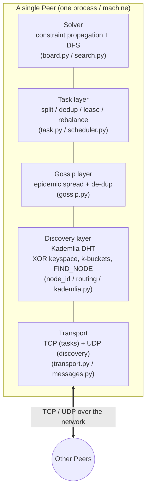
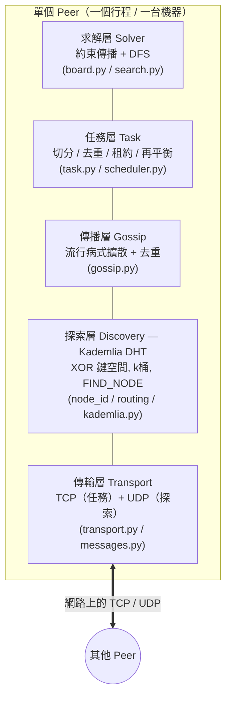

# SwarmSolve

> A decentralized peer-to-peer system for solving very large Sudoku puzzles
> (e.g. 16×16, 25×25). No central server: peers collaboratively explore
> different parts of the search tree in parallel.

**Languages / 语言 / 語言:** English (below) · [简体中文](#中文设计文档) · [繁體中文](#繁體中文設計文件) · code-level docs → [`docs/`](docs/README.md) ([EN](docs/architecture.en.md) · [简](docs/architecture.zh-CN.md) · [繁](docs/architecture.zh-TW.md))

---

## 1. The Idea

A large Sudoku is one giant **search tree** of partial states. A single machine
explores it depth-first; for 25×25 that tree can be huge. **SwarmSolve** cuts
the tree into **subtasks** and spreads them across many equal peers that talk
directly over the network. Three kinds of information flow between peers:

| Message | Meaning |
|---------|---------|
| **Open Task** | an unexplored region (subtree) of the search space |
| **Dead End** | a branch proven invalid → nobody should explore it again |
| **Solution** | the final valid grid → everyone can stop |

Sharing **dead ends** prunes everyone's work; sharing **open tasks** balances
the load; the first **solution** stops the swarm.

## 2. Architecture

Five layers, bottom-up. Each maps to a concept from the course.



| Layer | Responsibility | Course concept (highlight) |
|-------|----------------|----------------------------|
| Transport | message framing, TCP/UDP send/recv | Ch.2 (TCP, messaging) |
| **Discovery** | decentralized peer lookup & routing | **Ch.6 Kademlia** (XOR distance, k-buckets, iterative FIND_NODE) |
| Gossip | spread Open/Dead/Solution, de-dup, TTL | Ch.2 Gossip + Ch.7 probabilistic coverage |
| Task | split tree, dedup, fair placement, leases | Ch.5 load balancing + fault tolerance |
| Solver | constraint propagation + DFS | application core |

### The headline idea (our "wow" factor)

We reuse the **same Kademlia XOR keyspace** for **task IDs**. A subtask's path of
assignments (e.g. `cell12=4; cell37=9`) is hashed into a 160-bit key. The peers
**closest** to that key (XOR distance) are its natural owners. This gives us, for
free:

* **Structured placement** — work spreads deterministically, not randomly.
* **Deduplication** — the same subtask maps to the same owner everywhere.
* **Self-rebalancing** — when peers join/leave, ownership shifts smoothly.

So the DHT is not just "find a peer"; it is the backbone of fair task
distribution. That ties Ch.6 (Kademlia) directly to Ch.5 (balanced load).

## 3. How distributed solving works

```mermaid
sequenceDiagram
    participant S as Submitter peer
    participant A as Peer A
    participant B as Peer B
    Note over S,B: all peers already joined via Kademlia bootstrap
    S->>S: split root puzzle into a task frontier (BFS expand)
    S-->>A: gossip OPEN_TASK(s)
    S-->>B: gossip OPEN_TASK(s)
    A->>A: pick task closest to my ID, CLAIM (lease)
    B->>B: pick a different task, CLAIM (lease)
    A->>A: DFS subtree, hits contradiction
    A-->>B: gossip DEAD_END(path)
    B->>B: prune that subtree (skip it)
    B->>B: DFS subtree → SOLUTION found
    B-->>S: gossip SOLUTION
    B-->>A: gossip SOLUTION
    Note over S,A,B: everyone stops
```

1. **Submit** — one peer expands the root into a frontier of subtasks and
   gossips them as `OPEN_TASK`.
2. **Claim** — each peer picks the open task whose key it is *closest* to, and
   takes a **lease** (a time-boxed claim) announced via `TASK_CLAIM`.
3. **Explore** — it runs DFS on that subtree. Contradictions become `DEAD_END`
   messages; an exhausted subtree becomes `TASK_DONE`.
4. **Prune** — every peer that hears a `DEAD_END` skips that subtree.
5. **Finish** — the first peer to find a complete grid gossips `SOLUTION`; the
   `should_stop` hook stops everyone.

## 4. Fault tolerance

* **Leases**: a claim expires after `LEASE_SECONDS`. If a peer crashes mid-task,
  the lease lapses and [`Scheduler.reclaim_expired`](src/swarmsolve/tasks/scheduler.py)
  returns the task to the open pool → another peer redoes it.
* **Gossip robustness**: losing a few messages doesn't break correctness; dead
  ends and solutions keep re-propagating until everyone converges.
* **Kademlia churn tolerance**: k-buckets prefer long-lived peers, and lookups
  route around dead contacts.

## 5. Possible extension: jigsaw puzzles

The framework is puzzle-agnostic: anything expressible as *"a search tree split
into subtasks + dead-end pruning + first-solution-wins"* fits. For a jigsaw,
each **piece placement** is a branch; an invalid partial assembly is a dead end.
Only the `solver/` package changes; transport/discovery/gossip/tasks stay.

## 6. Tech stack & layout

* **Language**: Python 3.11+, `asyncio` for concurrency.
* **Package/deps**: [`uv`](https://docs.astral.sh/uv/).
* **CLI / output**: `typer` + `rich`.
* **Tests**: `pytest`.

```
SwarmSolve/
├── pyproject.toml            # uv project + deps
├── README.md
├── examples/puzzles/         # sample boards (9x9 easy/hard)
├── src/swarmsolve/
│   ├── transport/            # [A] messages.py, transport.py (TCP+UDP)
│   ├── discovery/            # [B] node_id.py, routing.py, kademlia.py
│   ├── gossip/               # [C] gossip.py
│   ├── tasks/                # [C]+[E] task.py, scheduler.py
│   ├── solver/               # [D] board.py, search.py
│   ├── puzzles.py            # load / generate puzzles
│   ├── peer.py               # [E] orchestration (ties all layers)
│   └── cli.py                # [E] gen/solve/demo/benchmark/dashboard/fault/peer
└── tests/                    # test_solver.py, test_dht.py
```

## 7. Quickstart

```bash
# 1. set up the environment
uv sync --extra dev

# 2. run the tests
uv run pytest -q

# 3. single-machine baseline
uv run swarmsolve solve examples/puzzles/hard_9x9.txt

# 4. generate a bigger puzzle
uv run swarmsolve gen --size 16 --out puzzle16.txt

# 5. REAL local swarm (separate OS processes over localhost) vs baseline
uv run swarmsolve demo --file puzzle16.txt --peers 4

# 6. [B] measurable speedup on an exhaustive search (count all solutions)
uv run swarmsolve benchmark --file examples/puzzles/hard_9x9.txt \
    --peers 4 --node-delay 0.0012 --split-depth 4

# 7. [A] fault tolerance: kill a peer mid-solve; its task gets reassigned
uv run swarmsolve fault --file examples/puzzles/hard_9x9.txt --peers 4 --kill-peer 2

# 8. [C] live dashboard of per-peer task counters
uv run swarmsolve dashboard --file examples/puzzles/hard_9x9.txt --peers 4 --node-delay 0.003

# 9. manual multi-terminal / multi-machine demo
#    terminal 1 (bootstrap + submitter):
uv run swarmsolve peer --port 9000 --file puzzle16.txt --submit
#    terminal 2..n (joiners):
uv run swarmsolve peer --port 9001 --file puzzle16.txt --bootstrap 127.0.0.1:9000
```

All of `demo`/`benchmark`/`fault`/`dashboard` spawn **real OS processes** talking
over real localhost sockets, so the CPU-bound search runs in parallel. See the
**code-level docs** in [`docs/`](docs/README.md) for what each command shows.
Note: first-*solution* search barely parallelizes (the answer sits on one deep
path), so use `benchmark` (exhaustive search) to see honest near-linear speedup.

## 8. Team split (5 members)

| # | Member | Owns | Key files | Deliverable |
|---|--------|------|-----------|-------------|
| A | **Transport** | message format, TCP+UDP I/O, serialization | `transport/` | reliable send/recv, wire schema |
| B | **Discovery (Kademlia)** | NodeID/XOR, k-buckets, FIND_NODE, bootstrap | `discovery/` | a peer can join & locate others |
| C | **Gossip + Task split** | epidemic spread, tree splitting, XOR placement, dedup | `gossip/`, `tasks/task.py` | tasks spread & deduplicated |
| D | **Solver engine** | board, constraint propagation, DFS, dead-end detection | `solver/` | fast subtree solving + pruning hooks |
| E | **Fault tolerance + Orchestration + Demo** | leases/rebalance, `Peer` glue, CLI, dashboard, tests | `tasks/scheduler.py`, `peer.py`, `cli.py` | end-to-end runnable swarm + measurements |

Interfaces are already stubbed so members can work in parallel against agreed
signatures (see the docstrings in each module).

## 9. MVP roadmap

* **M0 — Solver only** *(done)*: `solver/` + tests solve 9×9/16×16 locally; tree
  splitting works. Demonstrable with zero networking.
* **M1 — Two peers, one box**: transport + minimal gossip; peer B receives an
  OPEN_TASK from A and solves it. Proves the message path.
* **M2 — Kademlia discovery**: peers self-discover via bootstrap + FIND_NODE; no
  hard-coded peer lists.
* **M3 — Full swarm** *(done)*: XOR-based placement, dead-end pruning,
  work-stealing, first-solution stop + exhaustive `benchmark` with real speedup.
* **M4 — Fault tolerance** *(done)*: `swarmsolve fault` kills a peer mid-solve;
  lease expiry reassigns its task; the swarm still finishes.
* **M5 — Scale & polish** *(done)*: live dashboard; **deterministic exact mode**
  (single-owner + virtual nodes) → exact solution counts, **~2.55× on 4 peers,
  ~0 % duplicate work**; 25×25 generation + propagation solving. Metrics table &
  details in [`docs/`](docs/README.md) §14.
* **M6 (stretch)** — jigsaw extension reusing the same framework.

## 10. Design decisions & trade-offs

* **Kademlia (UDP) for discovery + TCP for tasks** — matches the brief's "TCP
  messages" for the heavy/reliable payloads while keeping discovery lightweight
  and churn-tolerant, exactly as Kademlia is used in practice (BitTorrent, IPFS).
* **MVP on 16×16 first** — same architecture as 25×25, but fast enough to iterate
  and demo; scaling up is just a parameter.
* **Work-stealing (`split_depth`)** — shallow tasks are re-split into finer
  OPEN_TASKs and re-gossiped, so the grain adapts to the swarm and idle peers get
  work. Deeper splitting balances load but adds duplicate work — a classic
  distributed-search trade-off (see [`docs/`](docs/README.md) §8).
* **Newline-delimited JSON on the wire** — readable for debugging/demo; can be
  swapped for msgpack without touching call sites.

---

# 中文设计文档

> 一个去中心化的 P2P 系统，用于求解超大数独（如 16×16、25×25）。没有中心服务器：
> 所有对等节点（peer）地位平等，并行探索搜索树的不同部分。

## 1. 核心思路

一个大数独本质上是一棵巨大的**搜索树**（所有部分填充状态构成）。单机用 DFS 探索
它，对 25×25 来说这棵树非常庞大。**SwarmSolve** 把这棵树切成若干**子任务**，分发
给许多地位平等、直接互联的节点。节点间流动三类信息：

| 消息 | 含义 |
|------|------|
| **Open Task（开放任务）** | 搜索空间中尚未探索的区域（子树） |
| **Dead End（死路）** | 已被证明无效的分支 → 任何人都不应再探索 |
| **Solution（解）** | 最终合法的完整数独 → 所有节点可停止 |

共享**死路**可裁剪所有节点的工作量（剪枝）；共享**开放任务**实现负载均衡；
第一个**解**让整个集群停止。

## 2. 系统架构

自底向上五层，每一层都对应一个课程知识点。


| 层 | 职责 | 对应课程亮点 |
|----|------|--------------|
| 传输 Transport | 消息封装、TCP/UDP 收发 | 第2章（TCP、消息） |
| **发现 Discovery** | 去中心化节点发现与路由 | **第6章 Kademlia**（XOR 距离、k桶、迭代 FIND_NODE） |
| 传播 Gossip | 扩散三类消息、去重、TTL 控制泛洪 | 第2章 Gossip + 第7章 概率覆盖思想 |
| 任务 Task | 切分树、去重、公平放置、租约 | 第5章 负载均衡 + 容错 |
| 求解 Solver | 约束传播 + DFS | 应用核心 |

### 最大亮点（我们的"wow"点）

我们把 **Kademlia 的 XOR 键空间**复用为**任务 ID 空间**。一个子任务的赋值路径
（如 `cell12=4; cell37=9`）被哈希成一个 160 位的 key，**XOR 距离最近**的节点就是
它天然的负责人。这样我们免费获得：

* **结构化放置**：任务确定性地分布，而非随机。
* **去重**：同一个子任务在任何节点都映射到同一负责人。
* **自再均衡**：节点上下线时，归属平滑迁移。

所以 DHT 不只是"找节点"，而是公平任务分发的骨架——这把第6章（Kademlia）和
第5章（负载均衡）直接打通了。

## 3. 分布式求解流程

```mermaid
sequenceDiagram
    participant S as 提交节点
    participant A as 节点 A
    participant B as 节点 B
    Note over S,B: 所有节点已通过 Kademlia bootstrap 加入网络
    S->>S: 把根数独切成任务前沿（BFS 展开）
    S-->>A: gossip OPEN_TASK
    S-->>B: gossip OPEN_TASK
    A->>A: 选择离自己 ID 最近的任务，CLAIM（租约）
    B->>B: 选择另一个任务，CLAIM（租约）
    A->>A: DFS 子树，遇到矛盾
    A-->>B: gossip DEAD_END(路径)
    B->>B: 裁剪该子树（跳过）
    B->>B: DFS 子树 → 找到 SOLUTION
    B-->>S: gossip SOLUTION
    B-->>A: gossip SOLUTION
    Note over S,A,B: 所有节点停止
```

1. **提交**：一个节点把根展开成子任务前沿，以 `OPEN_TASK` 广播。
2. **认领**：每个节点选取 key 离自己最近的开放任务，取得**租约**（带时限的认领），
   通过 `TASK_CLAIM` 通告。
3. **探索**：对该子树执行 DFS。矛盾 → `DEAD_END`；子树穷尽 → `TASK_DONE`。
4. **剪枝**：任何收到 `DEAD_END` 的节点跳过该子树。
5. **结束**：第一个找到完整解的节点广播 `SOLUTION`，`should_stop` 钩子让所有节点停止。

## 4. 容错机制

* **租约（Lease）**：认领在 `LEASE_SECONDS` 后过期。若节点中途崩溃，租约失效，
  [`Scheduler.reclaim_expired`](src/swarmsolve/tasks/scheduler.py) 把任务放回开放池
  → 由其他节点重做。
* **Gossip 鲁棒性**：丢几条消息不影响正确性；死路与解会持续重传直到全网收敛。
* **Kademlia 抗抖动**：k桶偏好长寿节点，查找会绕过失效联系人。

## 5. 可能的扩展：拼图（Jigsaw）

框架与具体谜题无关：凡是能表达为"搜索树切分子任务 + 死路剪枝 + 首解即停"的问题
都适配。对拼图而言，每次**拼块放置**是一个分支，非法的局部拼装就是死路。
只需替换 `solver/` 包，传输/发现/传播/任务层完全复用。

## 6. 技术栈与目录

* **语言**：Python 3.11+，并发用 `asyncio`。
* **包管理**：[`uv`](https://docs.astral.sh/uv/)。
* **命令行/展示**：`typer` + `rich`。
* **测试**：`pytest`。

目录结构见上方英文部分第 6 节（方括号标注了负责人 A–E）。

## 7. 快速开始

```bash
uv sync --extra dev                                   # 安装环境
uv run pytest -q                                      # 跑测试
uv run swarmsolve solve examples/puzzles/hard_9x9.txt # 单机基线
uv run swarmsolve gen --size 16 --out puzzle16.txt    # 生成 16x16 题目
uv run swarmsolve demo --file puzzle16.txt --peers 4  # 真实本地集群 vs 基线

# [B] 穷举搜索（统计所有解）上的可测量加速
uv run swarmsolve benchmark --file examples/puzzles/hard_9x9.txt \
    --peers 4 --node-delay 0.0012 --split-depth 4
# [A] 容错：求解中途杀掉一个节点，其任务被自动重分配
uv run swarmsolve fault --file examples/puzzles/hard_9x9.txt --peers 4 --kill-peer 2
# [C] 各节点任务计数的实时仪表盘
uv run swarmsolve dashboard --file examples/puzzles/hard_9x9.txt --peers 4 --node-delay 0.003
```

多终端/多机手动演示：
```bash
# 终端 1（引导节点 + 提交者）
uv run swarmsolve peer --port 9000 --file puzzle16.txt --submit
# 终端 2..n（加入者）
uv run swarmsolve peer --port 9001 --file puzzle16.txt --bootstrap 127.0.0.1:9000
```

`demo`/`benchmark`/`fault`/`dashboard` 都会启动**真实的多个进程**，通过本机真实
socket 通信，因此 CPU 密集的搜索是真正并行的。**注意**：首*解*搜索几乎无法并行
（解位于一条深路径上），因此请用 `benchmark`（穷举搜索）来观察诚实的近线性加速。
代码级三语详解见 [`docs/`](docs/README.md)。

## 8. 五人分工

| # | 成员 | 负责模块 | 关键文件 | 交付物 |
|---|------|----------|----------|--------|
| A | **传输层** | 消息格式、TCP+UDP 收发、序列化 | `transport/` | 可靠收发 + 线上协议 |
| B | **发现层（Kademlia）** | NodeID/XOR、k桶、FIND_NODE、bootstrap | `discovery/` | 节点能加入并定位他人 |
| C | **Gossip + 任务切分** | 流行病扩散、树切分、XOR 放置、去重 | `gossip/`、`tasks/task.py` | 任务扩散且去重 |
| D | **求解引擎** | 棋盘、约束传播、DFS、死路检测 | `solver/` | 高效子树求解 + 剪枝钩子 |
| E | **容错 + 编排 + 演示** | 租约/再均衡、`Peer` 粘合、CLI、dashboard、测试 | `tasks/scheduler.py`、`peer.py`、`cli.py` | 端到端可跑的集群 + 度量 |

各模块接口已写好桩（见每个模块的 docstring），成员可按约定签名并行开发。

## 9. MVP 路线图

* **M0 — 仅求解器**（已完成）：`solver/` + 测试可本地求解 9×9/16×16；树切分可用。
  无需任何网络即可演示。
* **M1 — 两节点单消息**：传输 + 最简 gossip；B 收到 A 的 OPEN_TASK 并求解，打通消息链路。
* **M2 — Kademlia 发现**：节点经 bootstrap + FIND_NODE 自发现，无需硬编码节点表。
* **M3 — 完整集群**（已完成）：基于 XOR 的放置、死路剪枝、工作窃取、首解即停，
  以及 `benchmark` 穷举搜索的真实加速。
* **M4 — 容错**（已完成）：`swarmsolve fault` 求解中途杀掉一个节点；租约过期重分配
  其任务；集群仍能完成。
* **M5 — 规模与打磨**（已完成）：实时 dashboard；**确定性精确模式**（单一负责人 +
  虚拟节点）→ 解计数精确、**4 节点 ~2.55×、约 0% 重复工作**；25×25 生成 + 约束传播求解。
  度量表与细节见 [`docs/`](docs/README.md) 第 14 节。
* **M6（挑战）** — 复用同一框架实现拼图扩展。

## 10. 设计取舍

* **发现用 Kademlia（UDP）+ 任务用 TCP**：既满足作业"TCP 消息"传重要/可靠负载，
  又让发现轻量、抗抖动——正是 Kademlia 在工业界（BitTorrent、IPFS）的用法。
* **MVP 先做 16×16**：架构与 25×25 完全一致，但迭代/演示更快；放大只是改参数。
* **工作窃取（`split_depth`）**：浅任务会被再切分成更细的 OPEN_TASK 并重新 gossip，
  使粒度自适应集群、让空闲节点有活干。切得越深负载越均衡但重复工作越多——这是分布式
  搜索的经典权衡（详见 [`docs/`](docs/README.md) 第 8 节）。
* **线上用换行分隔 JSON**：便于调试/演示；可无痛替换为 msgpack。

---

# 繁體中文設計文件

> 一個去中心化的 P2P 系統，用於求解超大數獨（如 16×16、25×25）。沒有中央伺服器：
> 所有對等節點（peer）地位平等，並行探索搜尋樹的不同部分。

## 1. 核心思路

一個大數獨本質上是一棵巨大的**搜尋樹**（由所有部分填充狀態構成）。單機以 DFS 探索
它，對 25×25 而言這棵樹非常龐大。**SwarmSolve** 把這棵樹切成若干**子任務**，分發
給許多地位平等、直接互聯的節點。節點間流動三類資訊：

| 訊息 | 含義 |
|------|------|
| **Open Task（開放任務）** | 搜尋空間中尚未探索的區域（子樹） |
| **Dead End（死路）** | 已被證明無效的分支 → 任何人都不應再探索 |
| **Solution（解）** | 最終合法的完整數獨 → 所有節點可停止 |

共享**死路**可裁剪所有節點的工作量（剪枝）；共享**開放任務**達成負載平衡；
第一個**解**讓整個叢集停止。

## 2. 系統架構

由下而上五層，每一層都對應一個課程知識點。



| 層 | 職責 | 對應課程亮點 |
|----|------|--------------|
| 傳輸 Transport | 訊息封裝、TCP/UDP 收發 | 第2章（TCP、訊息） |
| **探索 Discovery** | 去中心化節點發現與路由 | **第6章 Kademlia**（XOR 距離、k桶、迭代 FIND_NODE） |
| 傳播 Gossip | 擴散三類訊息、去重、TTL 控制氾濫 | 第2章 Gossip + 第7章 機率覆蓋思想 |
| 任務 Task | 切分樹、去重、公平放置、租約 | 第5章 負載平衡 + 容錯 |
| 求解 Solver | 約束傳播 + DFS | 應用核心 |

### 最大亮點（我們的「wow」點）

我們把 **Kademlia 的 XOR 鍵空間**重用為**任務 ID 空間**。一個子任務的賦值路徑
（如 `cell12=4; cell37=9`）被雜湊成一個 160 位元的 key，**XOR 距離最近**的節點就是
它天然的負責人。如此我們免費獲得：

* **結構化放置**：任務確定性地分佈，而非隨機。
* **去重**：同一個子任務在任何節點都對應到同一負責人。
* **自再平衡**：節點上下線時，歸屬平滑遷移。

所以 DHT 不只是「找節點」，而是公平任務分發的骨幹——這把第6章（Kademlia）與
第5章（負載平衡）直接打通了。

## 3. 分散式求解流程

```mermaid
sequenceDiagram
    participant S as 提交節點
    participant A as 節點 A
    participant B as 節點 B
    Note over S,B: 所有節點已透過 Kademlia bootstrap 加入網路
    S->>S: 把根數獨切成任務前沿（BFS 展開）
    S-->>A: gossip OPEN_TASK
    S-->>B: gossip OPEN_TASK
    A->>A: 選擇離自己 ID 最近的任務，CLAIM（租約）
    B->>B: 選擇另一個任務，CLAIM（租約）
    A->>A: DFS 子樹，遇到矛盾
    A-->>B: gossip DEAD_END(路徑)
    B->>B: 裁剪該子樹（跳過）
    B->>B: DFS 子樹 → 找到 SOLUTION
    B-->>S: gossip SOLUTION
    B-->>A: gossip SOLUTION
    Note over S,A,B: 所有節點停止
```

1. **提交**：一個節點把根展開成子任務前沿，以 `OPEN_TASK` 廣播。
2. **認領**：每個節點選取 key 離自己最近的開放任務，取得**租約**（有時限的認領），
   透過 `TASK_CLAIM` 通告。
3. **探索**：對該子樹執行 DFS。矛盾 → `DEAD_END`；子樹窮盡 → `TASK_DONE`。
4. **剪枝**：任何收到 `DEAD_END` 的節點跳過該子樹。
5. **結束**：第一個找到完整解的節點廣播 `SOLUTION`，`should_stop` 掛勾讓所有節點停止。

## 4. 容錯機制

* **租約（Lease）**：認領在 `LEASE_SECONDS` 後過期。若節點中途崩潰，租約失效，
  [`Scheduler.reclaim_expired`](src/swarmsolve/tasks/scheduler.py) 把任務放回開放池
  → 由其他節點重做。
* **Gossip 韌性**：掉幾則訊息不影響正確性；死路與解會持續重傳直到全網收斂。
* **Kademlia 抗抖動**：k桶偏好長壽節點，查找會繞過失效聯絡人。

## 5. 可能的擴充：拼圖（Jigsaw）

框架與具體謎題無關：凡能表達為「搜尋樹切分子任務 + 死路剪枝 + 首解即停」的問題
皆適用。對拼圖而言，每次**拼塊放置**是一個分支，非法的局部拼裝就是死路。
只需替換 `solver/` 套件，傳輸/探索/傳播/任務層完全重用。

## 6. 技術棧與目錄

* **語言**：Python 3.11+，並行採用 `asyncio`。
* **套件管理**：[`uv`](https://docs.astral.sh/uv/)。
* **命令列/展示**：`typer` + `rich`。
* **測試**：`pytest`。

目錄結構見上方英文部分第 6 節（方括號標註了負責人 A–E）。

## 7. 快速開始

```bash
uv sync --extra dev                                   # 安裝環境
uv run pytest -q                                      # 跑測試
uv run swarmsolve solve examples/puzzles/hard_9x9.txt # 單機基準
uv run swarmsolve gen --size 16 --out puzzle16.txt    # 產生 16x16 題目
uv run swarmsolve demo --file puzzle16.txt --peers 4  # 真實本地叢集 vs 基準

# [B] 窮舉搜尋（統計所有解）上的可量測加速
uv run swarmsolve benchmark --file examples/puzzles/hard_9x9.txt \
    --peers 4 --node-delay 0.0012 --split-depth 4
# [A] 容錯：求解中途殺掉一個節點，其任務被自動重分配
uv run swarmsolve fault --file examples/puzzles/hard_9x9.txt --peers 4 --kill-peer 2
# [C] 各節點任務計數的即時儀表板
uv run swarmsolve dashboard --file examples/puzzles/hard_9x9.txt --peers 4 --node-delay 0.003
```

多終端機/多機手動演示：
```bash
# 終端機 1（引導節點 + 提交者）
uv run swarmsolve peer --port 9000 --file puzzle16.txt --submit
# 終端機 2..n（加入者）
uv run swarmsolve peer --port 9001 --file puzzle16.txt --bootstrap 127.0.0.1:9000
```

`demo`/`benchmark`/`fault`/`dashboard` 都會啟動**真實的多個行程**，透過本機真實
socket 通訊，因此 CPU 密集的搜尋是真正並行的。**注意**：首*解*搜尋幾乎無法並行
（解位於一條深路徑上），因此請用 `benchmark`（窮舉搜尋）來觀察誠實的近線性加速。
程式碼層級三語詳解見 [`docs/`](docs/README.md)。

## 8. 五人分工

| # | 成員 | 負責模組 | 關鍵檔案 | 交付物 |
|---|------|----------|----------|--------|
| A | **傳輸層** | 訊息格式、TCP+UDP 收發、序列化 | `transport/` | 可靠收發 + 線上協定 |
| B | **探索層（Kademlia）** | NodeID/XOR、k桶、FIND_NODE、bootstrap | `discovery/` | 節點能加入並定位他人 |
| C | **Gossip + 任務切分** | 流行病擴散、樹切分、XOR 放置、去重 | `gossip/`、`tasks/task.py` | 任務擴散且去重 |
| D | **求解引擎** | 棋盤、約束傳播、DFS、死路偵測 | `solver/` | 高效子樹求解 + 剪枝掛勾 |
| E | **容錯 + 編排 + 演示** | 租約/再平衡、`Peer` 黏合、CLI、儀表板、測試 | `tasks/scheduler.py`、`peer.py`、`cli.py` | 端到端可跑的叢集 + 量測 |

各模組介面已寫好樁（見每個模組的 docstring），成員可依約定簽名並行開發。

## 9. MVP 路線圖

* **M0 — 僅求解器**（已完成）：`solver/` + 測試可本地求解 9×9/16×16；樹切分可用。
  無需任何網路即可演示。
* **M1 — 兩節點單訊息**：傳輸 + 最簡 gossip；B 收到 A 的 OPEN_TASK 並求解，打通訊息鏈路。
* **M2 — Kademlia 探索**：節點經 bootstrap + FIND_NODE 自發現，無需硬編碼節點表。
* **M3 — 完整叢集**（已完成）：基於 XOR 的放置、死路剪枝、工作竊取、首解即停，
  以及 `benchmark` 窮舉搜尋的真實加速。
* **M4 — 容錯**（已完成）：`swarmsolve fault` 求解中途殺掉一個節點；租約過期重分配
  其任務；叢集仍能完成。
* **M5 — 規模與打磨**（已完成）：即時 dashboard；**確定性精確模式**（單一負責人 +
  虛擬節點）→ 解計數精確、**4 節點 ~2.55×、約 0% 重複工作**；25×25 生成 + 約束傳播求解。
  量測表與細節見 [`docs/`](docs/README.md) 第 14 節。
* **M6（挑戰）** — 重用同一框架實作拼圖擴充。

## 10. 設計取捨

* **探索用 Kademlia（UDP）+ 任務用 TCP**：既滿足作業「TCP 訊息」傳重要/可靠負載，
  又讓探索輕量、抗抖動——正是 Kademlia 在工業界（BitTorrent、IPFS）的用法。
* **MVP 先做 16×16**：架構與 25×25 完全一致，但迭代/演示更快；放大只是改參數。
* **工作竊取（`split_depth`）**：淺任務會被再切分成更細的 OPEN_TASK 並重新 gossip，
  使粒度自適應叢集、讓閒置節點有事可做。切得越深負載越平衡但重複工作越多——這是分散式
  搜尋的經典取捨（詳見 [`docs/`](docs/README.md) 第 8 節）。
* **線上用換行分隔 JSON**：便於除錯/演示；可無痛替換為 msgpack。
