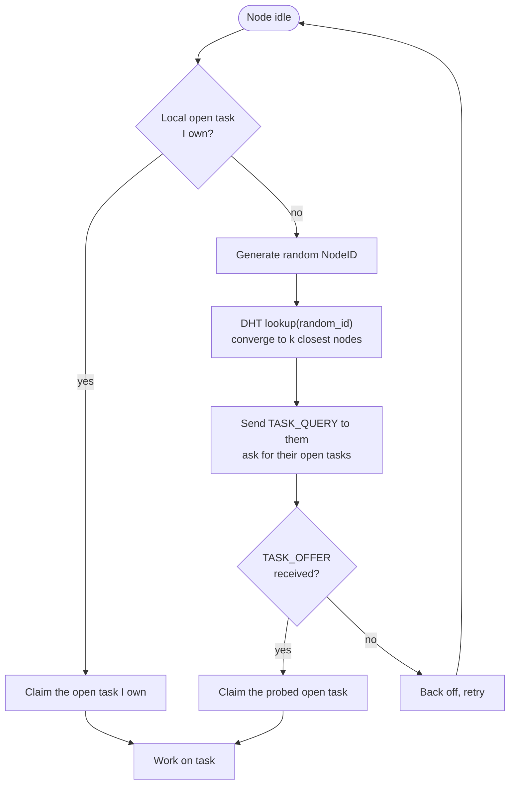
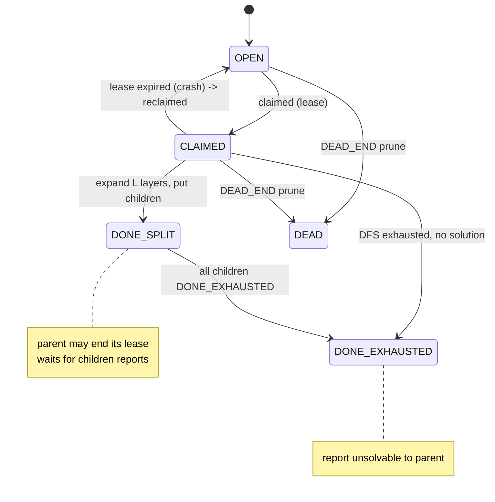
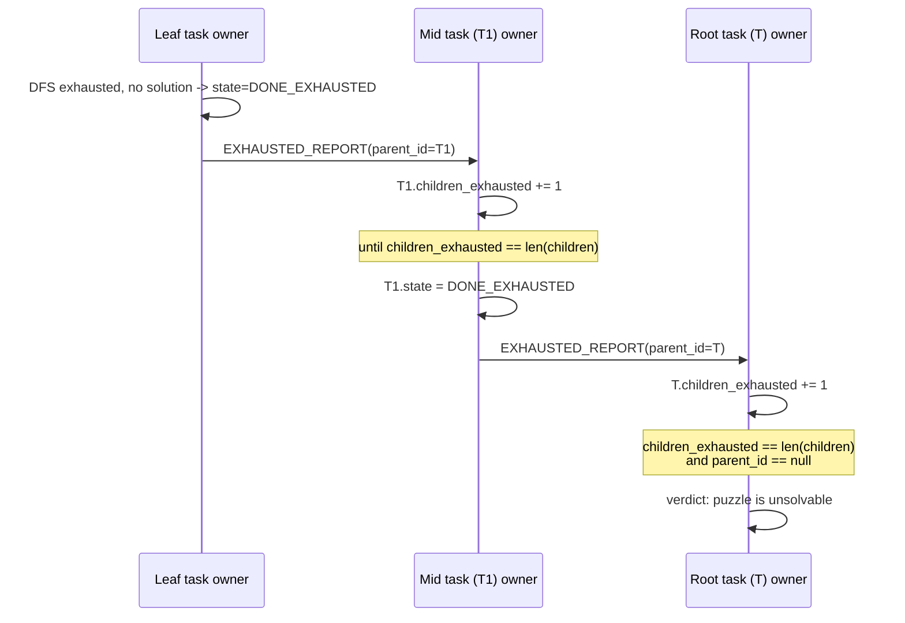
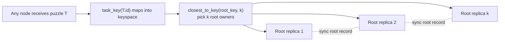
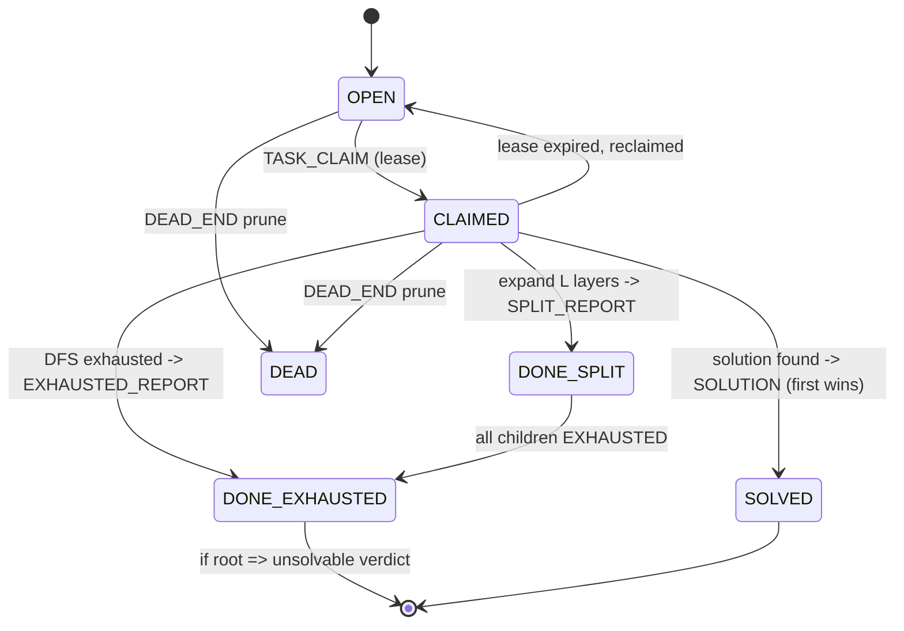
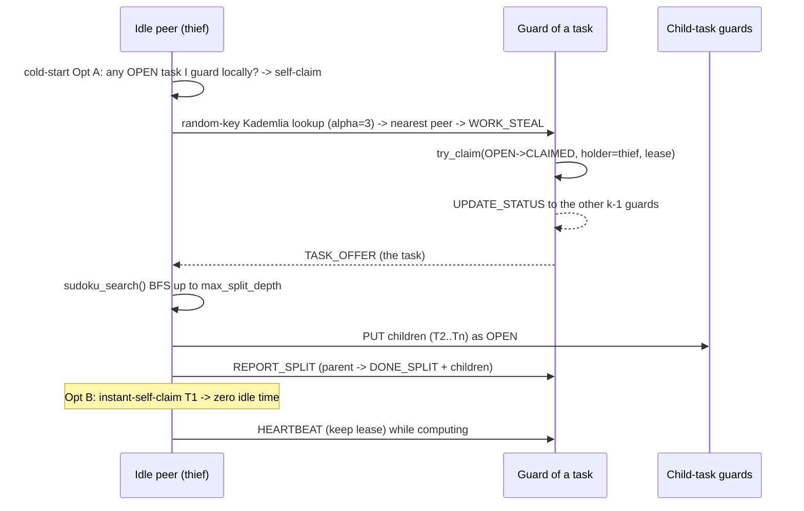

# SwarmSolve — Optimization Design (English)

> This document proposes three enhancements over the current implementation:
> 1. **Random-ID probing & cold start** (task discovery moves from "passively waiting" to "actively pulling").
> 2. **Unsolvable detection** (split `DONE` into `DONE_SPLIT` / `DONE_EXHAUSTED`, and aggregate "exhausted" bottom-up).
> 3. **Replicated root task** (remove the single point at the submitter; k nodes jointly own the root task).
>
> Languages: English (this file) · [简体中文](optimizations.zh-CN.md)
> Related: [Architecture](architecture.en.md) · [Docs index](README.md) · [Project README](../README.md)

---

## ✅ Implementation status & usage (shipped)

This design is implemented in code as **opt-in switches** (off by default → the
existing `demo/benchmark/fault` behavior is unchanged).

| Optimization | Switch / entry point | Code location |
|--------------|----------------------|---------------|
| Random-ID probing + self-claim after split | `Peer(probe_random=True)` | [`peer.py`](../src/swarmsolve/peer.py) `_probe_for_tasks` / `_handle_pull` |
| **Fine-grained work stealing (stealable deque)** | `Peer(steal=True)` / `swarmsolve demo --steal` | [`peer.py`](../src/swarmsolve/peer.py) `_work_on_stealing` / `_steal_from_deque` |
| **Search-space estimation (steal priority)** | built into steal (`steal_scan` window) | [`search.py`](../src/swarmsolve/solver/search.py) `estimate_subtree_size` / `estimate_board_size` |
| **Periodic state sync (crash recovery)** | `Peer(sync_interval=s)` / `swarmsolve demo --sync-interval` | [`peer.py`](../src/swarmsolve/peer.py) `_sync_state` / `_on_state_sync`; recovery in `_pick_task` |
| Unsolvable detection (DONE_SPLIT/DONE_EXHAUSTED + bottom-up) | `Peer(detect_unsolvable=True)` | [`peer.py`](../src/swarmsolve/peer.py) `_work_on_unsolvable` / `_on_exhausted_report` |
| Replicated root task | `Peer(root_replicas=k)` | [`peer.py`](../src/swarmsolve/peer.py) `_submit_root` / `_replicate_split` |
| New states & fields | `DONE_SPLIT`/`DONE_EXHAUSTED`, `children`/`children_exhausted`/`parent_id` | [`task.py`](../src/swarmsolve/tasks/task.py) |
| Aggregation bookkeeping | `mark_split`/`mark_exhausted`/`note_child_exhausted` (idempotent) | [`scheduler.py`](../src/swarmsolve/tasks/scheduler.py) |
| New messages | `TASK_QUERY`/`TASK_OFFER`/`SPLIT_REPORT`/`EXHAUSTED_REPORT` | [`messages.py`](../src/swarmsolve/transport/messages.py) |
| Unsolvable puzzle generator (verified via `solve_local`) | `make_unsolvable(n, seed, clue_ratio)` | [`puzzles.py`](../src/swarmsolve/puzzles.py) |

**One-shot end-to-end demos** (real multi-process sockets, auto cross-check the
single-machine baseline):

```bash
# unsolvable detection
uv run swarmsolve unsolvable --peers 4 --split-depth 3

# fine-grained work-stealing speedup comparison
uv run swarmsolve demo --file examples/puzzles/hard_9x9.txt --peers 4 --node-delay 0.002 --steal
```

Unsolvable demo: each peer independently reaches the `UNSOLVABLE` verdict and
confirms "verdict matches single-machine baseline"; the declaring peer fans the
verdict out over the SOLUTION termination link so the whole swarm stops quickly.

Work-stealing demo (`hard_9x9`, 4 peers, measured): **without `--steal` ~1.03×
speedup; with `--steal` ~4.04× (near-linear)**, and total explored nodes drop
from ~8484 to ~4072 (less duplicate work).

> **Honest note**: `make_unsolvable` corrupts a single clue, so constraint
> propagation usually finds the contradiction in 1–2 steps → the demo boards
> have shallow search trees (they validate *mechanism correctness*, not search
> scale). Constructing *deep* unsolvable boards is a separate hard problem, out
> of scope here. The core mechanism (bottom-up `DONE_EXHAUSTED` aggregation →
> root verdict) is covered by [`tests/test_optimizations.py`](../tests/test_optimizations.py).

### How fine-grained work stealing works (Chord-style, fused into the Kademlia backbone)

- **Stealable deque**: a busy peer no longer uses recursive DFS (whose branches
  are locked in the call stack and can't be handed out). It keeps the frontier
  of unexplored paths in an explicit `deque`; the owner works the **tail** (LIFO
  -> depth-first, good locality) while a thief steals from the **head** (the
  shallowest, coarsest-grained branch).
- **Zero duplication**: a stolen branch is **removed** from the deque, so the
  owner never explores it and the thief owns it exclusively.
- **Interruptible compute**: the DFS `await`s (yields to the event loop) every
  `steal_yield_every` nodes (or every `node_delay`), so `TASK_QUERY` requests
  can be served *while* we compute — essential under single-threaded asyncio.
- **Reuses the pull channel**: the thief is simply an idle peer's `probe_random`
  `TASK_QUERY`; the owner, in [`_handle_pull`](../src/swarmsolve/peer.py), prefers
  to steal a branch from its deque and returns it as `TASK_OFFER`. This is
  exactly "**coarse-grained gossip (initial scatter) + fine-grained work
  stealing (dynamic rebalancing)**" realized.

### Search-space estimation (steal priority)

- **Estimator**: [`estimate_subtree_size`](../src/swarmsolve/solver/search.py)
  returns the *log-size* of a subtree — the sum of `log2(#candidates)` over
  unsolved cells (the log of the naive product of branching factors; bigger =
  heavier). Dependency-free, comparable, cheap.
- **Use**: when stealing, instead of blindly taking the deque head, we estimate
  each branch in the head `steal_scan` window and hand out the **heaviest** one
  ([`_steal_from_deque`](../src/swarmsolve/peer.py)), so load flows toward where
  the real work is — mitigating the uneven Sudoku search tree.
- The API can also guide split points (future reuse in `seed_frontier`/split).

### Periodic state sync (crash recovery)

- **Snapshot**: every `sync_interval` seconds a busy peer sends its current
  deque (unexplored frontier paths) as a point-to-point `STATE_SYNC` to the
  task's backup peers (`closest_to_key(task.key, root_replicas)`,
  [`_sync_state`](../src/swarmsolve/peer.py)).
- **Backup**: a backup peer stores the latest snapshot via
  [`record_backup`](../src/swarmsolve/tasks/scheduler.py) in
  [`_on_state_sync`](../src/swarmsolve/peer.py).
- **Recovery**: when a lease expires ([`reclaim_expired`](../src/swarmsolve/tasks/scheduler.py)),
  [`_pick_task`](../src/swarmsolve/peer.py) checks for a backup frontier — if
  present, it **resumes branch-by-branch from the snapshot** (fine-grained)
  rather than redoing the whole subtree as one coarse task. **Only the sync
  window's progress is lost**, sharply cutting post-crash duplicate work —
  exactly the Chord plan's "periodic sync to a backup, accept loss within the
  sync window".

---

## 0. Baseline: what the code does today

Before optimizing, pin down the actual behavior so proposals stay grounded in the implementation.

### 0.1 Task distribution is gossip push

- The submitter BFS-expands the root into a task frontier in [`submit`](../src/swarmsolve/peer.py), then broadcasts each as `OPEN_TASK` via [`_route_open_task`](../src/swarmsolve/peer.py) → [`Gossip.broadcast`](../src/swarmsolve/gossip/gossip.py).
- Idle peers **passively wait** for `OPEN_TASK` in the [`run`](../src/swarmsolve/peer.py) work loop, then [`_pick_task`](../src/swarmsolve/peer.py) selects the XOR-closest task from the local open pool.
- In `exclusive` mode, [`_route_open_task`](../src/swarmsolve/peer.py) delivers the task **straight to its single owner over TCP** (`put(task -> owner)`), so that owner accumulates the open tasks it is responsible for in its local `scheduler.open`.

### 0.2 Only four task states

[`TaskStatus`](../src/swarmsolve/tasks/task.py) currently is:

| State | Meaning |
|-------|---------|
| `OPEN` | not yet claimed |
| `CLAIMED` | leased by a peer, in progress |
| `DONE` | fully explored, no solution inside |
| `DEAD` | proven contradictory (pruned) |

[`Task`](../src/swarmsolve/tasks/task.py) has only `path / status / owner / lease_expires` — **no parent/child links** (`children` / `parent_id`), so the fact "this branch is exhausted / unsolvable" cannot be reported up the tree.

### 0.3 DHT capability is ready but unused for discovery

[`KademliaNode`](../src/swarmsolve/discovery/kademlia.py) already provides:

- [`lookup(target)`](../src/swarmsolve/discovery/kademlia.py): iterative `FIND_NODE` that converges to the k closest nodes for **any target** (including a random ID);
- [`closest_to_key(key, count)`](../src/swarmsolve/discovery/kademlia.py) / [`is_responsible_for(key, replicas)`](../src/swarmsolve/discovery/kademlia.py): "who owns this key".

But there is **no** RPC to "ask a node for the open tasks it owns"; discovery relies entirely on gossip push.

### 0.4 The four resulting problems

| # | Problem | Root cause |
|---|---------|-----------|
| P1 | **Slow cold start**: few tasks early on; idle nodes can't find nodes that have tasks | pure push; idle nodes wait passively |
| P2 | **Re-discovery after finishing**: a node that finishes a task must wait for the next push | no active pull channel |
| P3 | **Cannot decide unsolvable**: if the puzzle truly has no solution, nothing can conclude "unsolvable" | `DONE` is one flat meaning; tasks lack parent/child links |
| P4 | **Root single point**: if the submitter crashes, no one can aggregate the unsolvable verdict | the root task is held by a single submitter |

The three optimizations below address P1+P2, P3, and P4 respectively.

---

## 1. Optimization 1: Random-ID probing & cold start

### 1.1 Goal

Upgrade task discovery from "passively await push" to "**first claim the open tasks I own; if none, probe with a random ID**", and when splitting into subtasks, **claim one subtask right away** to avoid re-probing after every finished task.

### 1.2 Core idea

Add two pull channels that coexist with (and complement) the existing gossip push:



### 1.3 Point A: prefer claiming tasks "I own"

**Problem**: at cold start there are few tasks swarm-wide, so random probing rarely hits.

**Solution**: when idle, **first look in the local open pool for tasks where I am the owner (XOR-closest)** and claim directly; only fall back to random-ID probing if none exist locally.

This is especially natural in `exclusive` + `put(task->owner)` mode: an owner already accumulates the open tasks it owns locally, so pulling from local memory has a 100% hit rate and zero network round-trips.

In code, [`_pick_task`](../src/swarmsolve/peer.py) already has the seed of "pick the XOR-closest local task". The optimization promotes it to **first priority**, and enters the probing branch only when it returns `None` (no owned task locally).

### 1.4 Point B: Random-ID probing

**Problem**: with no local task, how do we find a node that *does* have tasks?

**Solution**:

1. Generate a `NodeID.random()` (already in [`node_id.py`](../src/swarmsolve/discovery/node_id.py));
2. Call [`lookup(random_id)`](../src/swarmsolve/discovery/kademlia.py) to converge to the k nodes near that random key;
3. Send a **new** `TASK_QUERY` message to them; a queried node replies `TASK_OFFER` with claimable open tasks it holds (optionally a few candidates);
4. The prober runs the normal claim flow on a candidate (`TASK_CLAIM` + lease).

> Why random ID rather than a fixed scan? A random ID makes different idle nodes probe **different regions** of the keyspace, naturally spreading load and avoiding a stampede toward one "hot" owner.

### 1.5 Point C: self-claim after splitting, avoiding a second probe

**Problem**: after a node finishes a task (especially after re-splitting it into subtasks and `put`-ing them out), it becomes idle again and must re-probe, wasting a round-trip.

**Solution**: when a node `put`s the subtasks, it **directly claims one of them**, sliding straight into the next unit of work without another random-ID probe.

This maps to the work-stealing branch in [`_work_on`](../src/swarmsolve/peer.py) that re-splits a shallow task and calls `_route_open_task`: the optimization keeps **one child for itself** to `claim_local` and continue DFS, and only `put`s/gossips the remaining children.

### 1.6 Change summary

| Layer | Change |
|-------|--------|
| [`messages.py`](../src/swarmsolve/transport/messages.py) | add `TASK_QUERY`, `TASK_OFFER` to `MessageType` |
| [`kademlia.py`](../src/swarmsolve/discovery/kademlia.py) | reuse `lookup(NodeID.random())` for probing (no new method) |
| [`scheduler.py`](../src/swarmsolve/tasks/scheduler.py) | add "take a local claimable open task I own" and "expose an offerable open task" APIs |
| [`peer.py`](../src/swarmsolve/peer.py) | `run` loop: "local-first → random probe" branch; handle `TASK_QUERY`/`TASK_OFFER`; self-claim one child after splitting |

---

## 2. Optimization 2: Unsolvable detection (DONE_SPLIT / DONE_EXHAUSTED)

### 2.1 Goal

Let the swarm **deterministically decide a puzzle is unsolvable**: split `DONE` into two meanings, and aggregate "branch exhausted / unsolvable" **bottom-up along the task tree**, until the root task's owner concludes "unsolvable".

### 2.2 State machine extension

Split the single `DONE` into two states:

| New state | Meaning | Trigger |
|-----------|---------|---------|
| `DONE_SPLIT` | task was expanded L layers into children; itself needs no more exploration | after the owner splits into `children` and `put`s them |
| `DONE_EXHAUSTED` | this branch was exhaustively searched, **no solution inside** | owner's DFS bottoms out, finds no solution, and has no children |



> `DONE_SPLIT` tells the parent "I'm expanded, you may end my lease"; `DONE_EXHAUSTED` reports "this branch is exhausted (unsolvable)". A found solution still follows the existing `SOLUTION` first-solution-wins path and never enters these two states.

### 2.3 Task metadata extension

Add these fields to [`Task`](../src/swarmsolve/tasks/task.py) (and into `to_dict` / `from_dict`):

| Field | Type | Meaning |
|-------|------|---------|
| `children` | `list[str]` | child task ids (`[]` = leaf) |
| `children_exhausted` | `int` | count of children that reported `DONE_EXHAUSTED` |
| `parent_id` | `str \| None` | parent task id (`None` for the root) |
| `holder` | `str \| None` | current claimant NodeID (reuse existing `owner`) |
| `lease_expire` | `float` | lease expiry (reuse existing `lease_expires`) |

Core invariants of unsolvable detection:

```
if task.state == DONE_SPLIT and task.children_exhausted == len(task.children)
    -> mark task itself DONE_EXHAUSTED and report to task.parent_id

if task.state == DONE_EXHAUSTED and task.parent_id == null
    -> the root is unsolvable  =>  the whole puzzle is unsolvable
```

### 2.4 Bottom-up aggregation flow



### 2.5 Worked example (matching the requirements)

Below reproduces the T → T1 → T11 three-level example from the requirements. Convention: each task is jointly owned by k nodes (replication, see Optimization 3), kept consistent via synchronization.

**Step 1: P1 receives puzzle T, expands L layers into T1/T2/T3, PUTs them**

P1 records (root, already split):

```
T.id = T_id
T.children = [T1, T2, T3]
T.children_exhausted = 0
T.state = DONE_SPLIT
T.parent_id = null
T.holder = null
T.lease_expire = null
```

Owners of T1 (P2/P3/P4) record (a newly open child):

```
T1.id = T1_id
T1.children = []
T1.children_exhausted = 0
T1.state = OPEN
T1.parent_id = T_id
T1.holder = null
T1.lease_expire = null
```

**Step 2: P5 finds P2 via random ID, learns T1 is OPEN, claims T1 successfully**

P2/P3/P4 (after sync) record:

```
T1.id = T1_id
T1.children = []
T1.children_exhausted = 0
T1.state = CLAIMED
T1.parent_id = T_id
T1.holder = P5_id
T1.lease_expire = T1_expiry
```

**Step 3: P5 expands T1 L layers into T11/T12/T13, PUTs them, tells T1's owners "split done" with the child list**

P2/P3/P4 (after sync) record:

```
T1.id = T1_id
T1.children = [T11, T12, T13]
T1.children_exhausted = 0
T1.state = DONE_SPLIT
T1.parent_id = T_id
T1.holder = null
T1.lease_expire = null
```

Owners of T11 (P6/P7/P8) record:

```
T11.id = T11_id
T11.children = []
T11.children_exhausted = 0
T11.state = OPEN
T11.parent_id = T1_id
T11.holder = null
T11.lease_expire = null
```

**Step 4: P9 pulls T11 (OPEN→CLAIMED omitted), finds the branch unsolvable, tells T11's owners "exhausted"**

P6/P7/P8 (after sync) record:

```
T11.id = T11_id
T11.children = []
T11.children_exhausted = 0
T11.state = DONE_EXHAUSTED
T11.parent_id = T1_id
T11.holder = null
T11.lease_expire = null
```

**Step 5: P6/P7/P8 see T11 is DONE_EXHAUSTED, report to the owner of T11.parent_id (i.e. T1)**

P2/P3/P4 (after sync) record:

```
T1.id = T1_id
T1.children = [T11, T12, T13]
T1.children_exhausted = 1
T1.state = DONE_SPLIT
T1.parent_id = T_id
T1.holder = null
T1.lease_expire = null
```

**Step 6: T12/T13 report DONE_EXHAUSTED in turn, until `T1.children_exhausted == len(T1.children)`**

T1's owners set T1 to `DONE_EXHAUSTED` and report to the owner of T1.parent_id (i.e. T).

**Step 7: T's owner sees `T.children_exhausted == len(T.children)` and `T.parent_id == null`**

⇒ **verdict: the puzzle is unsolvable.**

### 2.6 Message extension

| New message | Direction | Payload | Purpose |
|-------------|-----------|---------|---------|
| `SPLIT_REPORT` | child owner → parent owner | `parent_id`, `children[]` | report "split done"; parent sets `DONE_SPLIT` and ends the lease |
| `EXHAUSTED_REPORT` | child owner → parent owner | `parent_id`, `child_id` | report "this child branch is exhausted"; parent does `children_exhausted += 1` |

> Alternatively reuse the existing `TASK_DONE` with a `kind: split|exhausted` + `parent_id` field to reduce the number of message types. Both work; this doc prefers explicit types for observability.

The report target is located via the DHT: `parent_id` is mapped to a key by [`task_key`](../src/swarmsolve/discovery/node_id.py), then [`closest_to_key`](../src/swarmsolve/discovery/kademlia.py) finds the k nodes owning the parent for delivery.

### 2.7 Change summary

| Layer | Change |
|-------|--------|
| [`task.py`](../src/swarmsolve/tasks/task.py) | add `DONE_SPLIT`/`DONE_EXHAUSTED` to `TaskStatus`; add `children`/`children_exhausted`/`parent_id` to `Task` + (de)serialization |
| [`scheduler.py`](../src/swarmsolve/tasks/scheduler.py) | split `mark_done` into `mark_split`/`mark_exhausted`; add `note_child_exhausted(parent_id)` that increments and checks `== len(children)` |
| [`messages.py`](../src/swarmsolve/transport/messages.py) | add `SPLIT_REPORT`/`EXHAUSTED_REPORT` (or reuse `TASK_DONE` + `kind`) |
| [`peer.py`](../src/swarmsolve/peer.py) | split branch emits `SPLIT_REPORT`; exhausted branch emits `EXHAUSTED_REPORT`; on receiving reports update counts and propagate up; root that hits the invariant declares unsolvable |

---

## 3. Optimization 3: Replicated root task (remove the single point)

### 3.1 Problem

The submitter is a single point today: if it crashes mid-solve, no node holds the root task T's record, so the "root owner declares unsolvable" step of Optimization 2 can never complete (P4).

### 3.2 Solution: map the root puzzle into the keyspace too, owned by k nodes

Treat the **original puzzle T as an ordinary task** from the start:

1. Map the root puzzle into the XOR keyspace with [`task_key(T.id)`](../src/swarmsolve/discovery/node_id.py);
2. Use [`closest_to_key(root_key, k)`](../src/swarmsolve/discovery/kademlia.py) to find the **k XOR-closest nodes** that jointly hold the root task record (`children` / `children_exhausted` / `state`);
3. These k replicas stay consistent via synchronization (gossip or direct delivery) — exactly isomorphic to "P2/P3/P4 jointly own T1" in the Optimization 2 example, just at the root level.



### 3.3 Benefits

- **No single point**: if any root replica crashes, the others still hold `T.children_exhausted` progress; unsolvable detection is unaffected, and the crashed replica's share is refilled by DHT self-rebalancing.
- **Consistent with fault tolerance**: this is the natural extension of the current `exclusive` mode + virtual-node [`owner_roster`](../src/swarmsolve/peer.py) idea — generalizing "k replicas own it" from subtasks to the root.
- **Authoritative verdict**: any root replica that satisfies `children_exhausted == len(children) && parent_id == null` can declare unsolvable, without depending on one specific node staying alive.

### 3.4 Change summary

| Layer | Change |
|-------|--------|
| [`peer.py`](../src/swarmsolve/peer.py) | `submit` no longer monopolizes the root; `put` it to the k owners at `closest_to_key(root_key, k)` |
| [`scheduler.py`](../src/swarmsolve/tasks/scheduler.py) | root and subtasks share the same `children`/`children_exhausted` bookkeeping, synced across replicas |

---

## 4. Summary: optimized state machine & protocol

### 4.1 Full state machine



### 4.2 Message types (additions over current)

| Category | Message | Status |
|----------|---------|--------|
| Application | `OPEN_TASK` / `DEAD_END` / `SOLUTION` | existing |
| Task coordination | `TASK_CLAIM` / `TASK_DONE` | existing |
| **Task pull (Opt 1)** | `TASK_QUERY` / `TASK_OFFER` | **new** |
| **Unsolvable aggregation (Opt 2)** | `SPLIT_REPORT` / `EXHAUSTED_REPORT` | **new** (or reuse `TASK_DONE` + `kind`) |
| **State sync (work-stealing crash recovery)** | `STATE_SYNC` | **new** |
| **Task Guards (Opt 4)** | `WORK_STEAL` / `UPDATE_STATUS` / `REPORT_SPLIT` / `REPORT_EXHAUSTED` / `REPORT_CHILD_EXHAUSTED` / `HEARTBEAT` | **new** (see §7) |
| Discovery | `PING` / `PONG` / `FIND_NODE` / `FIND_NODE_REPLY` | existing |
| Gossip | `GOSSIP_PUSH` | existing |

---

## 5. Rollout & compatibility

Land in three dependency-ordered steps, each independently testable and backward-compatible:

1. **Step 1 (Opt 2 data structures)**: first extend [`Task`](../src/swarmsolve/tasks/task.py) fields and `TaskStatus`. Default `children=[]`, `parent_id=None`; old `to_dict/from_dict` stay compatible (missing fields take defaults). No behavior change — just groundwork.
2. **Step 2 (Opt 1 + Opt 2 logic)**: add the `TASK_QUERY/TASK_OFFER` pull channel and "self-claim after split", plus `SPLIT_REPORT/EXHAUSTED_REPORT` hierarchical reporting. Gossip push remains; both discovery paths coexist.
3. **Step 3 (Opt 3)**: `put` the root task to its k owners, completing end-to-end unsolvable detection.

**Correctness notes**:

- Unsolvable detection depends on consistency of the `children` list and `children_exhausted` count — replicas must sync, and `EXHAUSTED_REPORT` must be **idempotent** (a repeated report for the same child counts once; dedup via a set of reported child ids) so gossip retransmission doesn't inflate the count.
- A found solution (`SOLUTION`) has top priority: first-solution-wins, unaffected by unsolvable aggregation.
- Lease reclamation ([`reclaim_expired`](../src/swarmsolve/tasks/scheduler.py)) coexists with new states: only `CLAIMED` is reclaimed to `OPEN`; `DONE_SPLIT/DONE_EXHAUSTED` are not.

---

## 6. Before / after

| Aspect | Before | After |
|--------|--------|-------|
| Task discovery | pure gossip push; idle nodes wait passively | local-first + random-ID probe + self-claim after split |
| Cold start | slow, low hit rate | fast, dual local/probe channels |
| Load balancing | static split + repeated re-split (limited help) | fine-grained work stealing (stealable deque) + search-space estimation |
| After finishing a task | must wait for another push | self-claim next child, seamless |
| Unsolvable detection | impossible | `DONE_SPLIT/DONE_EXHAUSTED` bottom-up aggregation; deterministic root verdict |
| Root node | single point, disabled on crash | k replicas jointly own, crash-tolerant |
| Crash recovery | whole subtree redone after lease expiry | periodic snapshot + resume from frontier, only sync-window progress lost |

---

## 7. Optimization 4: Task Guards (Kademlia-native non-exclusive mode)

> Code: [`tasks/guard.py`](../src/swarmsolve/tasks/guard.py) (`GuardStore`/`GuardRecord`),
> guard mode in [`peer.py`](../src/swarmsolve/peer.py); enable with `--guard`
> (e.g. `swarmsolve demo --guard`, `swarmsolve unsolvable --guard`).

### 7.1 The problem it fixes

Optimizations 1–3 still lean on **gossip** to move task-state around
(`TASK_CLAIM`, `SPLIT_REPORT`, `EXHAUSTED_REPORT` are broadcast). At scale this
is high network overhead and invites duplicate exploration: everybody hears about
every task even though only a handful of peers care.

### 7.2 Strategy: store tasks on their k guards

Instead of keeping a task isolated on one node (basic XOR placement) or gossiping
its state, we adopt the *traditional* Kademlia methodology: a task is hashed to a
key and **stored on the `k` nearest peers — its Task Guards** (`--guard-k`, default 3).

A guard keeps a small tracking record and **all state-sync is point-to-point TCP**
among the ≤`k` guards, never gossip. A global gossip broadcast happens **only** when
a valid solution (or the final unsolvable verdict) is found.

```
{ "task_id", "path", "state": OPEN|CLAIMED|DONE_SPLIT|DONE_EXHAUSTED,
  "holder", "lease_expire", "children", "children_exhausted", "parent_id", "ts" }
```

### 7.3 Active work stealing (the thief cycle)



1. **Local responsibility first (cold-start Opt A).** Before probing, a free peer
   checks if it already guards any `OPEN` task; if so it self-claims and runs it —
   no network round-trip. This directly attacks the `Peers ≫ Tasks` starvation of
   the cold-start phase.
2. **Random-key steal.** Otherwise it generates a random key and runs a Kademlia
   node lookup (parallel `FIND_NODE`, α = 3) to find the nearest active peer, then
   issues a direct TCP `WORK_STEAL`.
3. **Lease.** The guard moves the task `OPEN → CLAIMED(holder, lease)`, syncs it to
   the other guards, and hands the task over; it then monitors the thief's
   `HEARTBEAT`s until the final outcome.
4. **Split & instant self-claim (Opt B).** On receiving a task the thief runs
   `sudoku_search()` (BFS to `max_split_depth`), `PUT`s the child subtasks to their
   guards, `REPORT_SPLIT`s to the parent's guards, and **instantly self-claims one
   child** for its next cycle — only the *remaining* children go to the DHT for
   other thieves. Zero CPU idle time post-split (eliminates search-after-split).

### 7.4 Outcomes

* **Solved.** The thief sends the solution to the guards for verification; once
  verified it is gossiped globally to trigger immediate parallel termination.
* **Dead end.** The thief `REPORT_EXHAUSTED`s to the task's guards; each marks the
  task `DONE_EXHAUSTED`, and the exhaustion is tallied against the parent
  (`REPORT_CHILD_EXHAUSTED`).

### 7.5 Unsolvable puzzles — hierarchical bottom-up exhaustion

When a leaf branch is exhausted, its guards `REPORT_CHILD_EXHAUSTED` to the parent
task's guards, which increment `children_exhausted`. When
`children_exhausted == len(children)` the parent itself becomes `DONE_EXHAUSTED`
and rolls up one more level (only the *primary* guard — the single closest peer to
the key — propagates, so there is no `k²` fan-out). When the **root**
(`parent_id == null`) becomes exhausted, the root guards broadcast a global
`NO_SOLUTION` verdict. This is the exact 6-step trace in the design spec.

### 7.6 Fault tolerance & self-healing

| Failure | Mechanism |
|---------|-----------|
| **Guard failure** | a periodic, primary-guard, throttled re-`PUT` ([`_guard_maintain_replicas`](../src/swarmsolve/peer.py)) re-replicates records to the *current* guard set, so the peer now `k+1`-th nearest is promoted and receives the record — restoring `k`-way replication after a guard departs |
| **Thief failure** | the guard detects lease expiry (`expired_claims`), reverts `CLAIMED → OPEN` and `UPDATE_STATUS`-syncs the co-guards |
| **Race conditions** | two guards handing out the same task is resolved deterministically by timestamps in [`GuardStore.put`](../src/swarmsolve/tasks/guard.py) — **earliest claim wins**, the loser thief aborts; completed states are never regressed (monotonic progress) |

### 7.7 RPC API (registered in `transport/messages.py`)

| Message | Direction | Purpose |
|---------|-----------|---------|
| `WORK_STEAL` | thief → guard | request an OPEN task |
| `UPDATE_STATUS` | guard → other k-1 guards | sync a task's record (last-writer-wins) |
| `REPORT_SPLIT` | thief → task's guards | task expanded into child keys (→ DONE_SPLIT) |
| `REPORT_EXHAUSTED` | thief → task's guards | leaf branch invalid (→ DONE_EXHAUSTED) |
| `REPORT_CHILD_EXHAUSTED` | child guards → parent guards | recursive bottom-up tally |
| `HEARTBEAT` | thief → guard | keep the lease alive |

### 7.8 Why this is better, and its one risk

* **Reduced overhead** — intensive state-sync is confined to a group of `k` guards
  over point-to-point TCP; only the final solution is gossiped network-wide.
* **Structured indirect storage** — task management is native to the Kademlia DHT,
  and work-stealing reuses the *same* parallel structural routing for target
  location.
* **Comprehensive resilience** — guard failure, thief failure, dynamic arrivals,
  and decentralized load balancing are all handled.
* **Risk — cold start.** While `Peers ≫ Tasks` early on, steals fail often (most
  contacted peers hold no task yet). Opt A (local self-claim) + Opt B (self-claim
  after split) mitigate it, and it dissipates naturally as the search tree branches.
