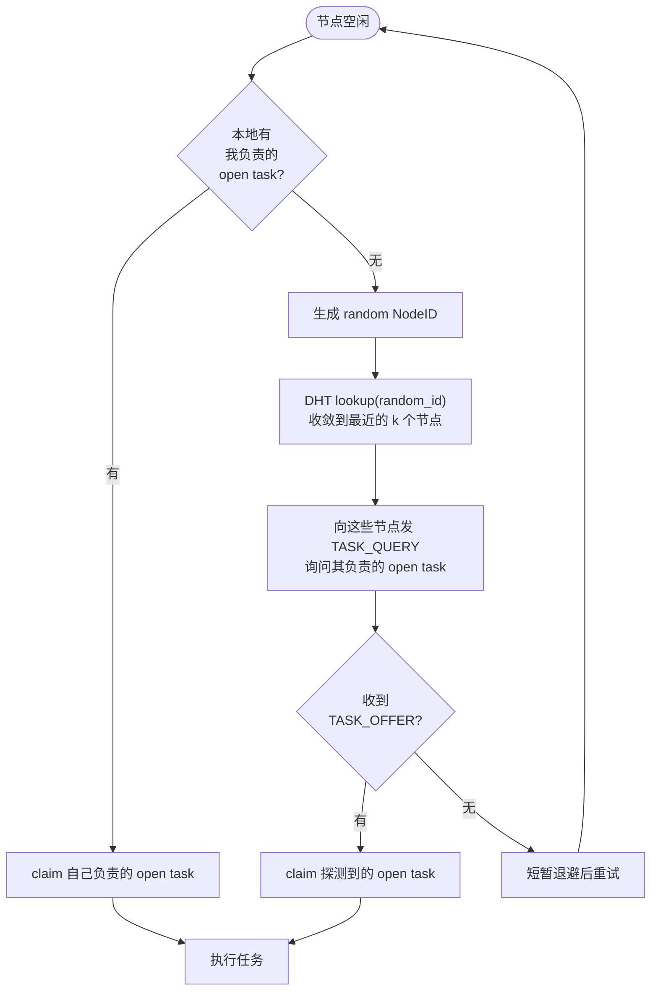
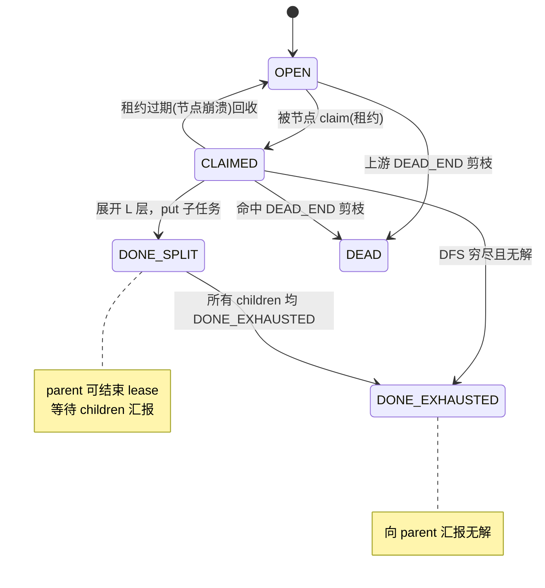
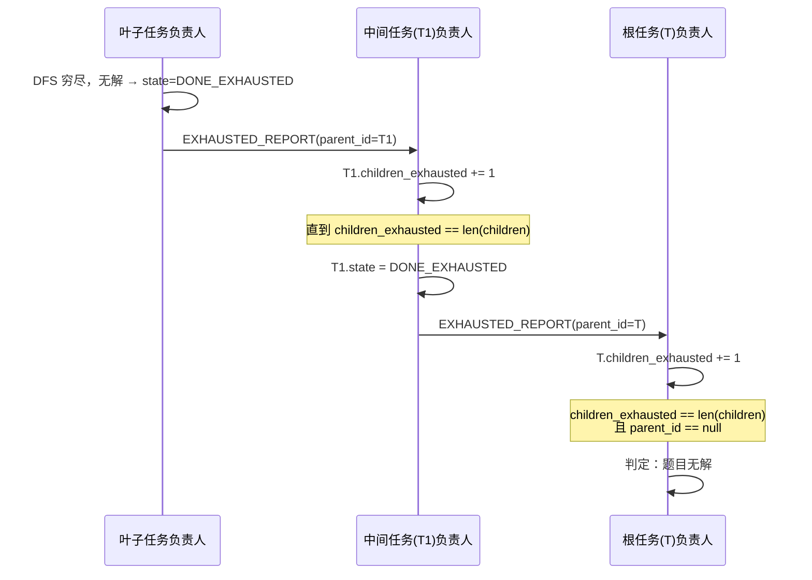
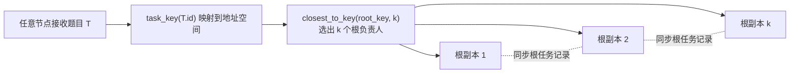
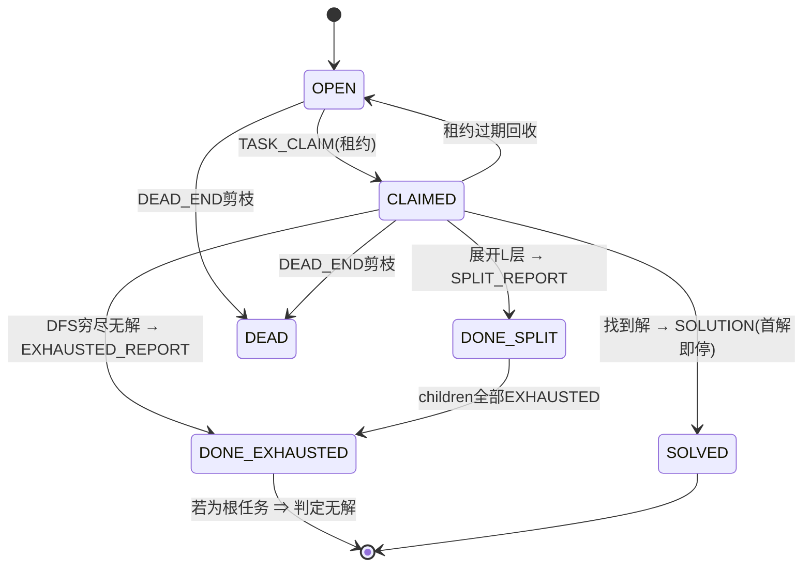

# SwarmSolve 优化设计文档（简体中文）

> 本文档针对当前实现提出三组增强设计：
> 1. **Random ID 探测与冷启动优化**（任务发现从"被动等待"变为"主动拉取"）
> 2. **无解判定**（把 `DONE` 细分为 `DONE_SPLIT` / `DONE_EXHAUSTED`，自底向上层级聚合无解）
> 3. **根任务多副本**（消除接收题目的单点，用 k 个节点共同负责根任务）
>
> 语言版本：简体中文（本文） · [English](optimizations.en.md)
> 相关文档：[架构详解](architecture.zh-CN.md) · [文档索引](README.md) · [项目 README](../README.md)

---

## ✅ 实现状态与用法（已落地）

本设计已在代码中实现，并作为**可选开关**接入（默认关闭 → 现有 `demo/benchmark/fault` 行为完全不变）。

| 优化 | 开关 / 入口 | 代码位置 |
|------|-------------|----------|
| Random ID 探测 + 拆分自认领 | `Peer(probe_random=True)` | [`peer.py`](../src/swarmsolve/peer.py) `_probe_for_tasks` / `_handle_pull` |
| **细粒度 work stealing（可偷 deque）** | `Peer(steal=True)` / `swarmsolve demo --steal` | [`peer.py`](../src/swarmsolve/peer.py) `_work_on_stealing` / `_steal_from_deque` |
| **搜索空间估算（指导偷取优先级）** | 内置于 steal（`steal_scan` 窗口） | [`search.py`](../src/swarmsolve/solver/search.py) `estimate_subtree_size` / `estimate_board_size` |
| **周期性状态同步（崩溃恢复）** | `Peer(sync_interval=s)` / `swarmsolve demo --sync-interval` | [`peer.py`](../src/swarmsolve/peer.py) `_sync_state` / `_on_state_sync`；恢复见 `_pick_task` |
| 无解判定（DONE_SPLIT/DONE_EXHAUSTED + 自底向上聚合） | `Peer(detect_unsolvable=True)` | [`peer.py`](../src/swarmsolve/peer.py) `_work_on_unsolvable` / `_on_exhausted_report` |
| 根任务多副本 | `Peer(root_replicas=k)` | [`peer.py`](../src/swarmsolve/peer.py) `_submit_root` / `_replicate_split` |
| 新状态与字段 | `DONE_SPLIT`/`DONE_EXHAUSTED`、`children`/`children_exhausted`/`parent_id` | [`task.py`](../src/swarmsolve/tasks/task.py) |
| 聚合记账 | `mark_split`/`mark_exhausted`/`note_child_exhausted`（幂等） | [`scheduler.py`](../src/swarmsolve/tasks/scheduler.py) |
| 新消息 | `TASK_QUERY`/`TASK_OFFER`/`SPLIT_REPORT`/`EXHAUSTED_REPORT` | [`messages.py`](../src/swarmsolve/transport/messages.py) |
| 无解题目生成器（经 `solve_local` 验证） | `make_unsolvable(n, seed, clue_ratio)` | [`puzzles.py`](../src/swarmsolve/puzzles.py) |

**一键端到端演示**（多进程真实 socket，自动与单机基线交叉校验）：

```bash
# 无解判定
uv run swarmsolve unsolvable --peers 4 --split-depth 3

# 细粒度 work stealing 加速对比
uv run swarmsolve demo --file examples/puzzles/hard_9x9.txt --peers 4 --node-delay 0.002 --steal
```

无解演示：每个节点各自判定 `UNSOLVABLE` 并确认"verdict matches single-machine baseline"；判定节点通过 SOLUTION 终止链路广播结论，全网快速一致停止。

work stealing 演示（`hard_9x9`，4 节点，实测）：**不开 `--steal` 约 1.03× 加速；开 `--steal` 约 4.04× 加速（近线性）**，且总探索节点从 ~8484 降到 ~4072（更少重复工作）。

> **诚实说明**：`make_unsolvable` 用"单线索损坏"法构造无解盘，约束传播通常 1~2 步即可发现矛盾，因此演示盘的搜索树较浅（用于验证**机制正确性**而非搜索规模）。构造"深度无解盘"是另一个独立难题，不在本次范围。核心机制（自底向上 `DONE_EXHAUSTED` 聚合 → 根判定无解）已由单元测试 [`tests/test_optimizations.py`](../tests/test_optimizations.py) 覆盖。

### 细粒度 work stealing 的实现要点（Chord 式，融合进 Kademlia 骨架）

- **可偷的 deque**：busy 节点不再用递归 DFS（分支锁死在调用栈里无法交出），而是把未展开的 frontier 路径放进一个显式 `deque`；owner 从**尾部**取（LIFO，深度优先、局部性好），thief 从**头部**偷（最浅、粒度最大的分支）。
- **零重复**：被偷的分支从 deque 中**移除**，owner 不再探索它，thief 独占探索它——天然避免重复工作。
- **可中断计算**：DFS 每 `steal_yield_every` 个节点（或每个 `node_delay`）`await` 让出事件循环，使 `TASK_QUERY` 能在计算过程中被响应（asyncio 单线程下的关键）。
- **复用已有拉取通道**：thief 就是空闲节点用 `probe_random` 发出的 `TASK_QUERY`；owner 在 [`_handle_pull`](../src/swarmsolve/peer.py) 里优先从 deque 偷一个分支作为 `TASK_OFFER` 返回。这正是"**粗粒度 gossip（初始播撒）+ 细粒度 work stealing（动态再均衡）**"的落地。

### 搜索空间估算（指导偷取优先级）

- **估算器**：[`estimate_subtree_size`](../src/swarmsolve/solver/search.py) 返回子树的**对数规模**——即各未填格 `log2(候选数)` 之和（朴素分支因子乘积的对数，越大越"重"）。零依赖、可比较、计算便宜。
- **用途**：thief 偷取时不再简单偷 deque 头部，而是在头部 `steal_scan` 窗口内估算每个分支规模，**偷走最重的那个**（[`_steal_from_deque`](../src/swarmsolve/peer.py)）。这样负载向"真正有活的地方"倾斜，缓解 sudoku 搜索树的不均匀。
- 该 API 也可用于指导切分点（未来在 `seed_frontier`/split 决策中复用）。

### 周期性状态同步（崩溃恢复）

- **快照**：busy 节点每 `sync_interval` 秒把当前 deque（未探索的 frontier 路径）通过点对点 `STATE_SYNC` 发给该任务的备份节点（`closest_to_key(task.key, root_replicas)`，[`_sync_state`](../src/swarmsolve/peer.py)）。
- **备份**：备份节点在 [`_on_state_sync`](../src/swarmsolve/peer.py) 里调用 [`record_backup`](../src/swarmsolve/tasks/scheduler.py) 保存最新快照。
- **恢复**：当租约过期回收（[`reclaim_expired`](../src/swarmsolve/tasks/scheduler.py)）时，[`_pick_task`](../src/swarmsolve/peer.py) 检查是否持有该任务的备份 frontier——若有，则**从快照 frontier 逐分支恢复**（细粒度），而不是把整棵子树作为一个粗任务重做。**只丢失同步窗口内的进度**，大幅减少崩溃后的重复工作（正是 Chord 方案"周期性同步到备份节点，接受同步窗口内丢失"的落地）。


---


## 0. 现状回顾（Baseline）

在动手优化前，先明确当前代码的实际行为，避免优化建议脱离实现。

### 0.1 任务分发是 gossip 推送（push）

- 提交节点在 [`submit`](../src/swarmsolve/peer.py) 中用 BFS 展开根题目得到任务前沿，然后对每个任务调用 [`_route_open_task`](../src/swarmsolve/peer.py)，通过 [`Gossip.broadcast`](../src/swarmsolve/gossip/gossip.py) 广播 `OPEN_TASK`。
- 空闲节点在 [`run`](../src/swarmsolve/peer.py) 的工作循环里**被动等待** `OPEN_TASK` 到达，再从本地 open 池里 [`_pick_task`](../src/swarmsolve/peer.py) 选一个 XOR 距离最近的任务认领。
- `exclusive` 模式下 [`_route_open_task`](../src/swarmsolve/peer.py) 会用 TCP 把任务**直投给唯一负责人**（`put(task -> owner)`），此时负责人本地 `scheduler.open` 里会累积它负责的开放任务。

### 0.2 任务状态只有四态

[`TaskStatus`](../src/swarmsolve/tasks/task.py) 目前是：

| 状态 | 含义 |
|------|------|
| `OPEN` | 尚未认领 |
| `CLAIMED` | 被某节点租约认领、进行中 |
| `DONE` | 已完全探索、内部无解 |
| `DEAD` | 已被证明矛盾（剪枝） |

[`Task`](../src/swarmsolve/tasks/task.py) 只有 `path / status / owner / lease_expires` 字段，**没有父子关系**（`children` / `parent_id`），因此无法把"某分支穷尽无解"这一事实沿树向上汇报。

### 0.3 DHT 能力已就绪但未被任务发现复用

[`KademliaNode`](../src/swarmsolve/discovery/kademlia.py) 已提供：

- [`lookup(target)`](../src/swarmsolve/discovery/kademlia.py)：迭代 `FIND_NODE`，可对**任意 target**（包括随机 ID）收敛到最近的 k 个节点；
- [`closest_to_key(key, count)`](../src/swarmsolve/discovery/kademlia.py) / [`is_responsible_for(key, replicas)`](../src/swarmsolve/discovery/kademlia.py)：判断"谁负责某个 key"。

但目前**没有**"向某个节点查询它负责的 open 任务"的 RPC，任务发现完全依赖 gossip 推送。

### 0.4 由此产生的四个问题

| # | 问题 | 根因 |
|---|------|------|
| P1 | **冷启动慢**：一开始任务少，空闲节点探测不到有任务的节点 | 纯 push、空闲节点被动等待 |
| P2 | **完成任务后需重新发现**：节点处理完一个任务后要再等新任务被推来 | 没有主动拉取通道 |
| P3 | **无法判定无解**：题目若真的无解，没有任何机制能得出"无解"结论 | `DONE` 语义单一、任务无父子关系 |
| P4 | **根节点单点**：接收题目的节点崩溃 → 无法汇总无解结论 | 根任务只由一个提交节点持有 |

下文三组优化分别解决 P1+P2、P3、P4。

---

## 1. 优化一：Random ID 探测与冷启动

### 1.1 目标

把任务发现从"被动等 push"升级为"**先拉自己负责的任务，拉不到再用 random id 主动探测**"，并在拆分子任务时**顺手认领一个子任务**，避免每完成一个任务就要重新探测。

### 1.2 核心思路

引入两条新的拉取（pull）通道，与现有 gossip 推送并存、互补：



### 1.3 优化点 A：优先认领"自己负责的" open task

**问题**：冷启动时全网任务少，随机探测命中率低。

**方案**：节点空闲时**先查本地 open 池里自己是负责人（XOR 最近）的任务**，直接认领；只有本地没有可认领的任务时，才启动 random id 探测。

这一步在 `exclusive` + `put(task->owner)` 模式下尤其自然：负责人本地已经攒了它负责的 open task，直接从本地拉即可，命中率 100%，无需任何网络往返。

对应到代码，[`_pick_task`](../src/swarmsolve/peer.py) 已经有"从本地 open 池里选 XOR 最近任务"的雏形，优化就是把它明确为**第一优先级**，并在返回 `None`（本地无我负责的任务）时进入探测分支。

### 1.4 优化点 B：Random ID 探测

**问题**：本地无任务时，如何找到"别处有任务"的节点？

**方案**：

1. 生成一个 `NodeID.random()`（[`node_id.py`](../src/swarmsolve/discovery/node_id.py) 已有 `random()`）；
2. 调用 [`lookup(random_id)`](../src/swarmsolve/discovery/kademlia.py) 收敛到该随机 key 附近的 k 个节点；
3. 向这些节点发送**新增消息** `TASK_QUERY`；被询问节点回 `TASK_OFFER`，附带它当前持有的、可认领的 open task（可带上少量候选）；
4. 探测方对返回的候选执行正常的 claim 流程（发 `TASK_CLAIM`、加租约）。

> 为什么用 random id 而不是固定扫描？random id 让不同空闲节点探测到 keyspace 的**不同区域**，天然打散、避免所有空闲节点涌向同一个"热点"负责人，起到负载均衡作用。

### 1.5 优化点 C：拆分后自认领，避免二次探测

**问题**：节点每处理完一个任务（尤其是把任务再拆成子任务 `put` 出去后），又变回空闲，需要重新探测，浪费一轮往返。

**方案**：节点在 `put` 子任务时，**自己直接 claim 其中一个子任务**，无缝进入下一轮工作，不必再走 random id 探测。

对应当前工作窃取逻辑 [`_work_on`](../src/swarmsolve/peer.py) 里"把浅任务 re-split 成子任务并 `_route_open_task`"的分支：优化是在把 `children` 发布出去后，**留下一个 child 给自己**立即 `claim_local` 并继续 DFS，其余 children 才 `put`/gossip 给别人。

### 1.6 需要的改动汇总

| 层 | 改动 |
|----|------|
| [`messages.py`](../src/swarmsolve/transport/messages.py) | 新增 `TASK_QUERY`、`TASK_OFFER` 两个 `MessageType` |
| [`kademlia.py`](../src/swarmsolve/discovery/kademlia.py) | 复用 `lookup(NodeID.random())` 做探测（无需新方法） |
| [`scheduler.py`](../src/swarmsolve/tasks/scheduler.py) | 新增"取出本地我负责的可认领 open task"、"取出可对外提供的 open task"接口 |
| [`peer.py`](../src/swarmsolve/peer.py) | `run` 循环加入"本地优先 → random 探测"分支；`_dispatch`/`_on_gossip` 处理 `TASK_QUERY`/`TASK_OFFER`；拆分后自认领一个 child |

---

## 2. 优化二：无解判定（DONE_SPLIT / DONE_EXHAUSTED）

### 2.1 目标

让集群能够**确定性地判定一道题目无解**：把 `DONE` 拆成两种语义，并让"分支穷尽无解"这一事实沿任务树**自底向上层级聚合**，最终由根任务的负责人得出"无解"结论。

### 2.2 状态机扩展

把原来的单一 `DONE` 拆成两态：

| 新状态 | 含义 | 触发时机 |
|--------|------|----------|
| `DONE_SPLIT` | 任务已展开 L 层为若干子任务，自身不再需要探索 | 负责人把任务拆成 `children` 并 `put` 出去后 |
| `DONE_EXHAUSTED` | 该分支已被穷尽搜索，**内部无解** | 负责人 DFS 到底、未发现解、且无子任务时 |



> 说明：`DONE_SPLIT` 用于告诉 parent "我已展开完成、可以结束我的 lease"；`DONE_EXHAUSTED` 用于汇报"这一分支已穷尽（无解）"。找到解时仍走原有 `SOLUTION` 首解即停逻辑，不进入这两态。

### 2.3 任务元数据扩展

在 [`Task`](../src/swarmsolve/tasks/task.py) 上新增以下字段（并同步进 `to_dict` / `from_dict`）：

| 字段 | 类型 | 含义 |
|------|------|------|
| `children` | `list[str]` | 子任务 id 列表（`[]` 表示叶子任务） |
| `children_exhausted` | `int` | 已汇报 `DONE_EXHAUSTED` 的子任务计数 |
| `parent_id` | `str \| None` | 父任务 id（根任务为 `None`） |
| `holder` | `str \| None` | 当前认领者 NodeID（对应原 `owner` 语义，可复用） |
| `lease_expire` | `float` | 租约到期时间（对应原 `lease_expires`，可复用） |

无解判定的核心不变式：

```
当 task.state == DONE_SPLIT 且 task.children_exhausted == len(task.children)
    → task 本身可置为 DONE_EXHAUSTED，并向 task.parent_id 汇报

当 task.state 达到 DONE_EXHAUSTED 且 task.parent_id == null
    → 根任务无解 ⇒ 整道题目无解
```

### 2.4 自底向上聚合流程



### 2.5 完整示例（对应需求描述）

以下逐步还原需求中给出的 T → T1 → T11 三层例子。约定：每个任务由 k 个节点共同负责（多副本，见优化三），它们通过同步保持任务记录一致。

**第 1 步：P1 接收题目 T，展开 L 层得到 T1/T2/T3，PUT 出去**

P1 记录（根任务，已拆分）：

```
T.id = T_id
T.children = [T1, T2, T3]
T.children_exhausted = 0
T.state = DONE_SPLIT
T.parent_id = null
T.holder = null
T.lease_expire = null
```

负责 T1 的 P2/P3/P4 记录（新开放的子任务）：

```
T1.id = T1_id
T1.children = []
T1.children_exhausted = 0
T1.state = OPEN
T1.parent_id = T_id
T1.holder = null
T1.lease_expire = null
```

**第 2 步：P5 用 random id 找到 P2，得知 T1 为 OPEN，claim T1 成功**

P2/P3/P4（同步后）记录：

```
T1.id = T1_id
T1.children = []
T1.children_exhausted = 0
T1.state = CLAIMED
T1.parent_id = T_id
T1.holder = P5_id
T1.lease_expire = T1_expiry
```

**第 3 步：P5 把 T1 展开 L 层得到 T11/T12/T13，PUT 出去，并告知负责 T1 的节点"展开完成"，附带子任务列表**

P2/P3/P4（同步后）记录：

```
T1.id = T1_id
T1.children = [T11, T12, T13]
T1.children_exhausted = 0
T1.state = DONE_SPLIT
T1.parent_id = T_id
T1.holder = null
T1.lease_expire = null
```

负责 T11 的 P6/P7/P8 记录：

```
T11.id = T11_id
T11.children = []
T11.children_exhausted = 0
T11.state = OPEN
T11.parent_id = T1_id
T11.holder = null
T11.lease_expire = null
```

**第 4 步：P9 pull 到 T11（省略 OPEN→CLAIMED 中间态），展开后发现分支无解，告知负责 T11 的节点"已穷尽"**

P6/P7/P8（同步后）记录：

```
T11.id = T11_id
T11.children = []
T11.children_exhausted = 0
T11.state = DONE_EXHAUSTED
T11.parent_id = T1_id
T11.holder = null
T11.lease_expire = null
```

**第 5 步：P6/P7/P8 发现 T11 为 DONE_EXHAUSTED，向负责 T11.parent_id（即 T1）的节点汇报**

P2/P3/P4（同步后）记录：

```
T1.id = T1_id
T1.children = [T11, T12, T13]
T1.children_exhausted = 1
T1.state = DONE_SPLIT
T1.parent_id = T_id
T1.holder = null
T1.lease_expire = null
```

**第 6 步：T12/T13 陆续汇报 DONE_EXHAUSTED，直到 `T1.children_exhausted == len(T1.children)`**

负责 T1 的节点把 T1 置为 `DONE_EXHAUSTED`，并向负责 T1.parent_id（即 T）的节点汇报。

**第 7 步：负责 T 的节点发现 `T.children_exhausted == len(T.children)` 且 `T.parent_id == null`**

⇒ **判定：该题目无解。**

### 2.6 消息扩展

| 新消息 | 方向 | 载荷 | 作用 |
|--------|------|------|------|
| `SPLIT_REPORT` | child 负责人 → parent 负责人 | `parent_id`, `children[]` | 汇报"已展开完成"，parent 置 `DONE_SPLIT` 并结束 lease |
| `EXHAUSTED_REPORT` | child 负责人 → parent 负责人 | `parent_id`, `child_id` | 汇报"该子任务分支穷尽无解"，parent `children_exhausted += 1` |

> 也可选择复用现有 `TASK_DONE`，在载荷里加 `kind: split|exhausted` + `parent_id` 字段来区分，减少消息类型数量。两种做法都可，本文推荐显式区分以便观测。

汇报的目标节点通过 DHT 定位：`parent_id` 经 [`task_key`](../src/swarmsolve/discovery/node_id.py) 映射到 key，再用 [`closest_to_key`](../src/swarmsolve/discovery/kademlia.py) 找到负责 parent 的 k 个节点并投递。

### 2.7 需要的改动汇总

| 层 | 改动 |
|----|------|
| [`task.py`](../src/swarmsolve/tasks/task.py) | `TaskStatus` 增 `DONE_SPLIT`/`DONE_EXHAUSTED`；`Task` 增 `children`/`children_exhausted`/`parent_id` 字段并进（反）序列化 |
| [`scheduler.py`](../src/swarmsolve/tasks/scheduler.py) | `mark_done` 拆分为 `mark_split`/`mark_exhausted`；新增 `note_child_exhausted(parent_id)` 累加计数并检测 `== len(children)` |
| [`messages.py`](../src/swarmsolve/transport/messages.py) | 新增 `SPLIT_REPORT`/`EXHAUSTED_REPORT`（或复用 `TASK_DONE` 加 `kind`） |
| [`peer.py`](../src/swarmsolve/peer.py) | 拆分分支发 `SPLIT_REPORT`；穷尽分支发 `EXHAUSTED_REPORT`；收到汇报后更新计数、必要时继续向上汇报；根任务命中不变式即宣告无解 |

---

## 3. 优化三：根任务多副本（消除单点）

### 3.1 问题

当前接收题目的节点（submitter）是单点：一旦它在求解过程中崩溃，就没有节点持有根任务 T 的记录，导致优化二里"根任务负责人判定无解"这一步永远无法完成（P4）。

### 3.2 方案：把根题目也映射到地址空间，由 k 个节点负责

一开始就把**原始题目 T 也当作一个普通任务**：

1. 用 [`task_key(T.id)`](../src/swarmsolve/discovery/node_id.py) 把根题目映射到 XOR 地址空间；
2. 用 [`closest_to_key(root_key, k)`](../src/swarmsolve/discovery/kademlia.py) 找到 XOR 最近的 **k 个节点**，共同持有根任务记录（含 `children` / `children_exhausted` / `state`）；
3. 这 k 个副本之间通过同步（gossip 或直接投递）保持根任务记录一致——与优化二示例中"P2/P3/P4 共同负责 T1"完全同构，只是层级为根。



### 3.3 收益

- **消除单点**：任一根副本崩溃，其余副本仍持有 `T.children_exhausted` 进度，无解判定不受影响；崩溃副本的份额还能被 DHT 自再均衡补上。
- **与容错一致**：这正是当前 `exclusive` 模式 + 虚拟节点 [`owner_roster`](../src/swarmsolve/peer.py) 思路的自然延伸——只是把"k 副本负责"从子任务推广到根任务。
- **判定权威**：任意一个根副本满足不变式 `children_exhausted == len(children) && parent_id == null` 即可宣告无解，无需依赖某个特定节点存活。

### 3.4 需要的改动汇总

| 层 | 改动 |
|----|------|
| [`peer.py`](../src/swarmsolve/peer.py) | `submit` 不再由本节点独占根任务，而是 `put` 到 `closest_to_key(root_key, k)` 的 k 个负责人 |
| [`scheduler.py`](../src/swarmsolve/tasks/scheduler.py) | 根任务与子任务用同一套 `children`/`children_exhausted` 记账逻辑，副本间同步 |

---

## 4. 汇总：优化后的状态机与消息协议

### 4.1 完整状态机



### 4.2 消息类型总览（在现有基础上新增）

| 类别 | 消息 | 状态 |
|------|------|------|
| 应用 | `OPEN_TASK` / `DEAD_END` / `SOLUTION` | 现有 |
| 任务协调 | `TASK_CLAIM` / `TASK_DONE` | 现有 |
| **任务拉取（优化一）** | `TASK_QUERY` / `TASK_OFFER` | **新增** |
| **无解聚合（优化二）** | `SPLIT_REPORT` / `EXHAUSTED_REPORT` | **新增**（或复用 `TASK_DONE` + `kind`） |
| 发现 | `PING` / `PONG` / `FIND_NODE` / `FIND_NODE_REPLY` | 现有 |
| 传播 | `GOSSIP_PUSH` | 现有 |

---

## 5. 实施路线图与兼容性

建议按依赖顺序分三步落地，每步都可独立测试、向后兼容：

1. **第一步（优化二的数据结构）**：先扩展 [`Task`](../src/swarmsolve/tasks/task.py) 字段与 `TaskStatus`。默认 `children=[]`、`parent_id=None`，旧的 `to_dict/from_dict` 保持兼容（缺字段取默认值）。此步不改变行为，只是为后续铺路。
2. **第二步（优化一 + 优化二的逻辑）**：加入 `TASK_QUERY/TASK_OFFER` 拉取通道与"拆分后自认领"，同时接入 `SPLIT_REPORT/EXHAUSTED_REPORT` 层级汇报。gossip 推送仍保留，两种发现方式并存。
3. **第三步（优化三）**：把根任务也 `put` 到 k 个负责人，打通端到端的无解判定。

**正确性要点**：

- 无解判定依赖 `children` 列表与 `children_exhausted` 计数的一致性——多副本间必须同步，且 `EXHAUSTED_REPORT` 需**幂等**（同一 child 重复汇报只计一次，可用已汇报 child_id 集合去重），避免因 gossip 重传导致计数虚高。
- 找到解时（`SOLUTION`）优先级最高，直接首解即停，不受无解聚合影响。
- 租约过期回收（[`reclaim_expired`](../src/swarmsolve/tasks/scheduler.py)）与新状态并存：只有 `CLAIMED` 会被回收成 `OPEN`，`DONE_SPLIT/DONE_EXHAUSTED` 不回收。

---

## 6. 优化前后对比

| 维度 | 优化前 | 优化后 |
|------|--------|--------|
| 任务发现 | 纯 gossip 推送，空闲节点被动等待 | 本地优先 + random id 主动探测 + 拆分自认领 |
| 冷启动 | 慢，命中率低 | 快，本地/探测双通道 |
| 完成任务后 | 需重新等待推送 | 拆分时自认领下一个，无缝衔接 |
| 无解判定 | 无法判定 | `DONE_SPLIT/DONE_EXHAUSTED` 自底向上聚合，根任务确定性判定 |
| 根节点 | 单点，崩溃即失能 | k 副本共同负责，抗崩溃 |
