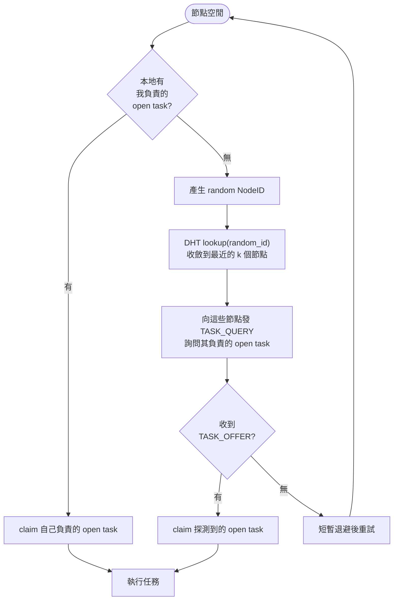
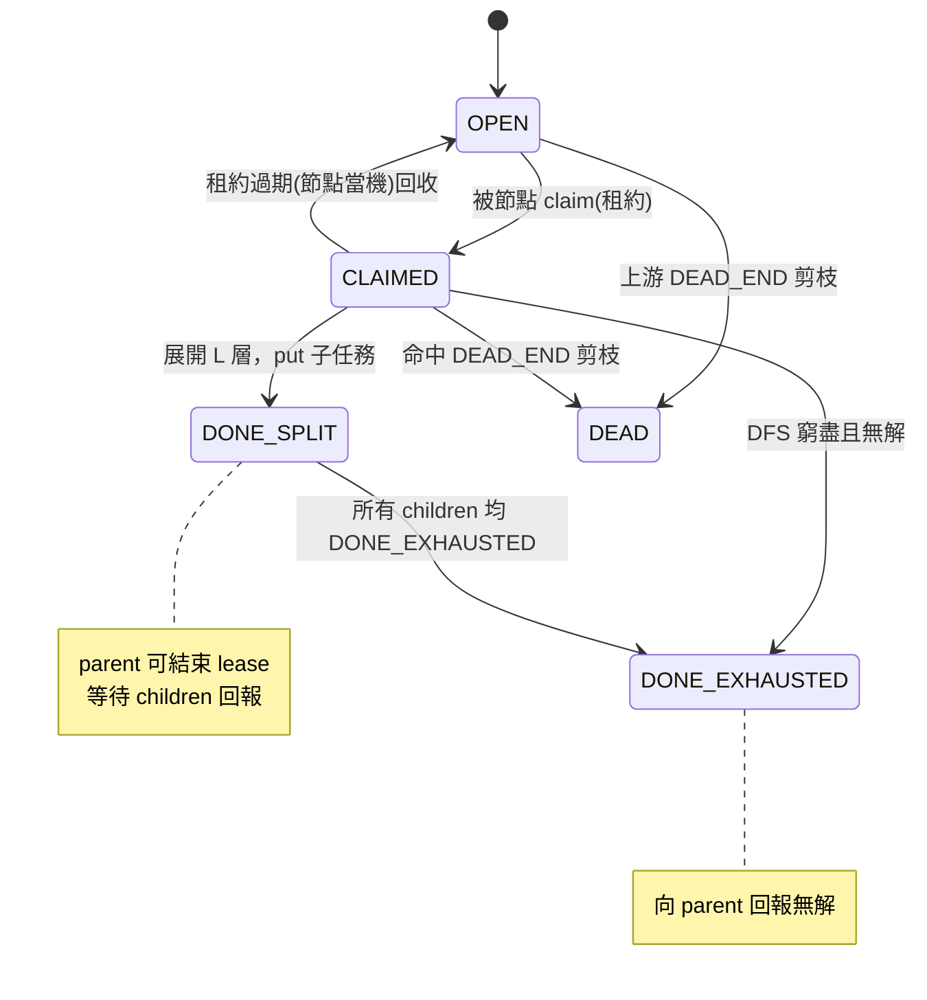
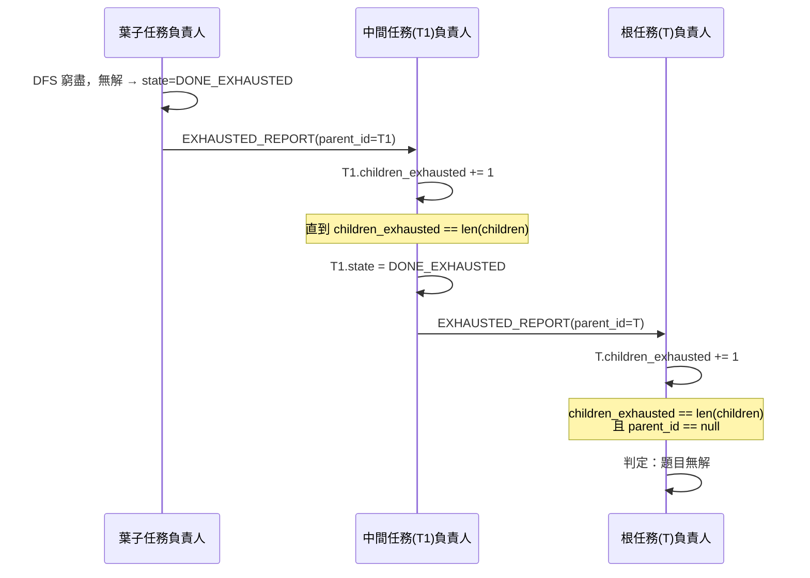
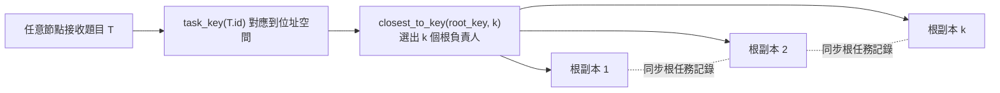
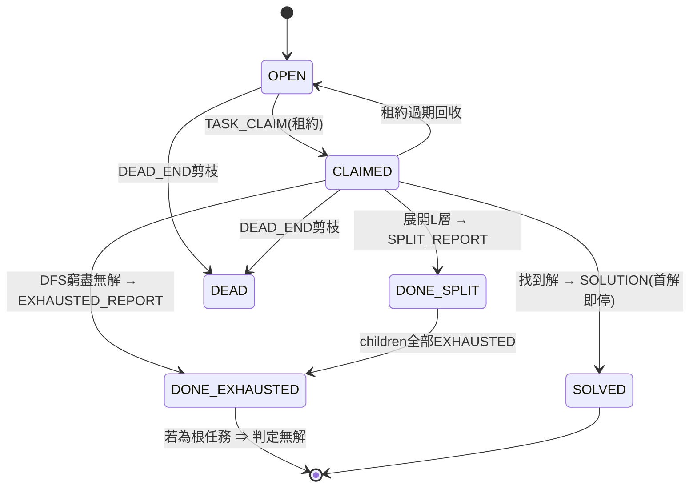
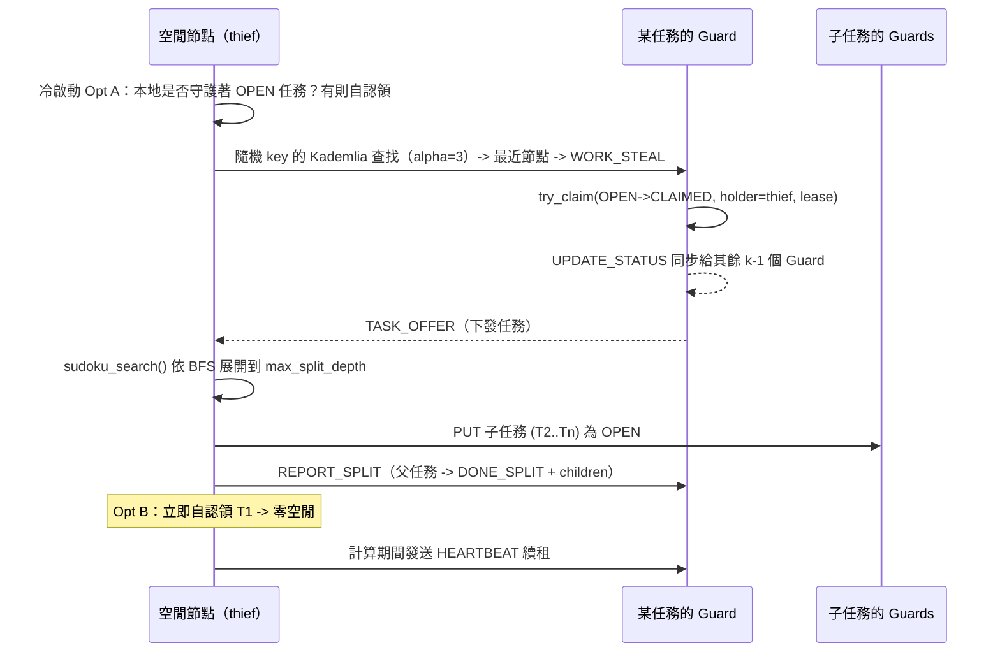

# SwarmSolve 最佳化設計文件（繁體中文）

> 本文件針對目前實作提出三組增強設計：
> 1. **Random ID 探測與冷啟動最佳化**（任務發現從「被動等待」變為「主動拉取」）
> 2. **無解判定**（把 `DONE` 細分為 `DONE_SPLIT` / `DONE_EXHAUSTED`，自底向上階層聚合無解）
> 3. **根任務多副本**（消除接收題目的單點，用 k 個節點共同負責根任務）
>
> 語言版本：繁體中文（本文） · [English](optimizations.en.md) · [简体中文](optimizations.zh-CN.md)
> 相關文件：[架構詳解](architecture.zh-TW.md) · [文件索引](README.md) · [專案 README](../README.md)

---

## ✅ 實作狀態與用法（已落地）

本設計已在程式碼中實作，並作為**可選開關**接入（預設關閉 → 現有 `demo/benchmark/fault` 行為完全不變）。

| 最佳化 | 開關 / 入口 | 程式碼位置 |
|------|-------------|----------|
| Random ID 探測 + 切分後自認領 | `Peer(probe_random=True)` | [`peer.py`](../src/swarmsolve/peer.py) `_probe_for_tasks` / `_handle_pull` |
| **細粒度 work stealing（可偷 deque）** | `Peer(steal=True)` / `swarmsolve demo --steal` | [`peer.py`](../src/swarmsolve/peer.py) `_work_on_stealing` / `_steal_from_deque` |
| **搜尋空間估算（指導偷取優先級）** | 內建於 steal（`steal_scan` 視窗） | [`search.py`](../src/swarmsolve/solver/search.py) `estimate_subtree_size` / `estimate_board_size` |
| **週期性狀態同步（當機復原）** | `Peer(sync_interval=s)` / `swarmsolve demo --sync-interval` | [`peer.py`](../src/swarmsolve/peer.py) `_sync_state` / `_on_state_sync`；復原見 `_pick_task` |
| 無解判定（DONE_SPLIT/DONE_EXHAUSTED + 自底向上聚合） | `Peer(detect_unsolvable=True)` | [`peer.py`](../src/swarmsolve/peer.py) `_work_on_unsolvable` / `_on_exhausted_report` |
| 根任務多副本 | `Peer(root_replicas=k)` | [`peer.py`](../src/swarmsolve/peer.py) `_submit_root` / `_replicate_split` |
| 新狀態與欄位 | `DONE_SPLIT`/`DONE_EXHAUSTED`、`children`/`children_exhausted`/`parent_id` | [`task.py`](../src/swarmsolve/tasks/task.py) |
| 聚合記帳 | `mark_split`/`mark_exhausted`/`note_child_exhausted`（冪等） | [`scheduler.py`](../src/swarmsolve/tasks/scheduler.py) |
| 新訊息 | `TASK_QUERY`/`TASK_OFFER`/`SPLIT_REPORT`/`EXHAUSTED_REPORT`/`STATE_SYNC` | [`messages.py`](../src/swarmsolve/transport/messages.py) |
| 無解題目產生器（經 `solve_local` 驗證） | `make_unsolvable(n, seed, clue_ratio)` | [`puzzles.py`](../src/swarmsolve/puzzles.py) |

**一鍵端到端演示**（多行程真實 socket，自動與單機基準交叉校驗）：

```bash
# 無解判定
uv run swarmsolve unsolvable --peers 4 --split-depth 3

# 細粒度 work stealing 加速對比
uv run swarmsolve demo --file examples/puzzles/hard_9x9.txt --peers 4 --node-delay 0.002 --steal
```

無解演示：每個節點各自判定 `UNSOLVABLE` 並確認「verdict matches single-machine baseline」；判定節點透過 SOLUTION 終止鏈路廣播結論，全網快速一致停止。

work stealing 演示（`hard_9x9`，4 節點，實測）：**不開 `--steal` 約 1.03× 加速；開 `--steal` 約 4.04× 加速（近線性）**，且總探索節點從 ~8484 降到 ~4072（更少重複工作）。

> **誠實說明**：`make_unsolvable` 用「單線索損壞」法建構無解盤，約束傳播通常 1~2 步即可發現矛盾，因此演示盤的搜尋樹較淺（用於驗證**機制正確性**而非搜尋規模）。建構「深度無解盤」是另一個獨立難題，不在本次範圍。核心機制（自底向上 `DONE_EXHAUSTED` 聚合 → 根判定無解）已由單元測試 [`tests/test_optimizations.py`](../tests/test_optimizations.py) 覆蓋。

### 細粒度 work stealing 的實作要點（Chord 式，融合進 Kademlia 骨架）

- **可偷的 deque**：busy 節點不再用遞迴 DFS（分支鎖死在呼叫堆疊裡無法交出），而是把未展開的 frontier 路徑放進一個顯式 `deque`；owner 從**尾部**取（LIFO，深度優先、區域性好），thief 從**頭部**偷（最淺、粒度最大的分支）。
- **零重複**：被偷的分支從 deque 中**移除**，owner 不再探索它，thief 獨佔探索它——天然避免重複工作。
- **可中斷計算**：DFS 每 `steal_yield_every` 個節點（或每個 `node_delay`）`await` 讓出事件迴圈，使 `TASK_QUERY` 能在計算過程中被回應（asyncio 單執行緒下的關鍵）。
- **重用既有拉取通道**：thief 就是空閒節點用 `probe_random` 發出的 `TASK_QUERY`；owner 在 [`_handle_pull`](../src/swarmsolve/peer.py) 裡優先從 deque 偷一個分支作為 `TASK_OFFER` 回傳。這正是「**粗粒度 gossip（初始播撒）+ 細粒度 work stealing（動態再平衡）**」的落地。

### 搜尋空間估算（指導偷取優先級）

- **估算器**：[`estimate_subtree_size`](../src/swarmsolve/solver/search.py) 回傳子樹的**對數規模**——即各未填格 `log2(候選數)` 之和（樸素分支因子乘積的對數，越大越「重」）。零相依、可比較、計算便宜。
- **用途**：thief 偷取時不再單純偷 deque 頭部，而是在頭部 `steal_scan` 視窗內估算每個分支規模，**偷走最重的那個**（[`_steal_from_deque`](../src/swarmsolve/peer.py)）。這樣負載向「真正有活的地方」傾斜，緩解 sudoku 搜尋樹的不均勻。
- 該 API 也可用於指導切分點（未來在 `seed_frontier`/split 決策中重用）。

### 週期性狀態同步（當機復原）

- **快照**：busy 節點每 `sync_interval` 秒把目前 deque（未探索的 frontier 路徑）透過點對點 `STATE_SYNC` 發給該任務的備份節點（`closest_to_key(task.key, root_replicas)`，[`_sync_state`](../src/swarmsolve/peer.py)）。
- **備份**：備份節點在 [`_on_state_sync`](../src/swarmsolve/peer.py) 裡呼叫 [`record_backup`](../src/swarmsolve/tasks/scheduler.py) 儲存最新快照。
- **復原**：當租約過期回收（[`reclaim_expired`](../src/swarmsolve/tasks/scheduler.py)）時，[`_pick_task`](../src/swarmsolve/peer.py) 檢查是否持有該任務的備份 frontier——若有，則**從快照 frontier 逐分支復原**（細粒度），而不是把整棵子樹作為一個粗任務重做。**只遺失同步視窗內的進度**，大幅減少當機後的重複工作（正是 Chord 方案「週期性同步到備份節點，接受同步視窗內遺失」的落地）。

---

## 0. 現狀回顧（Baseline）

在動手最佳化前，先明確目前程式碼的實際行為，避免最佳化建議脫離實作。

### 0.1 任務分發是 gossip 推送（push）

- 提交節點在 [`submit`](../src/swarmsolve/peer.py) 中用 BFS 展開根題目得到任務前沿，然後對每個任務呼叫 [`_route_open_task`](../src/swarmsolve/peer.py)，透過 [`Gossip.broadcast`](../src/swarmsolve/gossip/gossip.py) 廣播 `OPEN_TASK`。
- 空閒節點在 [`run`](../src/swarmsolve/peer.py) 的工作迴圈裡**被動等待** `OPEN_TASK` 到達，再從本地 open 池裡 [`_pick_task`](../src/swarmsolve/peer.py) 選一個 XOR 距離最近的任務認領。
- `exclusive` 模式下 [`_route_open_task`](../src/swarmsolve/peer.py) 會用 TCP 把任務**直投給唯一負責人**（`put(task -> owner)`），此時負責人本地 `scheduler.open` 裡會累積它負責的開放任務。

### 0.2 任務狀態只有四態

[`TaskStatus`](../src/swarmsolve/tasks/task.py) 目前是：

| 狀態 | 含義 |
|------|------|
| `OPEN` | 尚未認領 |
| `CLAIMED` | 被某節點租約認領、進行中 |
| `DONE` | 已完全探索、內部無解 |
| `DEAD` | 已被證明矛盾（剪枝） |

[`Task`](../src/swarmsolve/tasks/task.py) 只有 `path / status / owner / lease_expires` 欄位，**沒有父子關係**（`children` / `parent_id`），因此無法把「某分支窮盡無解」這一事實沿樹向上回報。

### 0.3 DHT 能力已就緒但未被任務發現重用

[`KademliaNode`](../src/swarmsolve/discovery/kademlia.py) 已提供：

- [`lookup(target)`](../src/swarmsolve/discovery/kademlia.py)：迭代 `FIND_NODE`，可對**任意 target**（包括隨機 ID）收斂到最近的 k 個節點；
- [`closest_to_key(key, count)`](../src/swarmsolve/discovery/kademlia.py) / [`is_responsible_for(key, replicas)`](../src/swarmsolve/discovery/kademlia.py)：判斷「誰負責某個 key」。

但目前**沒有**「向某個節點查詢它負責的 open 任務」的 RPC，任務發現完全依賴 gossip 推送。

### 0.4 由此產生的四個問題

| # | 問題 | 根因 |
|---|------|------|
| P1 | **冷啟動慢**：一開始任務少，空閒節點探測不到有任務的節點 | 純 push、空閒節點被動等待 |
| P2 | **完成任務後需重新發現**：節點處理完一個任務後要再等新任務被推來 | 沒有主動拉取通道 |
| P3 | **無法判定無解**：題目若真的無解，沒有任何機制能得出「無解」結論 | `DONE` 語意單一、任務無父子關係 |
| P4 | **根節點單點**：接收題目的節點當機 → 無法彙總無解結論 | 根任務只由一個提交節點持有 |

下文三組最佳化分別解決 P1+P2、P3、P4。

---

## 1. 最佳化一：Random ID 探測與冷啟動

### 1.1 目標

把任務發現從「被動等 push」升級為「**先拉自己負責的任務，拉不到再用 random id 主動探測**」，並在切分子任務時**順手認領一個子任務**，避免每完成一個任務就要重新探測。

### 1.2 核心思路

引入兩條新的拉取（pull）通道，與現有 gossip 推送並存、互補：



### 1.3 最佳化點 A：優先認領「自己負責的」open task

**問題**：冷啟動時全網任務少，隨機探測命中率低。

**方案**：節點空閒時**先查本地 open 池裡自己是負責人（XOR 最近）的任務**，直接認領；只有本地沒有可認領的任務時，才啟動 random id 探測。

這一步在 `exclusive` + `put(task->owner)` 模式下尤其自然：負責人本地已經攢了它負責的 open task，直接從本地拉即可，命中率 100%，無需任何網路往返。

對應到程式碼，[`_pick_task`](../src/swarmsolve/peer.py) 已經有「從本地 open 池裡選 XOR 最近任務」的雛形，最佳化就是把它明確為**第一優先級**，並在回傳 `None`（本地無我負責的任務）時進入探測分支。

### 1.4 最佳化點 B：Random ID 探測

**問題**：本地無任務時，如何找到「別處有任務」的節點？

**方案**：

1. 產生一個 `NodeID.random()`（[`node_id.py`](../src/swarmsolve/discovery/node_id.py) 已有 `random()`）；
2. 呼叫 [`lookup(random_id)`](../src/swarmsolve/discovery/kademlia.py) 收斂到該隨機 key 附近的 k 個節點；
3. 向這些節點傳送**新增訊息** `TASK_QUERY`；被詢問節點回 `TASK_OFFER`，附帶它目前持有的、可認領的 open task（可帶上少量候選）；
4. 探測方對回傳的候選執行正常的 claim 流程（發 `TASK_CLAIM`、加租約）。

> 為什麼用 random id 而不是固定掃描？random id 讓不同空閒節點探測到 keyspace 的**不同區域**，天然打散、避免所有空閒節點湧向同一個「熱點」負責人，起到負載平衡作用。

### 1.5 最佳化點 C：切分後自認領，避免二次探測

**問題**：節點每處理完一個任務（尤其是把任務再拆成子任務 `put` 出去後），又變回空閒，需要重新探測，浪費一輪往返。

**方案**：節點在 `put` 子任務時，**自己直接 claim 其中一個子任務**，無縫進入下一輪工作，不必再走 random id 探測。

對應目前工作竊取邏輯 [`_work_on`](../src/swarmsolve/peer.py) 裡「把淺任務 re-split 成子任務並 `_route_open_task`」的分支：最佳化是在把 `children` 發布出去後，**留下一個 child 給自己**立即 `claim_local` 並繼續 DFS，其餘 children 才 `put`/gossip 給別人。

### 1.6 需要的改動彙總

| 層 | 改動 |
|----|------|
| [`messages.py`](../src/swarmsolve/transport/messages.py) | 新增 `TASK_QUERY`、`TASK_OFFER` 兩個 `MessageType` |
| [`kademlia.py`](../src/swarmsolve/discovery/kademlia.py) | 重用 `lookup(NodeID.random())` 做探測（無需新方法） |
| [`scheduler.py`](../src/swarmsolve/tasks/scheduler.py) | 新增「取出本地我負責的可認領 open task」、「取出可對外提供的 open task」介面 |
| [`peer.py`](../src/swarmsolve/peer.py) | `run` 迴圈加入「本地優先 → random 探測」分支；`_dispatch`/`_on_gossip` 處理 `TASK_QUERY`/`TASK_OFFER`；切分後自認領一個 child |

---

## 2. 最佳化二：無解判定（DONE_SPLIT / DONE_EXHAUSTED）

### 2.1 目標

讓叢集能夠**確定性地判定一道題目無解**：把 `DONE` 拆成兩種語意，並讓「分支窮盡無解」這一事實沿任務樹**自底向上階層聚合**，最終由根任務的負責人得出「無解」結論。

### 2.2 狀態機擴展

把原來的單一 `DONE` 拆成兩態：

| 新狀態 | 含義 | 觸發時機 |
|--------|------|----------|
| `DONE_SPLIT` | 任務已展開 L 層為若干子任務，自身不再需要探索 | 負責人把任務拆成 `children` 並 `put` 出去後 |
| `DONE_EXHAUSTED` | 該分支已被窮盡搜尋，**內部無解** | 負責人 DFS 到底、未發現解、且無子任務時 |



> 說明：`DONE_SPLIT` 用於告訴 parent「我已展開完成、可以結束我的 lease」；`DONE_EXHAUSTED` 用於回報「這一分支已窮盡（無解）」。找到解時仍走原有 `SOLUTION` 首解即停邏輯，不進入這兩態。

### 2.3 任務中繼資料擴展

在 [`Task`](../src/swarmsolve/tasks/task.py) 上新增以下欄位（並同步進 `to_dict` / `from_dict`）：

| 欄位 | 型別 | 含義 |
|------|------|------|
| `children` | `list[str]` | 子任務 id 列表（`[]` 表示葉子任務） |
| `children_exhausted` | `int` | 已回報 `DONE_EXHAUSTED` 的子任務計數 |
| `parent_id` | `str \| None` | 父任務 id（根任務為 `None`） |
| `holder` | `str \| None` | 目前認領者 NodeID（對應原 `owner` 語意，可重用） |
| `lease_expire` | `float` | 租約到期時間（對應原 `lease_expires`，可重用） |

無解判定的核心不變式：

```
當 task.state == DONE_SPLIT 且 task.children_exhausted == len(task.children)
    → task 本身可置為 DONE_EXHAUSTED，並向 task.parent_id 回報

當 task.state 達到 DONE_EXHAUSTED 且 task.parent_id == null
    → 根任務無解 ⇒ 整道題目無解
```

### 2.4 自底向上聚合流程



### 2.5 完整範例（對應需求描述）

以下逐步還原需求中給出的 T → T1 → T11 三層範例。約定：每個任務由 k 個節點共同負責（多副本，見最佳化三），它們透過同步保持任務記錄一致。

**第 1 步：P1 接收題目 T，展開 L 層得到 T1/T2/T3，PUT 出去**

P1 記錄（根任務，已切分）：

```
T.id = T_id
T.children = [T1, T2, T3]
T.children_exhausted = 0
T.state = DONE_SPLIT
T.parent_id = null
T.holder = null
T.lease_expire = null
```

負責 T1 的 P2/P3/P4 記錄（新開放的子任務）：

```
T1.id = T1_id
T1.children = []
T1.children_exhausted = 0
T1.state = OPEN
T1.parent_id = T_id
T1.holder = null
T1.lease_expire = null
```

**第 2 步：P5 用 random id 找到 P2，得知 T1 為 OPEN，claim T1 成功**

P2/P3/P4（同步後）記錄：

```
T1.id = T1_id
T1.children = []
T1.children_exhausted = 0
T1.state = CLAIMED
T1.parent_id = T_id
T1.holder = P5_id
T1.lease_expire = T1_expiry
```

**第 3 步：P5 把 T1 展開 L 層得到 T11/T12/T13，PUT 出去，並告知負責 T1 的節點「展開完成」，附帶子任務列表**

P2/P3/P4（同步後）記錄：

```
T1.id = T1_id
T1.children = [T11, T12, T13]
T1.children_exhausted = 0
T1.state = DONE_SPLIT
T1.parent_id = T_id
T1.holder = null
T1.lease_expire = null
```

負責 T11 的 P6/P7/P8 記錄：

```
T11.id = T11_id
T11.children = []
T11.children_exhausted = 0
T11.state = OPEN
T11.parent_id = T1_id
T11.holder = null
T11.lease_expire = null
```

**第 4 步：P9 pull 到 T11（省略 OPEN→CLAIMED 中間態），展開後發現分支無解，告知負責 T11 的節點「已窮盡」**

P6/P7/P8（同步後）記錄：

```
T11.id = T11_id
T11.children = []
T11.children_exhausted = 0
T11.state = DONE_EXHAUSTED
T11.parent_id = T1_id
T11.holder = null
T11.lease_expire = null
```

**第 5 步：P6/P7/P8 發現 T11 為 DONE_EXHAUSTED，向負責 T11.parent_id（即 T1）的節點回報**

P2/P3/P4（同步後）記錄：

```
T1.id = T1_id
T1.children = [T11, T12, T13]
T1.children_exhausted = 1
T1.state = DONE_SPLIT
T1.parent_id = T_id
T1.holder = null
T1.lease_expire = null
```

**第 6 步：T12/T13 陸續回報 DONE_EXHAUSTED，直到 `T1.children_exhausted == len(T1.children)`**

負責 T1 的節點把 T1 置為 `DONE_EXHAUSTED`，並向負責 T1.parent_id（即 T）的節點回報。

**第 7 步：負責 T 的節點發現 `T.children_exhausted == len(T.children)` 且 `T.parent_id == null`**

⇒ **判定：該題目無解。**

### 2.6 訊息擴展

| 新訊息 | 方向 | 載荷 | 作用 |
|--------|------|------|------|
| `SPLIT_REPORT` | child 負責人 → parent 負責人 | `parent_id`, `children[]` | 回報「已展開完成」，parent 置 `DONE_SPLIT` 並結束 lease |
| `EXHAUSTED_REPORT` | child 負責人 → parent 負責人 | `parent_id`, `child_id` | 回報「該子任務分支窮盡無解」，parent `children_exhausted += 1` |

> 也可選擇重用現有 `TASK_DONE`，在載荷裡加 `kind: split|exhausted` + `parent_id` 欄位來區分，減少訊息型別數量。兩種做法都可，本文推薦顯式區分以便觀測。

回報的目標節點透過 DHT 定位：`parent_id` 經 [`task_key`](../src/swarmsolve/discovery/node_id.py) 對應到 key，再用 [`closest_to_key`](../src/swarmsolve/discovery/kademlia.py) 找到負責 parent 的 k 個節點並投遞。

### 2.7 需要的改動彙總

| 層 | 改動 |
|----|------|
| [`task.py`](../src/swarmsolve/tasks/task.py) | `TaskStatus` 增 `DONE_SPLIT`/`DONE_EXHAUSTED`；`Task` 增 `children`/`children_exhausted`/`parent_id` 欄位並進（反）序列化 |
| [`scheduler.py`](../src/swarmsolve/tasks/scheduler.py) | `mark_done` 拆分為 `mark_split`/`mark_exhausted`；新增 `note_child_exhausted(parent_id)` 累加計數並偵測 `== len(children)` |
| [`messages.py`](../src/swarmsolve/transport/messages.py) | 新增 `SPLIT_REPORT`/`EXHAUSTED_REPORT`（或重用 `TASK_DONE` 加 `kind`） |
| [`peer.py`](../src/swarmsolve/peer.py) | 切分分支發 `SPLIT_REPORT`；窮盡分支發 `EXHAUSTED_REPORT`；收到回報後更新計數、必要時繼續向上回報；根任務命中不變式即宣告無解 |

---

## 3. 最佳化三：根任務多副本（消除單點）

### 3.1 問題

目前接收題目的節點（submitter）是單點：一旦它在求解過程中當機，就沒有節點持有根任務 T 的記錄，導致最佳化二裡「根任務負責人判定無解」這一步永遠無法完成（P4）。

### 3.2 方案：把根題目也對應到位址空間，由 k 個節點負責

一開始就把**原始題目 T 也當作一個普通任務**：

1. 用 [`task_key(T.id)`](../src/swarmsolve/discovery/node_id.py) 把根題目對應到 XOR 位址空間；
2. 用 [`closest_to_key(root_key, k)`](../src/swarmsolve/discovery/kademlia.py) 找到 XOR 最近的 **k 個節點**，共同持有根任務記錄（含 `children` / `children_exhausted` / `state`）；
3. 這 k 個副本之間透過同步（gossip 或直接投遞）保持根任務記錄一致——與最佳化二範例中「P2/P3/P4 共同負責 T1」完全同構，只是層級為根。



### 3.3 收益

- **消除單點**：任一根副本當機，其餘副本仍持有 `T.children_exhausted` 進度，無解判定不受影響；當機副本的份額還能被 DHT 自再平衡補上。
- **與容錯一致**：這正是目前 `exclusive` 模式 + 虛擬節點 [`owner_roster`](../src/swarmsolve/peer.py) 思路的自然延伸——只是把「k 副本負責」從子任務推廣到根任務。
- **判定權威**：任意一個根副本滿足不變式 `children_exhausted == len(children) && parent_id == null` 即可宣告無解，無需依賴某個特定節點存活。

### 3.4 需要的改動彙總

| 層 | 改動 |
|----|------|
| [`peer.py`](../src/swarmsolve/peer.py) | `submit` 不再由本節點獨佔根任務，而是 `put` 到 `closest_to_key(root_key, k)` 的 k 個負責人 |
| [`scheduler.py`](../src/swarmsolve/tasks/scheduler.py) | 根任務與子任務用同一套 `children`/`children_exhausted` 記帳邏輯，副本間同步 |

---

## 4. 彙總：最佳化後的狀態機與訊息協定

### 4.1 完整狀態機



### 4.2 訊息型別總覽（在現有基礎上新增）

| 類別 | 訊息 | 狀態 |
|------|------|------|
| 應用 | `OPEN_TASK` / `DEAD_END` / `SOLUTION` | 現有 |
| 任務協調 | `TASK_CLAIM` / `TASK_DONE` | 現有 |
| **任務拉取（最佳化一）** | `TASK_QUERY` / `TASK_OFFER` | **新增** |
| **無解聚合（最佳化二）** | `SPLIT_REPORT` / `EXHAUSTED_REPORT` | **新增**（或重用 `TASK_DONE` + `kind`） |
| **狀態同步（work stealing 當機復原）** | `STATE_SYNC` | **新增** |
| **Task Guards（最佳化四）** | `WORK_STEAL` / `UPDATE_STATUS` / `REPORT_SPLIT` / `REPORT_EXHAUSTED` / `REPORT_CHILD_EXHAUSTED` / `HEARTBEAT` | **新增**（見第 7 節） |
| 發現 | `PING` / `PONG` / `FIND_NODE` / `FIND_NODE_REPLY` | 現有 |
| 傳播 | `GOSSIP_PUSH` | 現有 |

---

## 5. 實施路線圖與相容性

建議按相依順序分三步落地，每步都可獨立測試、向後相容：

1. **第一步（最佳化二的資料結構）**：先擴展 [`Task`](../src/swarmsolve/tasks/task.py) 欄位與 `TaskStatus`。預設 `children=[]`、`parent_id=None`，舊的 `to_dict/from_dict` 保持相容（缺欄位取預設值）。此步不改變行為，只是為後續鋪路。
2. **第二步（最佳化一 + 最佳化二的邏輯）**：加入 `TASK_QUERY/TASK_OFFER` 拉取通道與「切分後自認領」，同時接入 `SPLIT_REPORT/EXHAUSTED_REPORT` 階層回報。gossip 推送仍保留，兩種發現方式並存。
3. **第三步（最佳化三）**：把根任務也 `put` 到 k 個負責人，打通端到端的無解判定。

**正確性要點**：

- 無解判定依賴 `children` 列表與 `children_exhausted` 計數的一致性——多副本間必須同步，且 `EXHAUSTED_REPORT` 需**冪等**（同一 child 重複回報只計一次，可用已回報 child_id 集合去重），避免因 gossip 重傳導致計數虛高。
- 找到解時（`SOLUTION`）優先級最高，直接首解即停，不受無解聚合影響。
- 租約過期回收（[`reclaim_expired`](../src/swarmsolve/tasks/scheduler.py)）與新狀態並存：只有 `CLAIMED` 會被回收成 `OPEN`，`DONE_SPLIT/DONE_EXHAUSTED` 不回收。

---

## 6. 最佳化前後對比

| 維度 | 最佳化前 | 最佳化後 |
|------|--------|--------|
| 任務發現 | 純 gossip 推送，空閒節點被動等待 | 本地優先 + random id 主動探測 + 切分自認領 |
| 冷啟動 | 慢，命中率低 | 快，本地/探測雙通道 |
| 負載平衡 | 靜態切分 + 多次細分（幫助有限） | 細粒度 work stealing（可偷 deque）+ 搜尋空間估算指導偷取 |
| 完成任務後 | 需重新等待推送 | 切分時自認領下一個，無縫銜接 |
| 無解判定 | 無法判定 | `DONE_SPLIT/DONE_EXHAUSTED` 自底向上聚合，根任務確定性判定 |
| 根節點 | 單點，當機即失能 | k 副本共同負責，抗當機 |
| 當機復原 | 租約過期後整棵子樹重做 | 週期性快照 + 從 frontier 復原，只遺失同步視窗內進度 |

---

## 7. 最佳化四：Task Guards（Kademlia 原生的非獨佔模式）

> 程式碼：[`tasks/guard.py`](../src/swarmsolve/tasks/guard.py)（`GuardStore`/`GuardRecord`），
> [`peer.py`](../src/swarmsolve/peer.py) 中的 guard 模式；以 `--guard` 開啟
> （如 `swarmsolve demo --guard`、`swarmsolve unsolvable --guard`）。

### 7.1 要解決的問題

最佳化 1–3 仍依賴 **gossip** 搬運任務狀態（`TASK_CLAIM`、`SPLIT_REPORT`、
`EXHAUSTED_REPORT` 都是廣播）。規模一大，網路開銷很高，還會引發重複探索：每個任務的
狀態都被全網知曉，而真正關心它的只有少數幾個節點。

### 7.2 策略：把任務存到它的 k 個 Guard 上

不再把任務孤立地留在單一節點（樸素 XOR 放置），也不再 gossip 它的狀態，而是採用
**傳統 Kademlia** 做法：任務被雜湊成一個 key，**儲存在 key 最近的 `k` 個節點上——即它的
Task Guards**（`--guard-k`，預設 3）。

Guard 維護一份小的追蹤記錄，**所有狀態同步都是 Guard 組內的點對點 TCP**，絕不 gossip。
**只有**在找到合法解（或最終無解判定）時才觸發一次全網 gossip 廣播。

```
{ "task_id", "path", "state": OPEN|CLAIMED|DONE_SPLIT|DONE_EXHAUSTED,
  "holder", "lease_expire", "children", "children_exhausted", "parent_id", "ts" }
```

### 7.3 主動工作竊取（thief 週期）



1. **本地責任優先（冷啟動 Opt A）。** 空閒節點在發起探測前，先檢查自己是否守護著任何
   `OPEN` 任務；若有則直接自認領執行，省去一次網路往返。這直接緩解冷啟動階段
   `Peers ≫ Tasks` 的飢餓問題。
2. **隨機 key 竊取。** 否則產生一個隨機 key，做一次 Kademlia 節點查找（並行 `FIND_NODE`，
   α = 3）找到最近的活躍節點，再發起點對點 TCP `WORK_STEAL`。
3. **租約。** Guard 把任務從 `OPEN → CLAIMED(holder, lease)`，同步給其餘 Guard，然後下發；
   之後透過 thief 的 `HEARTBEAT` 監控其存活，直到最終結果返回。
4. **切分並立即自認領（Opt B）。** thief 拿到任務後執行 `sudoku_search()`（BFS 到
   `max_split_depth`），把子任務 `PUT` 到各自的 Guard，向父任務的 Guard 發 `REPORT_SPLIT`，
   並**立即自認領其中一個子任務**用於下一輪——只把*其餘*子任務放進 DHT 供其他 thief 竊取。
   切分後零 CPU 空閒（消除「切分後再搜尋」的空檔）。

### 7.4 任務結果

* **求解成功。** thief 把解發給 Guard 驗證；驗證通過後全網 gossip，觸發所有節點立即並行終止。
* **死路。** thief 向該任務的 Guard 發 `REPORT_EXHAUSTED`；各 Guard 標記 `DONE_EXHAUSTED`，
  並把該 exhaustion 記到父任務名下（`REPORT_CHILD_EXHAUSTED`）。

### 7.5 無解判定——自底向上的層級 exhaustion

某個葉子分支被窮盡後，它的 Guard 向父任務的 Guard 發 `REPORT_CHILD_EXHAUSTED`，父任務
`children_exhausted` 加一。當 `children_exhausted == len(children)` 時父任務自身變為
`DONE_EXHAUSTED` 並再向上滾動一層（只有*主 Guard*——離 key 最近的那個——負責傳播，避免
`k²` 擴散）。當**根任務**（`parent_id == null`）被窮盡時，根 Guard 全網廣播 `NO_SOLUTION`
判定。這正是設計說明中的 6 步狀態轉移。

### 7.6 容錯與自癒

| 故障 | 機制 |
|------|------|
| **Guard 失效** | 其餘副本利用 DHT 路由找到 key 的下一個（第 `k+1` 近）節點，把記錄遷移過去 |
| **Thief 失效** | Guard 偵測到租約過期（`expired_claims`），把 `CLAIMED → OPEN` 並 `UPDATE_STATUS` 同步給其餘 Guard |
| **競爭條件** | 兩個 Guard 把同一任務派給不同 thief 時，用時間戳在 [`GuardStore.put`](../src/swarmsolve/tasks/guard.py) 中確定性裁決——**最早認領者勝**，落敗方 abort；已完成狀態不回退（單調推進） |

### 7.7 RPC API（註冊於 `transport/messages.py`）

| 訊息 | 方向 | 用途 |
|------|------|------|
| `WORK_STEAL` | thief → guard | 請求一個 OPEN 任務 |
| `UPDATE_STATUS` | guard → 其餘 k-1 guard | 同步任務記錄（last-writer-wins） |
| `REPORT_SPLIT` | thief → 任務 guards | 任務已展開成子任務（→ DONE_SPLIT） |
| `REPORT_EXHAUSTED` | thief → 任務 guards | 葉子分支無效（→ DONE_EXHAUSTED） |
| `REPORT_CHILD_EXHAUSTED` | 子 guards → 父 guards | 遞迴自底向上計數 |
| `HEARTBEAT` | thief → guard | 續租，保持存活 |

### 7.8 為什麼更好，以及唯一的風險

* **降低開銷**——密集的狀態同步被限制在 `k` 個 Guard 組內的點對點 TCP；只有最終解才全網 gossip。
* **結構化間接儲存**——任務管理原生融入 Kademlia DHT，工作竊取複用*同一套*並行結構化路由來定位目標。
* **全面韌性**——Guard 失效、thief 失效、動態加入、去中心化負載平衡都被涵蓋。
* **風險——冷啟動。** 早期 `Peers ≫ Tasks` 時，竊取常失敗（聯繫到的節點大多還沒任務）。
  Opt A（本地自認領）+ Opt B（切分後自認領）予以緩解，且隨著搜尋樹分叉會自然消散。
