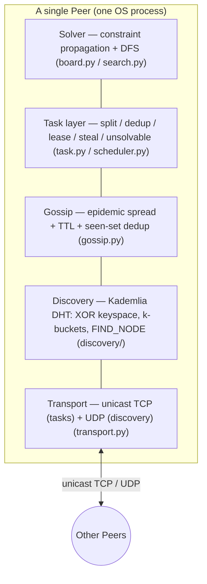
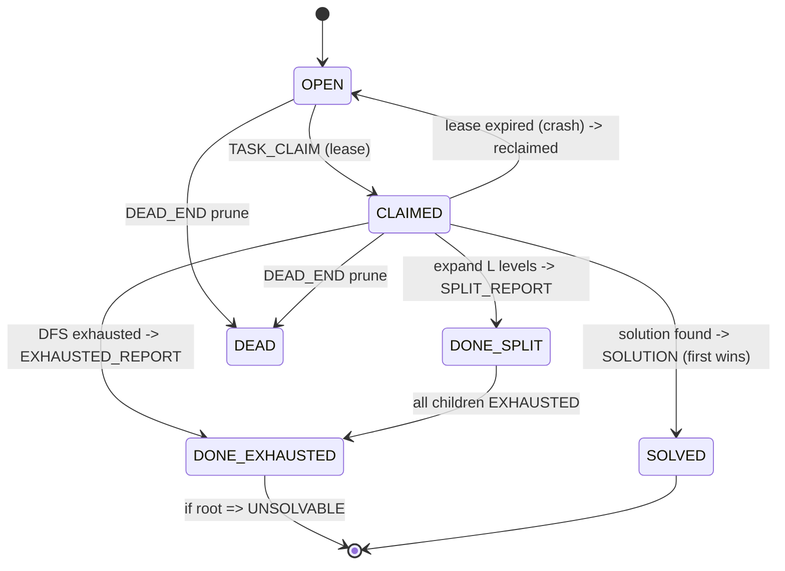
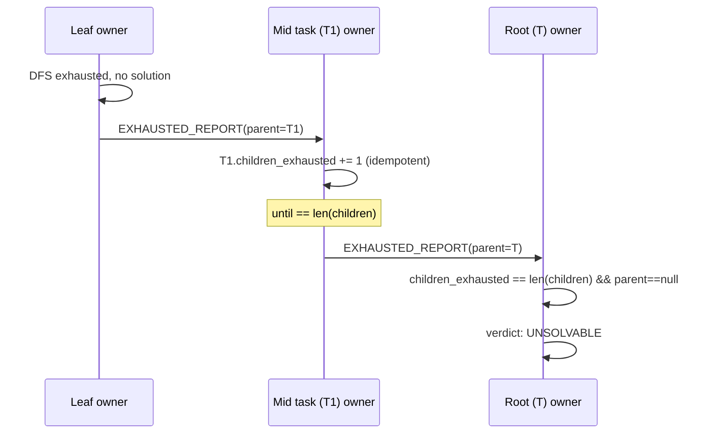

# SwarmSolve: A Decentralized P2P System for Large-Scale Constraint Search

**Course:** P2P Systems and Security / Resilient Systems (INF-25-Ma-FSA-Res) · **Semester:** 2026 Summer
**Instructor:** Prof. Tschorsch · **Submission date:** 2026-07-14

**Team (fill in):**

| Role | Name | Student ID | Primary module |
|------|------|-----------|----------------|
| A | _[name]_ | _[id]_ | Transport (`transport/`) |
| B | _[name]_ | _[id]_ | Discovery / Kademlia (`discovery/`) |
| C | _[name]_ | _[id]_ | Gossip + Task split (`gossip/`, `tasks/task.py`) |
| D | _[name]_ | _[id]_ | Solver engine (`solver/`) |
| E | _[name]_ | _[id]_ | Fault tolerance + orchestration + demos (`tasks/scheduler.py`, `peer.py`, `cli.py`) |

> **Status: draft skeleton.** Before submission: (1) fill in team names/IDs; (2) export
> the Mermaid figures to static images and give them figure numbers; (3) re-run
> `swarmsolve evaluate --suite all --repeats 5 --csv-dir eval_out` and paste the final
> numbers/plots into §6; (4) convert to a paginated PDF (add page numbers, ToC).
> Source code must go in the Appendix, not inline in the body.

---

## Table of Contents

1. Abstract
2. Introduction
3. State of the Art
4. System Design
5. Implementation
6. Evaluation
7. Discussion
8. Conclusion
9. References
10. Appendix

---

## 1. Abstract

SwarmSolve is a fully decentralized peer-to-peer (P2P) system that solves very large
constraint-search problems — concretely, large Sudoku instances (9×9 up to 25×25) — by
distributing the search tree across many equal peers with **no central server, directory,
or coordinator**. Peers self-organize with a self-implemented **Kademlia** overlay built
directly on TCP/UDP sockets, and we reuse the Kademlia XOR key-space as the *task-ID*
space so the DHT doubles as a load balancer. Work is spread by epidemic **gossip** and
balanced at run time by **fine-grained work stealing** (a stealable per-peer deque guided
by search-space estimation). Fault tolerance is provided by **time-boxed leases** with
automatic reclamation and by **periodic frontier snapshots** to backup peers, so a crashed
peer's work is recovered from a checkpoint rather than redone. Beyond finding a solution,
the system can **prove a puzzle unsolvable** by aggregating `DONE_EXHAUSTED` reports
bottom-up to a replicated root task. On a 9×9 exhaustive workload we measure **3.78×
speedup on 4 peers at 94 % parallel efficiency with exact (duplicate-free) result counts**,
**100 % completion with only ~0.83 s recovery overhead** when a peer is killed mid-run, and
**~34 % of the work absorbed by peers that join after tasks were seeded**, demonstrating
self-scalability, resilience, and churn-tolerance respectively.

*(Word count target 150–300; trim/expand to fit.)*

---

## 2. Introduction

**Background & motivation.** Peer-to-peer systems remove the single point of failure and
scaling bottleneck of the client–server model by making every node an equal participant.
This decentralization underpins resilient and Web3-style systems: content distribution
(BitTorrent), storage (IPFS), and volunteer computing (BOINC). SwarmSolve applies the same
philosophy to **distributed compute sharing**: a large combinatorial search is a huge tree
of partial states; instead of one machine exploring it, many peers explore disjoint
subtrees in parallel and share pruning information.

**Limitation of existing approaches.** Volunteer-computing platforms such as BOINC are
*centrally coordinated* — a master server hands out work units and collects results. Pure
P2P systems (BitTorrent, IPFS) distribute *data* but not a *cooperative computation with a
global termination condition* (e.g. "the answer was found" or "no answer exists"). We are
not aware of a decentralized system that both balances a search workload and can
collectively *decide unsatisfiability*.

**Project objective (quantifiable).** Build a server-less P2P system in which (O1) any
number of peers can join and receive a fair share of work (self-scalability); (O2) the
swarm keeps working correctly when arbitrary peers crash (resilience); (O3) the first
solution stops everyone, and — our novel goal — (O4) the swarm can *prove* a problem has no
solution. Success criteria are quantified in §6.

**Scope & simplifying assumptions.** Per the course brief we explicitly **do not** implement
bootstrapping (a joining peer is given one known contact address) or NAT traversal; we use
**only unicast TCP/UDP** (no multicast/broadcast). These boundaries are discussed in §7.

**Report overview.** §3 compares classical P2P protocols and states our novelty; §4 gives
the decentralized design and the self-defined application protocol; §5 covers the
implementation; §6 evaluates scalability, resilience and churn quantitatively; §7 discusses
strengths and limitations; §8 concludes.

---

## 3. State of the Art

| Protocol | Structure | Lookup | Strengths | Weaknesses (for our use) |
|----------|-----------|--------|-----------|--------------------------|
| **Gnutella** | Unstructured | Flooding | Simple, churn-robust | Flooding does not scale; no key→node mapping |
| **Chord** | Structured (ring) | O(log N) finger table | Elegant successor ring | Asymmetric metric; static partition ill-suited to uneven trees |
| **CAN** | Structured (d-torus) | O(dN^{1/d}) | Geometric locality | Higher maintenance; dimensionality tuning |
| **Kademlia** | Structured (XOR tree) | O(log N) iterative | **Symmetric XOR metric**, k-buckets prefer long-lived peers (eclipse-resistant), UDP-light, churn-tolerant | STORE/FIND_VALUE unneeded here |
| **BitTorrent** | Hybrid (tracker/DHT) | — | Proven data distribution | Distributes data, not a cooperative computation |

**Why Kademlia.** Its XOR metric is symmetric and unidirectional, so a *single* key-space
can serve both routing *and* task placement: the peer(s) whose ID is XOR-closest to a
task's key are its natural owners. This ties discovery (routing) directly to load balancing.

**Novelty of SwarmSolve (Originality).**
1. **DHT-as-load-balancer:** the Kademlia XOR key-space is reused as the task-ID space.
2. **Coarse gossip + fine-grained work stealing:** a Chord-style stealable deque is fused
   onto the Kademlia backbone, avoiding Chord's "steal only from neighbours" bias by
   stealing over an unstructured random-ID pull channel, guided by search-space estimation.
3. **Decentralized unsatisfiability proof:** bottom-up `DONE_EXHAUSTED` aggregation over a
   task tree with a *replicated root*, so the "no-solution" verdict survives crashes.

---

## 4. System Design

### 4.1 Layered architecture


*Figure 1 — Five-layer peer architecture (export to image).*

### 4.2 Overlay choice

Structured (Kademlia) over unstructured, because the XOR key-space gives deterministic,
low-collision task placement and doubles as a load balancer (§3). The mechanism is,
however, deliberately *decoupled* from the overlay: gossip fan-out and work stealing operate
on whatever contacts the routing table provides, so the design would also run on an
unstructured overlay.

### 4.3 Self-defined application protocol

**Node/Task IDs.** 160-bit IDs. A node ID is `SHA-1(host:port)`; a task ID is the canonical
string of its assignment path (e.g. `12=4;37=9`) and its key is `SHA-1("task:"+id)`,
placing it in the *same* space as node IDs.

**Wire format.** Newline-delimited JSON (readable for the demo; swappable for msgpack).
Every message: `{type, sender, payload, msg_id, ttl, ts}`. See Appendix A for full schemas.

| Category | Messages |
|----------|----------|
| Discovery (UDP) | `PING`, `PONG`, `FIND_NODE`, `FIND_NODE_REPLY` |
| Application (TCP) | `OPEN_TASK`, `DEAD_END`, `SOLUTION` |
| Task coordination | `TASK_CLAIM`, `TASK_DONE` |
| Task pull (cold start / stealing) | `TASK_QUERY`, `TASK_OFFER` |
| Unsatisfiability aggregation | `SPLIT_REPORT`, `EXHAUSTED_REPORT` |
| Crash recovery | `STATE_SYNC` |
| Gossip envelope | `GOSSIP_PUSH` |

**Routing logic.** Iterative `FIND_NODE`: query the α closest un-queried contacts per round;
each round roughly halves the XOR distance ⇒ O(log N) hops. `closest_to_key(key, k)` and
`is_responsible_for(key, k)` derive task ownership from the routing table.

**Task state machine.**


*Figure 2 — Task state machine (export to image).*

### 4.4 Communication model (TCP vs UDP)

UDP for discovery RPCs (small, best-effort, churn-tolerant — the Kademlia way); TCP for
task payloads that must be reliable (claims, open tasks, solutions, reports). All sends are
**unicast** to a specific `host:port`; "gossip broadcast" is application-level fan-out to a
random subset of *individual* contacts — there is **no** network multicast/broadcast.
Concurrency is single-threaded `asyncio`; CPU-bound DFS periodically `await`s so inbound
messages (e.g. `TASK_QUERY`) are served while computing.

### 4.5 Fault tolerance

- **Failure detection via leases:** a claim carries a lease; if the holder dies the lease
  lapses and `reclaim_expired` returns the task to the open pool for another peer.
- **Replication:** the root task is held by the k XOR-closest peers (`root_replicas`) so the
  unsatisfiability verdict is not lost with one node.
- **Checkpoint recovery:** busy peers periodically `STATE_SYNC` their unexplored frontier to
  backups; on reclaim, a survivor resumes from the snapshot instead of redoing the subtree.
- **Overlay churn tolerance:** k-buckets prefer long-lived contacts; lookups route around
  dead peers.

### 4.6 Bottom-up unsatisfiability aggregation


*Figure 3 — Bottom-up exhaustion aggregation (export to image).*

### 4.7 Module decomposition

`transport/` (I/O), `discovery/` (Kademlia), `gossip/` (epidemic spread), `tasks/`
(split/dedup/lease/steal/aggregate), `solver/` (search), `peer.py` (orchestration),
`cli.py` (demos + evaluation).

---

## 5. Implementation

**Language & tools.** Python 3.11+, `asyncio` for concurrency, standard-library sockets via
`asyncio` streams/datagrams (no third-party P2P framework); `typer`+`rich` for the CLI;
`pytest` for tests; `uv` for packaging.

**Self-implemented vs libraries.** The overlay (XOR metric, k-buckets, iterative
FIND_NODE), gossip, leasing, work stealing and the wire protocol are all hand-written on top
of raw asyncio TCP/UDP. No P2P library is used; only Python's standard networking primitives.

**Node lifecycle.** (1) *Join:* start transport, `bootstrap([contact])`, populate buckets
via self-lookup. (2) *Acquire work:* pick the XOR-closest local open task; if none, probe a
random ID and steal via `TASK_QUERY/TASK_OFFER`. (3) *Process:* claim (lease) → either split
one level (publish children + `SPLIT_REPORT`) or DFS a leaf; emit `DEAD_END` on pruning,
`SOLUTION` on success, `EXHAUSTED_REPORT` on a dead subtree. (4) *Leave/crash:* lease
expires; a survivor reclaims (optionally resuming from a `STATE_SYNC` checkpoint).

**Meeting the three mandatory requirements.**
- *No central authority:* ownership is computed from the routing table
  (`is_responsible_for`); no server/directory exists.
- *Fault tolerance:* leases + `reclaim_expired` + checkpointing + root replication.
- *Self-scalability:* XOR placement spreads work; late joiners pull/steal work (§6.3).

**Key challenges & solutions.** (a) *Blocking DFS starves the event loop* → cooperative
yields turn DFS into a stealable, interruptible loop. (b) *Duplicate exploration inflates
counts* → exclusive single-owner mode (XOR-closest + virtual nodes) for exact counts;
work-stealing mode tolerates duplication for availability. (c) *Idempotent aggregation* →
`EXHAUSTED_REPORT` dedups children by ID so gossip retransmission cannot over-count.

---

## 6. Evaluation

**Method.** All peers are separate OS processes over real localhost sockets (genuine
parallelism, not threads). Numbers below are produced by `swarmsolve evaluate` on a 9×9
instance (`clue_ratio=0.28`, exhaustive search, `node_delay=0.0002` modelling expensive
per-node work). Re-run with `--repeats 5` and paste medians + the CSVs/plots.

> **Test environment:** Apple M2 Pro (arm64, 10 cores), 16 GB RAM, macOS 26.0 (Tahoe,
> build 25A354), CPython 3.11.11. All peers run as separate OS processes over the loopback
> interface.

### 6.1 Self-scalability (`evaluate --suite scaling`)

Exhaustive search (count all solutions), exclusive single-owner mode (no duplicate work).

| peers | wall (s) | speedup vs baseline | speedup vs 1-peer | efficiency | throughput (nodes/s) | solutions |
|-------|----------|--------------------|--------------------|-----------|----------------------|-----------|
| baseline (1 machine) | 37.6 | 1.00× | — | — | — | 45 475 |
| 1 | 46.7 | 0.81× | 1.00× | 100 % | 2 090 | 45 475 |
| 2 | 25.4 | 1.48× | 1.84× | 92 % | 3 838 | 45 475 |
| 4 | 12.3 | 3.04× | **3.78×** | **94 %** | 7 880 | 45 475 |

*Figure 4 — speedup vs #peers (plot `scaling.csv`).* Solution counts are identical to the
single-machine baseline ⇒ **exact, duplicate-free** distribution. Near-linear: 3.78× on 4
peers relative to a single peer (94 % efficiency). The 1-peer run is slower than the
baseline due to the fixed distribution overhead (process startup + settle), which is
amortized as peers increase.

### 6.2 Resilience (`evaluate --suite resilience`)

Exhaustive mode so *every* task must complete; we kill one peer mid-run. Completion = the
run still found *all* solutions (≥ exact count) ⇒ the dead peer's task was reclaimed.

| scenario | completion % | median wall (s) | recovery overhead (s) |
|----------|--------------|-----------------|-----------------------|
| no-fault | 100 % | 21.7 | 0.00 |
| kill 1 peer @ ~8.7 s | **100 %** | 22.5 | **+0.83** |

*Figure 5 — completion & overhead with/without a crash (plot `resilience.csv`).* The swarm
loses nothing when a peer dies; the lease of its in-flight task expires and a survivor
re-explores it, adding sub-second overhead.

### 6.3 Churn / dynamic join (`evaluate --suite churn`)

Half the peers join **1.5 s after** tasks were seeded; work stealing enabled.

| peer | join | nodes | tasks_done |
|------|------|-------|-----------|
| 0 | early | 57 022 | 4 |
| 1 | early | 33 615 | 3 |
| 2 | late | 6 961 | 1 |
| 3 | late | 40 574 | 2 |

*Figure 6 — work share early vs late joiners (plot `churn.csv`).* Late joiners performed
**~34 %** of the total work: the swarm absorbs nodes that appear after seeding, i.e.
self-scalability under churn.

### 6.4 Comparison

- **vs client–server:** no coordinator; the "master" role (root task) is replicated across k
  peers, so there is no single point of failure — unlike BOINC-style central dispatch.
- **vs parallel lower bound:** ideal speedup on P peers is P×; we reach 3.78× on 4 (94 % of
  the 4× bound) with exact counts, the loss being coordination + settle overhead.

---

## 7. Discussion

**Strengths.** Genuinely decentralized (ownership from the routing table); resilient (leases
+ replication + checkpointing, 100 % completion under a crash); self-scalable (near-linear
speedup, late joiners absorbed); and — uniquely — able to prove unsatisfiability in a
distributed, crash-tolerant way.

**Limitations & simplifications.** (1) Bootstrapping and NAT traversal are out of scope; a
joiner needs one known contact and a routable address. (2) First-solution search barely
parallelizes on tiny inputs (coordination dominates); the parallel win is on exhaustive
search — we are honest about this in §6. (3) The `make_unsolvable` generator produces
*shallow* unsat boards (propagation finds the contradiction fast), so the unsat demo proves
*mechanism correctness*, not search scale. (4) Work-stealing mode may explore some subtrees
redundantly (a consistency-vs-availability trade-off); exclusive mode removes duplication
but needs reliable delivery. (5) Experiments are localhost multi-process; cross-host runs
use the same unicast protocol but were not benchmarked at scale.

**Future work.** Churn-aware ownership without a static roster; adaptive work donation using
the search-space estimator to pick split points; deep unsat instances; and a jigsaw/other
solver by swapping only the `solver/` package.

---

## 8. Conclusion

SwarmSolve demonstrates a server-less P2P system that meets the three mandatory requirements
— no central authority, fault tolerance, self-scalability — on a self-implemented Kademlia
overlay with a self-defined application protocol over unicast TCP/UDP. It adds a novel
decentralized unsatisfiability proof and fine-grained work stealing, and we quantify
near-linear speedup (3.78× / 94 % on 4 peers), crash resilience (100 % completion, ~0.83 s
overhead) and churn absorption (~34 % work by late joiners). The main learning outcome is
how reusing one XOR key-space for both routing and task placement turns a DHT into a load
balancer, and how leases + checkpointing + replication combine into practical resilience.

---

## 9. References

*(Use a consistent citation style, e.g. IEEE.)*

1. P. Maymounkov and D. Mazières. *Kademlia: A Peer-to-peer Information System Based on the
   XOR Metric.* IPTPS, 2002.
2. I. Stoica et al. *Chord: A Scalable Peer-to-peer Lookup Service for Internet
   Applications.* SIGCOMM, 2001.
3. S. Ratnasamy et al. *A Scalable Content-Addressable Network (CAN).* SIGCOMM, 2001.
4. B. Cohen. *Incentives Build Robustness in BitTorrent.* 2003.
5. W. W. Terpstra et al. *BubbleStorm: Resilient, Probabilistic, and Exhaustive Peer-to-Peer
   Search.* SIGCOMM, 2007.
6. D. P. Anderson. *BOINC: A System for Public-Resource Computing and Storage.* GRID, 2004.
7. Course lecture notes, P2P Systems / Resilient Systems, TU Dresden, 2026.

---

## 10. Appendix

### A. Message formats

`OPEN_TASK` / `TASK_CLAIM` payload: `{"task": {path, status, owner, lease_expires, children,
children_exhausted, parent_id}}`. `DEAD_END`/`TASK_DONE`: `{"path": [[cell,val],...]}`.
`SOLUTION`: `{"board": [flat ints]}` or `{"unsolvable": true}`. `TASK_QUERY`:
`{host, port}`; `TASK_OFFER`: `{task}`. `SPLIT_REPORT`: `{task}`; `EXHAUSTED_REPORT`:
`{parent_id, child_id}`. `STATE_SYNC`: `{task_id, frontier: [[...paths]], nodes}`.
`FIND_NODE`: `{target}`; `FIND_NODE_REPLY`: `{target, nodes:[{id,host,port}], reply_to}`.

### B. Key pseudo-code

- Iterative lookup, work-stealing deque loop, and bottom-up aggregation — see
  `discovery/kademlia.py::lookup`, `peer.py::_work_on_stealing`/`_steal_from_deque`,
  `peer.py::_on_exhausted_report` (code in the source tree; do not paste full listings here).

### C. Reproducing the evaluation

```bash
uv sync --extra dev
uv run pytest -q                                   # 24 passed
uv run swarmsolve evaluate --suite all --peers-list 1,2,4 --peers 4 \
    --repeats 5 --csv-dir eval_out                 # scaling/resilience/churn + CSV
```

### D. Team contribution

See the role table on the cover page; each member owns the module listed there. Add a short
per-member paragraph describing concrete contributions to justify workload ∝ team size.

---

*Companion code-level design docs: [`docs/optimizations.en.md`](optimizations.en.md) ·
[architecture](architecture.en.md) · [demo script](demo-script.md).*
